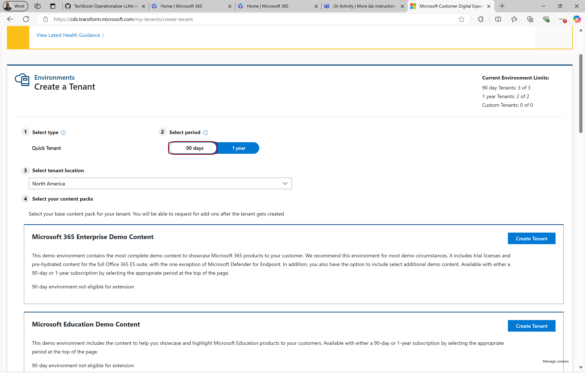
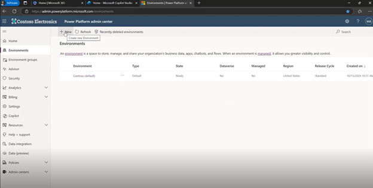
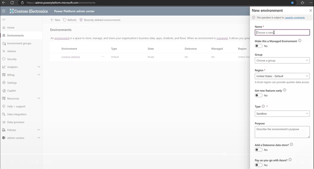
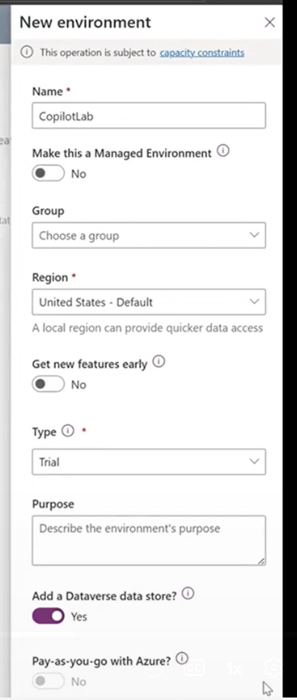
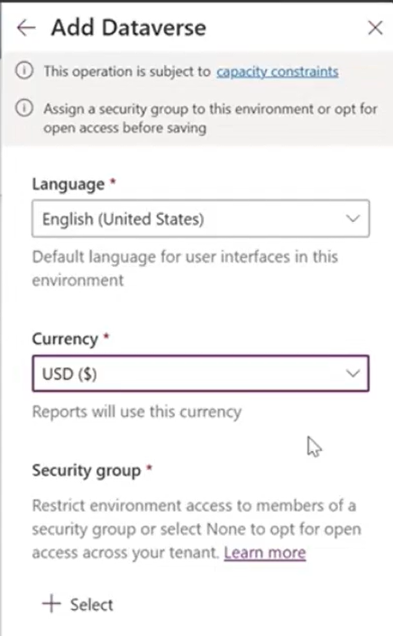
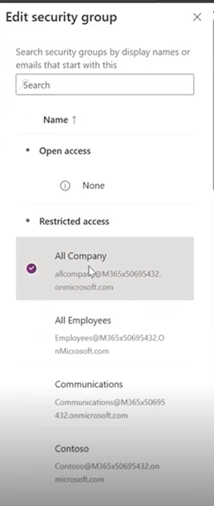
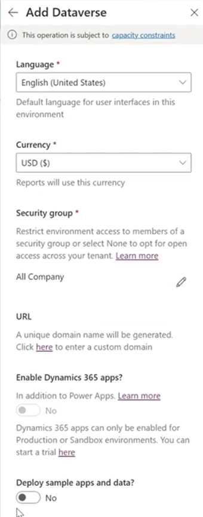
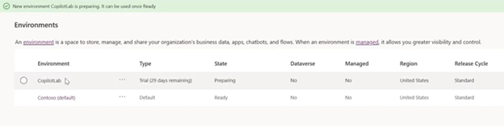
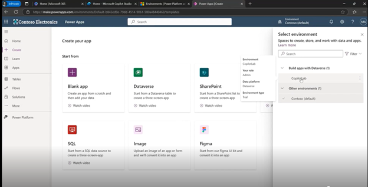

# Task 01: Add on a trial of Power Platform

{: .important }
> For those who are building a demo environment using CDX, you can start with a 90 day M365.

 

{: .note }
> Since the hosted lab will have credentials for M365 including sample data and SharePoint sites, you can skip to step 3.

1.	Stay in your In Private browser window. Open a new browser tab and enter: 
    ```
    aka.ms/ppac
    ```
    
    {: .note }
    > This will retain your M365 account Identity and carry it over to the Power Platform which is the foundation on which Copilot Studio is built.
    >
    > This is also where Copilot Studio will store data associated with your Custom Copilot.

     


1.	Let’s create a new Power Platform environment by clicking **New**. This is gives you a series of Apps and sample data that can be used with our Copilots. 

     

    {: .important }
    > You can also create Flows and Actions that Copilot can leverage. You can even use Power Platform connectors as a way for our Copilots to access outside data from customer apps, document sources and their own databases.

1.	Fill in the right side panel with these options:

     

1.	On the next screen, click **Select** for Security Group.

     

1.	Select the first option for **All Company**.

     

1.	Select **Done**.

1.	Back on the **Add Dataverse** screen turn on **Deploy sample apps and data**. 

     

1.	Wait until the green status bar indicates that your environment has been built.  

    {: .note }
    > This could take a few minutes  

     

1.	Still using your In Private browser Window open a new brower tab and go to make.powerapps.com. Here you will be able to use your new enviroment, build Power Apps and inspect components of your Copilots.

     

1.	You may need to select the new environment in the top right corner. In this case, the new environment is named **CopilotLab** but you could have chosen any suitable name.
