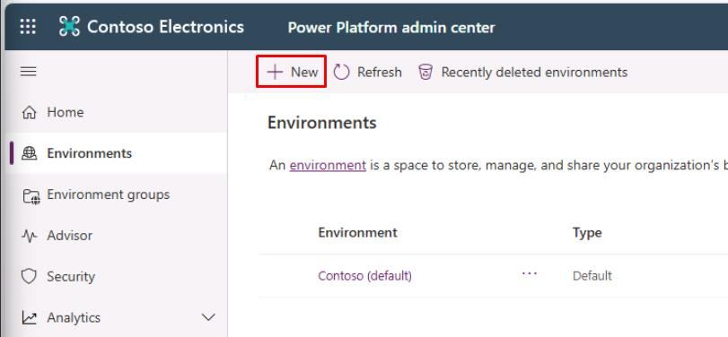
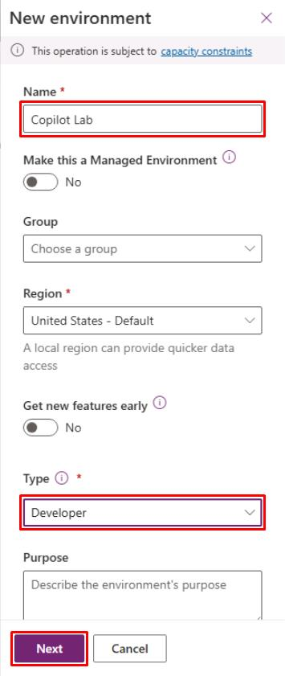
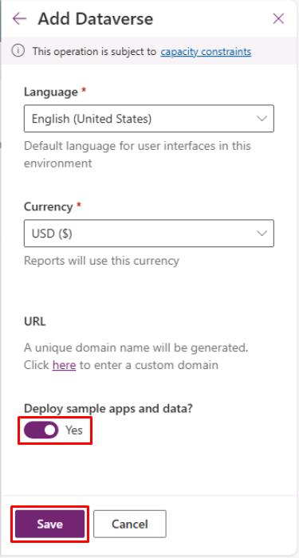
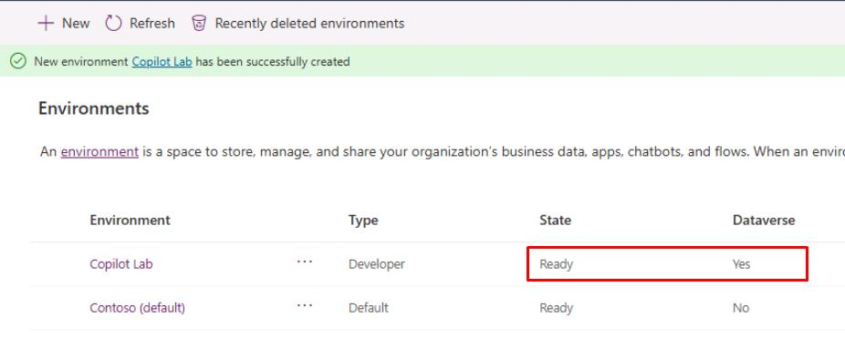

# Task 01: Add on a trial of Power Platform

{: .important }
> For those who are building a demo environment using CDX, you can start with a 90 day M365 trial. Start by going to **[CDX](cdx.transform.microsoft.com)** and select **My Environments**. Select **Create Tenant** on the first option *Microsoft M365 Enterprise demo content*, accept the disclaimer,  and wait for the provisioning.  You will then get a new M365 tenant in **My Environments**. Open an In Private browser, sign in to *Office.com* with the new credentials and activate multi factor authentication (MFA).  Consult your instructor if you need support.

 

1. Stay in your In Private browser window. Open a new browser tab and enter: 

    ```
    aka.ms/ppac
    ```

1. Power Platform may have transitioned to the new admin center. 

	Near the upper-right corner of the page, toggle off **New admin center** if it's on.

	
	
1. On the left service menu, select **Environments**.

1. On the top bar, select **New**.

	

1. In the **New environment** pane, set the following:

	| Item | Value | 
    |----------|---------------------------------------------------------| 
    | Name | `Copilot Lab` | 
    | Type | **Developer** or **Trial** | 

1. Select **Next** at the bottom of the pane.

	

1. Select the toggle for **Deploy sample apps and data?** to change to **Yes**, then select **Save** at the bottom. 

    

	{: .warning }
	> Sample data must be deployed for a later exercise.

1. Wait until the **Copilot Lab** environment's **State** column shows **Ready**. 

	Periodically select the **Refresh** option on the top bar.

	

	{: .warning }
	> This may take a few minutes.
