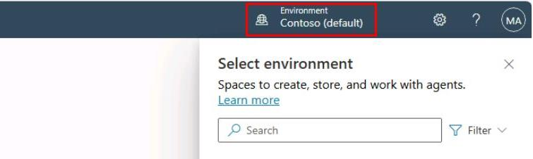
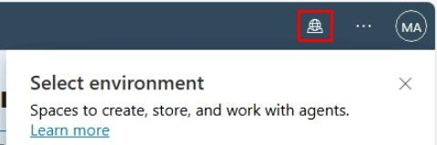
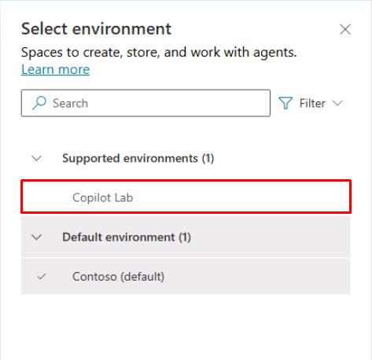
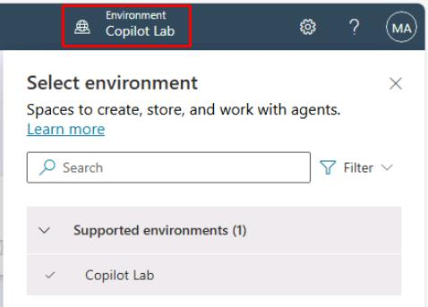

# Task 02: Add on a trial of Copilot Studio 
 
1. Open a new browser tab in your InPrivate browser window, then go to `copilotstudio.microsoft.com`. 

1. Select your **Environment** in the upper-right corner of the page.

	

	{: .warning }
	> If stuck in a loop on "Setting up your copilot may take a while", refresh the page and immediately select **Environment**.

	{: .note }
	> Depending on screen resolution, you may need to select the globe icon to set the selected environment.
	>
	> 

1. In the **Select environment** pane, select **Copilot Lab**.

	

	{: .warning }
	> If prompted for the verification and account creation seen below, don't fill it out. Try opening `copilotstudio.microsoft.com` again in a new tab.  
	> 
	> 
	> 
	> The URL should take you to the screenshot in the next step when the page loads. 
 
1. Select your region, then select **Start free trial**. 
 
	 
 
1. In the upper-right part of the page, verify that **Copilot Lab** is set as the **Environment**.

	
