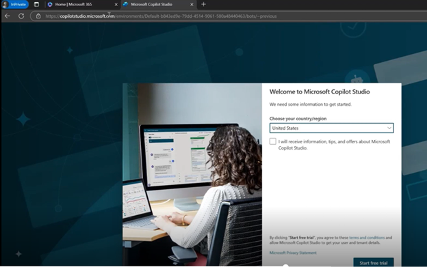
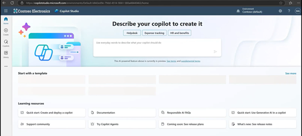

# Task 02: Add on a trial of Copilot Studio

1.	Still using your In Private browser window, open a new tab and go to **[copilotstudio.microsoft.com](copilotstudio.microsoft.com)**

     

2.	Select your region, accept the disclaimer and click Start Free Trial. This will take you to the home page for Copilot Studio. Notice the option to choose different low-code environments in the top right.  You will need to select the new environment you created earlier. 

     