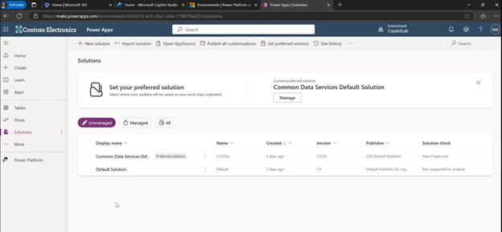
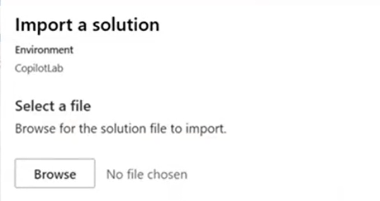
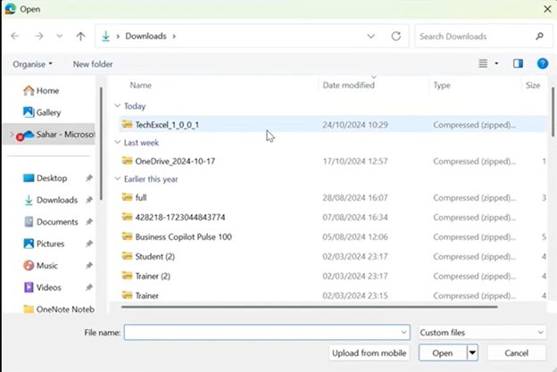
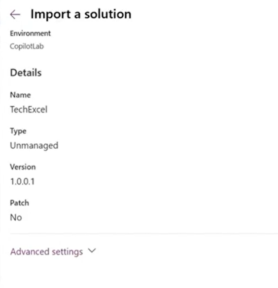
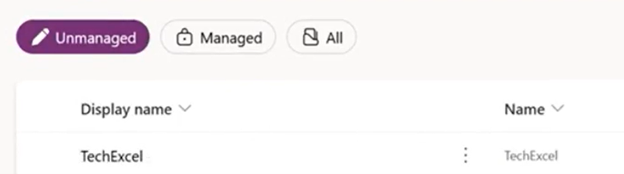
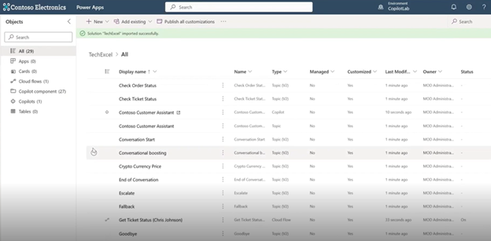

# Task 03: (Optional) Use Power Apps to upload a pre-built Copilot 

1.	In **make.powerapps.com** you can (optionally) import a Copilot to use as a starting point for your lab exercises. You will need one of our Zip files called **TechExcel_1.0.0.1.Zip** available as a separate download. To import this Copilot select **Solutions** in the left pane.

     

1.	Now click **Import Solution** in the top ribbon.

     

1.	Now click **browse** and find the file that you downloaded called **TechExcel_1.0.0.1.zip**

     

1.	This zip file will bring in all the objects that define the Copilot.

     

1.	After a few minutes you will see the new Copilot solution. 

    {: .note }
    > This is just the defintiion of the Copilot, not the running version.

     

1.	If you click on the name **TechExcel** you will see the Copilot and some of the internal components.

     

1.	This can save you time in the lab exercise because all the steps are completed from exercise 1 to 4.