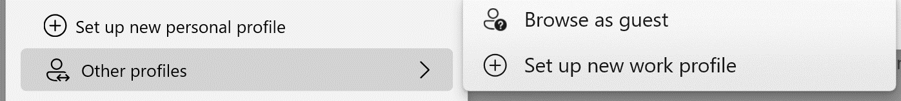
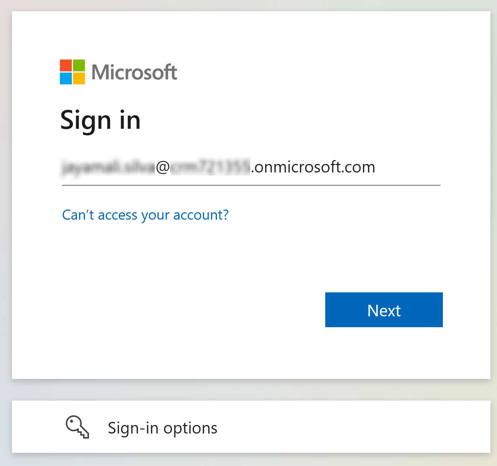

# Setup your browser experience and sign in to create a Copilot

1.      To avoid conflicting with your existing logged-in experiences, you can do these labs by using one of these 3 options:

-	Set up a new work profile specific to that workshop.
	
       {: .important }
       > Best option to switch between your work and trial environments while keeping history of your work. Ideal if you want to continue using the account later.

-	Or browse as a guest.

-	Or start an InPrivate session.

       

       {: .note }
       > If you signed in already using your CDX M365 tenant and your *In Private browser* you can skip the rest of the steps in this task

1.	Now sign in to create a Copilot. On the login screen, enter your Windows password to proceed.

1.	Navigate to **[aka.ms/CopilotStudioStart](aka.ms/CopilotStudioStart)**.

1.	Enter **your Copilot user name**, click **Next**.

1.	Enter **your Copilot password**, click **Sign in**.

1.	If prompted, choose whether to stay signed in.

      

      {: .important }
      >The first time you access Microsoft Copilot Studio, you’ll be prompted to choose your country/region. You can choose a value or leave the default option.

1.	Click **Start free trial**.
