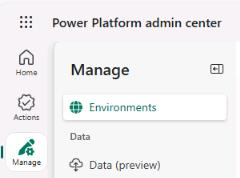
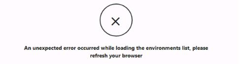
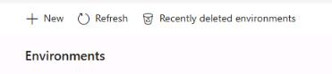
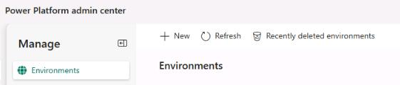
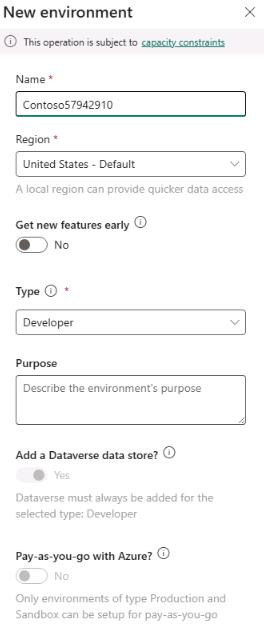
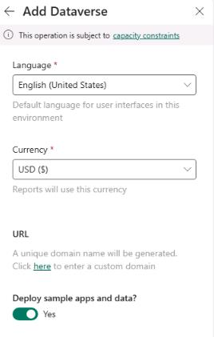

## Task 01: Set up assets  

### Introduction

Contoso has decided to adopt an AI-driven customer support solution to address increasing customer demands and reduce the workload on customer service representatives. To start implementing this solution, you first need to set up the required environment within the Power Platform. This task involves preparing the necessary foundational components such as Dataverse, enabling you to build the AI-powered agent effectively.

### Description

In this task, you'll create an environment and deploy Microsoft Dataverse, sample apps, and data to the environment. 

### Success criteria

- You've navigated to the Power Platform admin center and signed in by using the provided Microsoft 365 credentials.
- You've created an environment, enabled Dataverse, and deployed sample apps and data.

### Key tasks

---

#### 01: Create a Power Platform environment
First, you'll create a Power Platform environment to store all the component parts for your solution.

1. Sign in to the virtual machine by using the following credentials:

    | Item | Value |
    | ---- | ----- |
    | Username | **Admin** |
    | Password | +++@lab.VirtualMachine(Win11).Password+++ |

1. Open Microsoft Edge and go to the [Power Platform](admin.powerplatform.microsoft.com).

1. Sign in by using the following credentials:

    | Item | Value |
    | ---- | ----- |
    | Username | `@lab.CloudPortalCredential(User1).Username` |
    | TAP Token | `@lab.CloudPortalCredential(User1).AccessToken` |

1. Close the various dialogs that display.

1. In the left pane, select **Manage** and then select **Environments**.

    

    {: .warning }
    > When the **Environments** page first displays, you may see an error that resembles the following screenshot. This error indicates that Power Platform is not yet fully provisioned and configured.
    >
    > 
    > 
    > If you see the error, continue with the rest of the steps in this task anyway. 
    >
    > It may take 10-15 minutes to deploy the environment. 
    >
    > On the command bar at the top of the page, select **Refresh** periodically until the error no longer displays and the environnment you created displays..
    >
    > 

1. On the command bar at the top of the page, select  **+ New**.

    

1. Configure the **New environment** pane by using the following values and then select **Next**:

    | Item | Value |
    | ---- | ----- |
    | **Name** | `Contoso@lab.LabInstance.Id` |
    | **Type** | **Developer** |

    {: .warning }
    > Be sure to select **Developer** as the environment type.

    

1. Set **Deploy sample apps and data?** to **Yes** and then select **Save**.

    {: .warning }
    > Do not skip this step. You'll need the sample data later in the lab.
    
       
 
1. Wait until the **Contoso** environment's **State** column shows **Ready**.

    

    {: .warning }
    > You can continue with part 02 of this task (Configure SharePoint) while you wait for your environment deployment to complete.

    {: .important }
    > Lab activities for "test out" version of lab are in progress. Please disregard **Score** button for now.

---

#### 02: Configure SharePoint
Next, you'll set up a SharePoint site and upload documents to the site. The agent that you create will use the documents as an authoritative source of information.

1. Open a new browser tab and go to `lodsprodmslearnmca.sharepoint.com/_layouts/15/sharepoint.aspx`.

1. If prompted, sign in by using the following credentials:

    | Item | Value |
    | ---- | ----- |
    | Username | `@lab.CloudPortalCredential(User1).Username` |
    | TAP Token | `@lab.CloudPortalCredential(User1).AccessToken` |

1. On the top bar, select **Create site**.

    

1. In the **Create a site: Select the site type** dialog, select **Communication site**.

    

1. In the Select a Template dialog, select **Standard communication**.

    
    

1. In the **Preview and use...** dialog, select **Use template**.

1. In the **Give your site a name** dialog, enter the following details and then select **Next**.

    | Item | Value |
    | ---- | ----- |
    | Site name | `Mark 8 Project Team` |
    | Site description | `The team dedicated to the Mark 8 Project.` |
    | Site address | `Mark8ProjectTeam@lab.LabInstance.Id` |

1. Select **Create site**.

    

1. On the command bar for the site, select **Documents**.

    

1. On the **Documents** page, on the command bar, select **Upload** and then select **Folder**.

    

1. Go to `F:\LabFiles`, select **SharePointFiles**, and then select **Upload**.

    

1. In the confirmation dialog that displays, select **Upload**.

    

1. After the upload completes, close the SharePoint browser window.

    

    {: .warning }
    > Do not move on to Task 02 until you confirm that the status for the environment you created is **Ready**.

    {: .important }
    > Lab activities for "test out" version of lab are in progress. Please disregard **Score** button for now. 