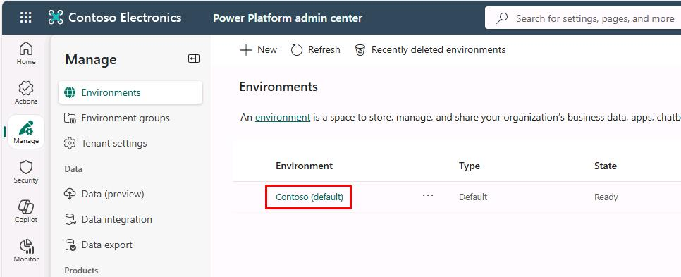
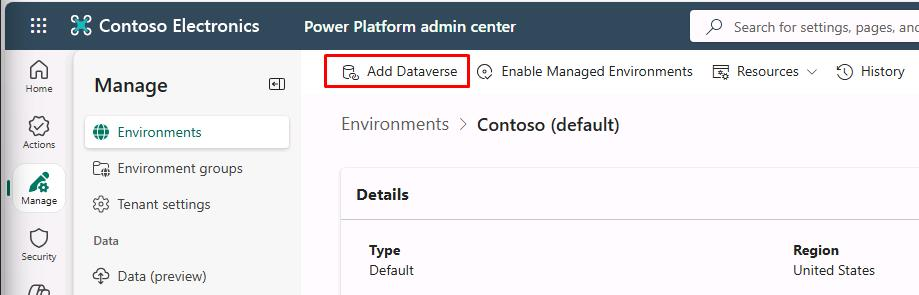
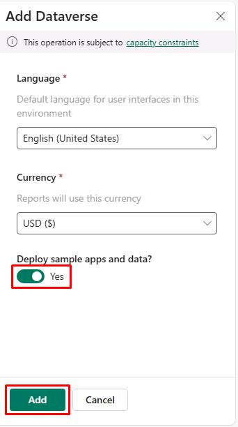
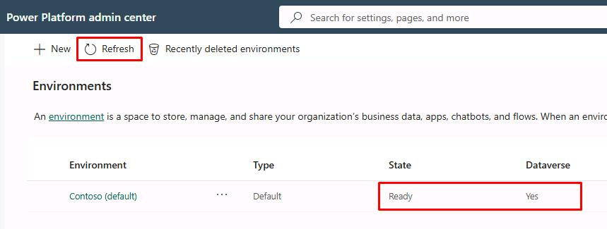
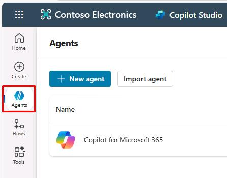
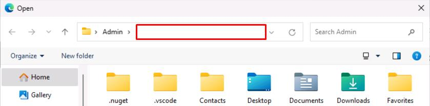
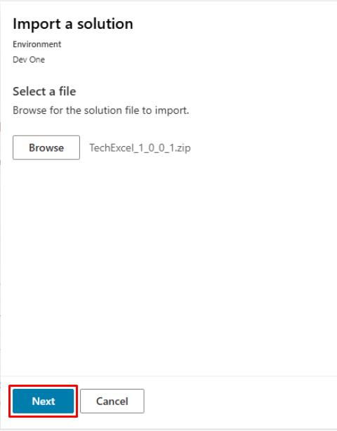
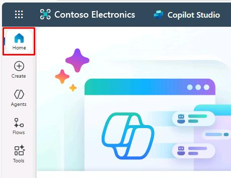

# Task 01: Set up

## Introduction

Contoso has decided to adopt an AI-driven customer support solution to address increasing customer demands and reduce the workload on customer service representatives. To start implementing this solution, you first need to set up the required environment within the Power Platform. This task involves preparing the necessary foundational components such as Dataverse, enabling you to build the AI-powered agent effectively.

## Description

In this task, you’ll configure the Power Platform environment by enabling Microsoft Dataverse and deploying sample apps and data. These components provide the essential foundation for creating and deploying intelligent agents with Microsoft Copilot Studio.

## Success criteria

-   You navigated to the Power Platform admin center and signed in with the provided Microsoft 365 credentials.
-   You selected the correct environment ("Contoso (default)") and enabled Dataverse with sample apps and data.

## Navigate the lab environment

**The Type Text icon**  

Select the icon in the instructions and the Type Text feature will automatically send the specified text to the active window in the virtual machine.  
 
Always compare the text in the instructions with the typed text in the virtual machine to verify that the expected text displays. 

For larger code blocks, use the **Copy** button and then paste the text by right-clicking or using **CTRL+V** in the virtual machine.

---

**Lab credentials**  
The credentials required for accessing the virtual environment and the lab-supplied Microsoft 365 tenant are always available at the top of this instructions pane under the **Resources** tab. 

---

**Saving your progress**  
To save your progress, select **Exit Lab** in the upper-right corner of the screen, then select **Save Progress and Exit**. This will ensure that your work is preserved for future sessions.

{: .warning } Selecting **End Lab** will terminate the lab without saving.

---

**Images**   

All images in the lab instructions are clickable. By selecting them, you can open a zoomed-in view in a separate window for better clarity and analysis. 
 
--- 

**Split Windows feature**  
If you're equipped with multiple screens, you can use the Split Windows feature to place the lab instructions on a separate screen, making better use of your screen real estate. 

To enable this feature:  
1. Select the **cogwheel** icon in the upper-right corner of this pane.  
2. Select **Split Windows** at the bottom of the **Settings** pane.

This will help you keep the virtual machine and instructions visible simultaneously for a more efficient workflow.

## Key tasks

### 01: Set up Power Platform

 
  
<strong>Expand this section to view the solution</strong>
 

1. Open Microsoft Edge, then go to [Power Platform](admin.powerplatform.microsoft.com).

1. Sign in with your credentials: 

	| Item | Value |
    |----------|---------------------------------------------------------|
    | **Username** | `Administrative user name for Power Platform` |
    | **Password** | `Password for the Power Platform administrative user` |

1. Select the following options on the various dialogs: 
 
    | Item | Value | 
    |----------|---------------------------------------------------------| 
    | Sign in to Microsoft Edge | **No, thanks** | 
    | Save your password? | **Save** | 
    | Stay signed in? | **Yes** | 
 
	

1. On the left service menu, select **Manage**.

    

1. Select the **Contoso (default)** environment.

    

    {: .note } 
    > This will retain your Microsoft 365 account identity and carry it over to Power Platform, which is the foundation on which Copilot Studio is built.
    > 
    > This is also where Copilot Studio will store data associated with your custom agent.

1. Select **Add Dataverse** on the top bar.

    

1. In the **Add Dataverse** pane, select the toggle for **Deploy sample apps and data?** to change to **Yes**, then select **Add** at the bottom.

    

    {: .warning }
    > Sample data must be deployed for a later exercise.

1. Wait until the **Contoso (default)** environment's **State** column shows **Ready**.

    Periodically select **Refresh** on the top bar.

    

    {: .warning } 
    > This may take around 15 minutes.
    > 
    > If not **Ready** after 25 minutes, please exit and relaunch the lab.

### 02: Add on a trial of Copilot Studio 

 
  
<strong>Expand this section to view the solution</strong>

1. Open a new browser tab, then go to [Copilot Studio](copilotstudio.microsoft.com). 

    {: .warning }
    > If prompted for the verification and account creation seen below, don't fill it out. Try opening `copilotstudio.microsoft.com` again in a new tab.  
    > 
    > 
    > 
    > The URL should take you to the screenshot in the next step when the page loads. 
 
1. Select your region, then select **Start free trial**. 
 
	 
 
1. In the upper-right part of the page, verify that **Contoso (default)** is set as the **Environment**.

    

    {: .note }
    > Depending on screen resolution, you may need to select the globe icon to see the selected environment.
    >
    > 
  
 

### 03: (Optional) Use Power Apps to upload a pre-built agent

 
  
<strong>Expand this section to view the solution</strong>
 

{: .warning } 
> You can **optionally** import an agent to use as a starting point for your lab exercises. This completes all the steps from **Exercise 01** to the end of **Exercise 04**. You'll need to download and import a custom solution for this.
>
> If you import a custom solution, please observe all the following exercises, regardless, to learn how everything is configured. Also follow along with the various tests of the agent.

1. In the leftmost menu of Copilot Studio, select **Agents**. 
 
	
 
1. In the upper-left part of the page, select **Import agent**. 
 
	
	
    {: .note }
    > This will open the **Solutions** page in a new tab. 
 
1. Select **Import solution** on the top bar. 
 
	
 
1. Select **Browse** in the new pane. 
 
1. In the top address bar, select the empty white space to the right of **Admin >** to change the file path, then enter `F:\LabFiles\Solution`. 
 
	

	 
	
    {: .note }
    > Alternatively, expand for navigating through the folders manually: 
    >1. In the left pane, move down to under **This PC**, then select **AllFiles (F:)**. 
    >
    >  
    > 
    >1. Double-click **LabFiles**.
    >1. Double-click **Solution**. 
	
1. Select **TechExcel_1_0_0_1.zip**, then select **Open**.  
 
	
 
1. Select **Next** in the lower-left corner of the pane. 
 
	
 
1. Select **Import** in the lower-left corner of the pane.  
 
1. Wait until you see a yellow warning banner under the top bar upon completion. The warning can be safely ignored. 
 
    

    
 
    {: .warning }
    > It may take a couple of minutes to complete the import of the agent.  
 
    {: .note } 
    > This is the definition of the agent, not the running version. This comes with various internal components that you'll explore in the upcoming exercises. 

1. After the import finishes, close the **Solutions** page tab to return to Copilot Studio.

1. Select **Home** in the leftmost menu.

	

