# Task 02: Create an agent

## Introduction

With the Power Platform environment prepared, your next step is to create a customer support agent for Contoso. This task involves defining the agent’s purpose, customizing its tone and limitations, and specifying external knowledge sources. Completing these steps ensures the agent is tailored to Contoso’s specific support scenarios and customer interactions.

## Description

In this task, you’ll use Microsoft Copilot Studio to define and create your first AI-driven agent. You’ll specify the agent's purpose, tone, conversational boundaries, and data sources, preparing it for initial testing.

## Success criteria

-   An agent is created within Microsoft Copilot Studio.
-   The agent’s purpose, tone, and boundaries are clearly defined.
-   External knowledge sources are successfully integrated.

## Key tasks

### 01: Create an agent

 
  
<strong>Expand this section to view the solution</strong>
 

1. In the text box at the top for **Describe your agent to create it**, enter the following prompt, then select **Enter**:

	`I want to create an agent for my customer support. It is an assistant for Contoso customers, helping to answer common questions and helping with common tasks, like checking order status.`

    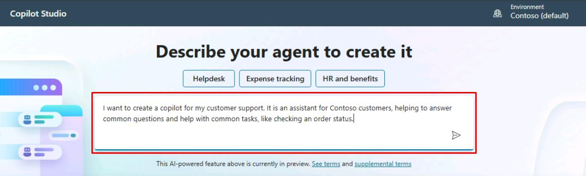

    {: .note }
	> You'll be redirected to a conversational experience to further customize your agent.

	{: .warning }
	> If prompted to wait before submitting your request, please wait a few moments and try again. If the issue persists, expand the following dropdown menu for additional instructions on manually creating your agent.

	

	 
Select to expand for details on manually creating your agent instead.

      1. On the leftmost pane, select **Create**.  
         
		 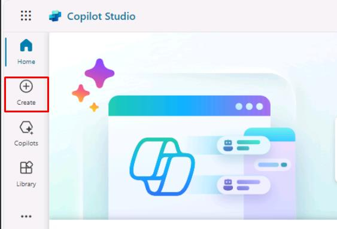

      1. On the **Create** page, select **New agent** near the upper-left corner of the page.

         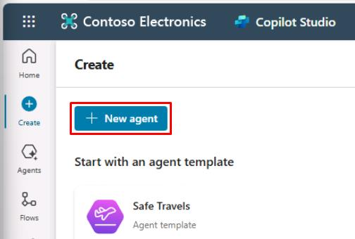
 
      1. In the upper-right corner of the page, select **Create**.

      1. In the upper-right corner of the page, select **Skip to configure**.  

         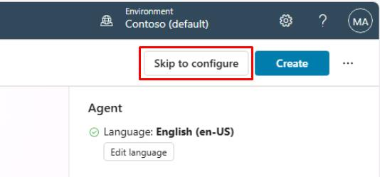

      1. In the upper-right corner of the page, select **Create**.

      1. In the upper-right corner of the page, select **Settings**.  
         
		 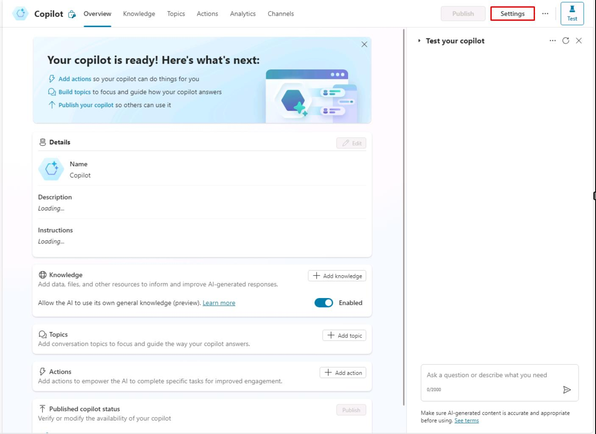

      1. On the **Settings** pane, select **✨ Generative AI**.

      1. Under **How should your agent interact with people?**, select **Generative**, then select **Save**.  

         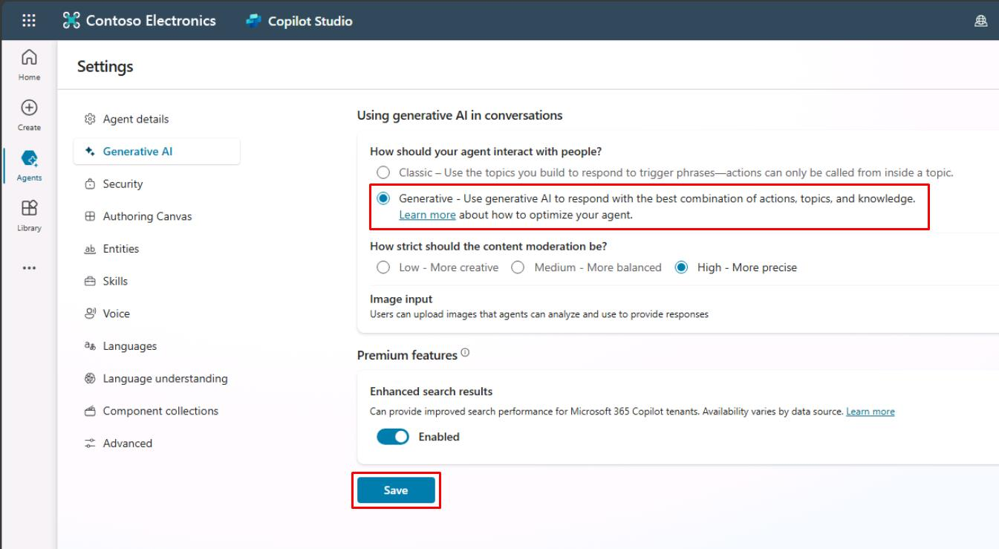

      1. Proceed to the next task.

	

1. In response to the agent name suggested, enter `OK`.

	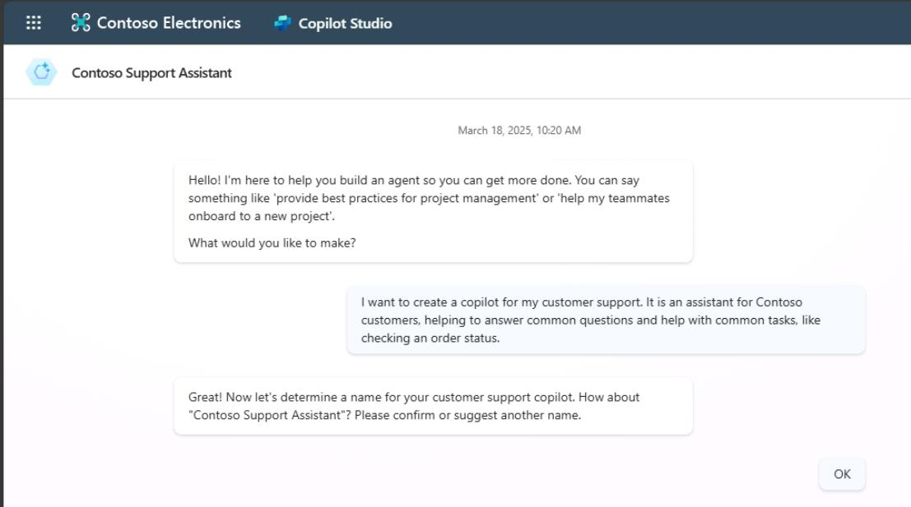

    {: .warning }
	> Note that the following steps may be in a different order for you, as the responses will vary. The agent may not even ask some of the questions. Be sure to input all four of the following prompts, regardless of the order.

1. If asked, confirm the agent's main purpose, or enter the following again:

	`It is an assistant for Contoso customers, helping to answer common questions and helping with common tasks, like checking order status.`

1. Enter the following to set up the agent's tone:

	`Playful tone, joyful, customer focused, but definitely professional.`

1. Enter the following to set up its boundaries and limitations:

	`We don't want to discuss other brands like Fabrikam. Never provide product comparisons with competitor technologies.`

1. Enter the following prompt to set up publicly accessible data sources: 

	`Information should come from https://learn.microsoft.com/en-us/microsoft-copilot-studio and from https://www.microsoft.com/en-us/microsoft-copilot.`

1. In the right pane, under **Get its knowledge**, select the checkboxes for confirming both URLs.

	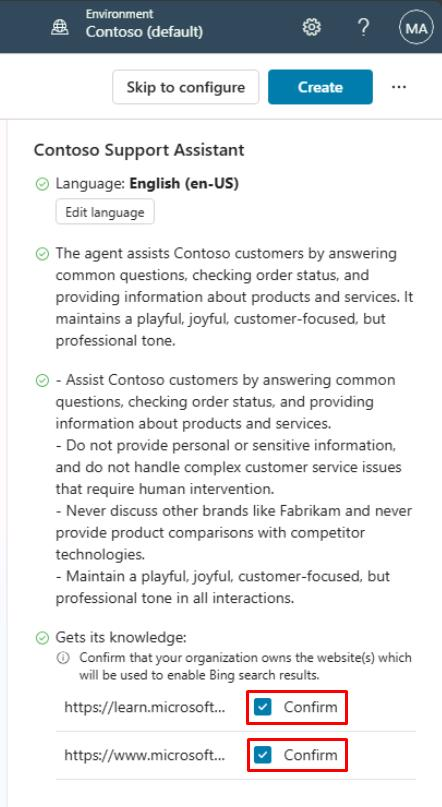

1. Select the ellipsis in the upper-right corner of the page, then select **Edit advanced settings**.

	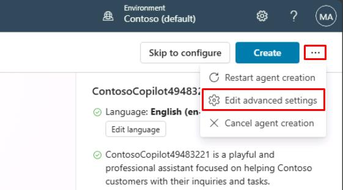

1. In the **Advanced Settings** window, under **Schema Name**, after the underscore, enter `ContosoCopilot@lab.LabInstance.Id`, then select **Save**.

	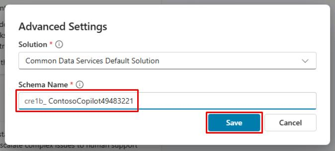

	{: .important }
	> Unlike the agent's display name, the schema name is a technical property that can't be changed after creation and must be unique.

1. Select **Create** in the upper-right corner of the window.
	
    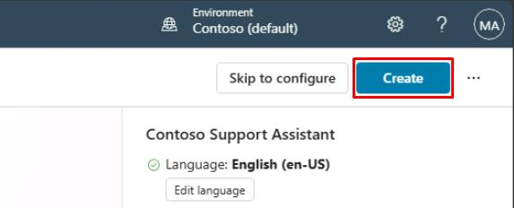

{: .important }
> You can also choose to avoid the conversational creation experience by selecting **Skip to configure**. You can set the agent's primary language in the **Edit language** menu. For the lab, be sure to remain in English (en-US). It's best practice to always configure your agent in the context of your own solution and publisher, so that the agent is created with the desired publisher prefix, and so you can easily export the agent and deploy it to other environments.

