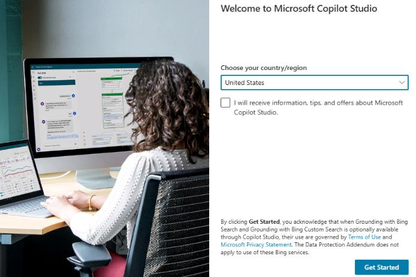
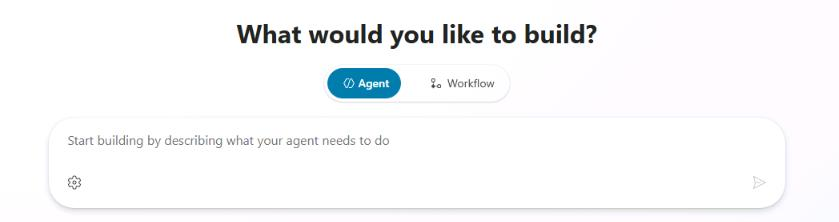
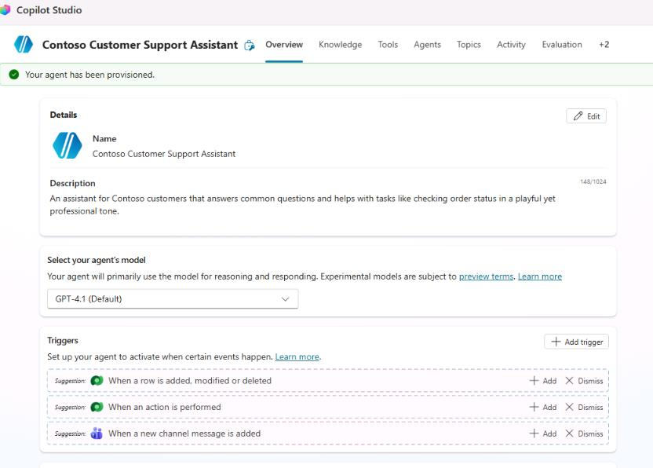
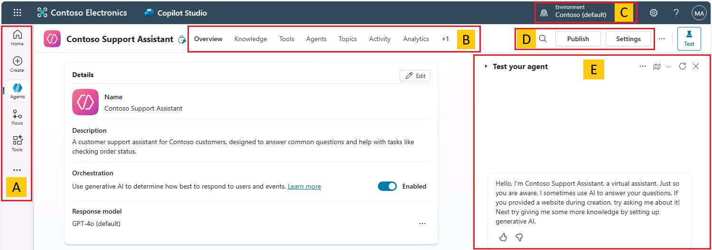
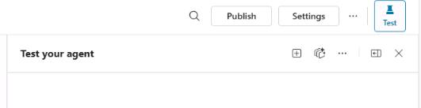
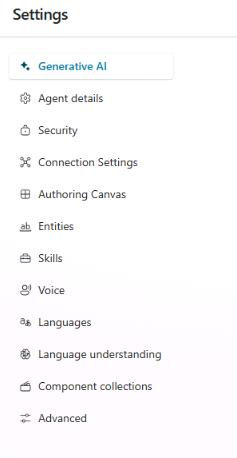
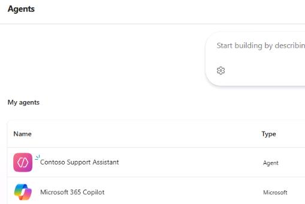
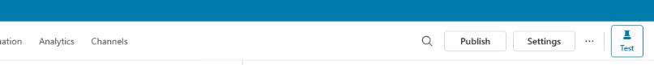
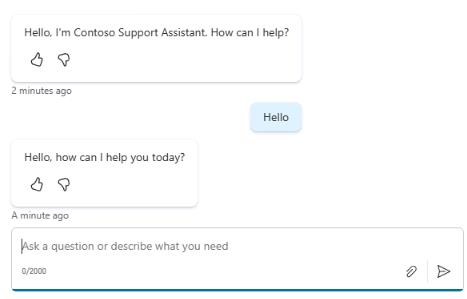

## Task 02: Create and test an agent

### Introduction

With the Power Platform environment prepared, your next step is to create a customer support agent for Contoso. This task involves defining the agent's purpose, customizing its tone and limitations, and specifying external knowledge sources. Completing these steps ensures the agent is tailored to Contoso's specific support scenarios and customer interactions.

### Description

In this task, you'll use Microsoft Copilot Studio to define and create your first AI-driven agent. You'll specify the agent's purpose, tone, conversational boundaries, and data sources, preparing it for initial testing.

### Success criteria

- You've created an agent by using Copilot Studio.
- You've defined the agent's purpose, tone, and boundaries.
- You've connected the agent to external knowledge sources.


### Key tasks

---

#### 01: Create an agent

{: .warning }
>  Copilot Studio is evolving rapidly. The user interface and behavior of elements may differ from what you see in the instructions. Collaborate with your coaches and other learners to identify workarounds as needed.

1. Open a new browser tab and go to `copilotstudio.microsoft.com`.

1. If prompted, sign in by using the following credentials:

	| Item | Value |
	| ---- | ----- |
	| Username | `@lab.CloudPortalCredential(User1).Username` |
	| TAP Token | `@lab.CloudPortalCredential(User1).AccessToken` |
	

1. In the **Welcome to Microsoft Copilot Studio** dialog, select your region and then select **Get Started**.

	

1. Close any other dialogs that display.


1. Select the **Start building by describing what your agent needs to do** field.

	


1. Enter the following prompt and then select **Enter**:

	```
	I want to create an agent for my customer support. It is an assistant for Contoso customers, helping to answer common questions and helping with common tasks including checking order status.
		
	It is an assistant for Contoso customers, helping to answer common questions and helping with common tasks, like checking order status.

	Use the name Contoso Customer Support Assistant for the agent.

	Playful tone, joyful, customer focused, but definitely professional.

	We don't want to discuss other brands like Fabrikam. Never provide product comparisons with competitor technologies.`

	Information should come from https://learn.microsoft.com/en-us/microsoft-copilot-studio and from https://www.microsoft.com/en-us/microsoft-copilot.
	```

1. On the command bar, select **Create**.

1. After Copilot Studio creates the agent, the **Agent** page displays.

	

1. Leave Copilot Studio open and continue to the next task.


---

#### 02: Explore the Copilot Studio user interface





1. Review the options on the left pane. These include:

	

	- **Home** - View a list of recently created agents, agent templates to get you started, and learning resources. 
	- **Agents** - View the agents you can access. 
	- **Flows** - View the agent flows (automations) that you can access.
	- **Tools** - View a list of tools that you can access. Tools include prompts, custom connectors, REST APIs, and Model Context Protocol connectors.

1. Review the command bar options. These include:

	

	- **Overview** - Provide a description of the agent and instructions, and see a quick view of the agent's configuration including knowledge sources, topics, actions, and publish status.
	- **Knowledge** - Manage the agent knowledge sources (such as websites or files).
	- **Tools** - Create building blocks that enable your agent to interact with external systems.
	- **Topics** - Manage custom and system topics. Topics are the core building blocks of an agent.
	- **Analytics** - View metrics to monitor how well your agent is serving your users and identify ways to improve the agent. 
	- **Channels** - Configure how your agent is made available to your users (for example, Teams or a website). 
 
1. Review the Environment selection area. This is where you can select the environment that you'll be working with. If you only have one environment, you may not see this area in the user interface.

1. Review the agent management and publishing options. These include:

	

	- **Publish** - Make the latest version of your agent available to your users. 
	- **Settings** - Manage your agent configuration. 

1. Review the agent testing area. You can use this area to immediately see the impact of changes that you made to an agent.

	

---

#### 03: Explore Copilot Studio settings 

1. On the command bar for the agent, select **Settings**.

      

1. Review the **Settings** page. The page includes the following sections:

	

	- **Generative AI** - Select how the agent responds to prompts. This is also where you can configure content moderation settings for knowledge sources (to reduce risks of hallucinations).
	- **Agent details** - Update the agent display name, icon, and modify advanced settings.
	- **Security** -Configure authentication and security for the agent.
	- **Entities** - Configure these structured data objects to represent real-world concepts or items that the agent must work with.
	- **Skills** - Configure skills to extend the agent's conversational abilities. Skills can automate series of actions in a topic.
	- **Language understanding** - Where you can configure custom language models developed and trained on Azure AI Language in Azure 

	{: .important }
	> Lab activities for "test out" version of lab are in progress. Please disregard **Score** button for now.

#### 04: Test the agent

1. In the left pane, select **Agents**.

	

1. On the **Agents** page, select **Contoso Customer Assistant**.

	
	
1. In the upper right of the page, select **Test**.

	

	{: .note }
	> The **Test your agent** pane shows that a message has already been sent to you from the agent. This message was sent from the **Conversation Start** topic, which begins automatically.

1. At the bottom of the **Test your agent** pane, in the text field,  enter `Hello` and then select **Enter**.

	

1. Leave the Copilot Studio page open. You'll add a topic to the agent in the next task.

	{: .important }
	> Lab activities for "test out" version of lab are in progress. Please disregard **Score** button for now.