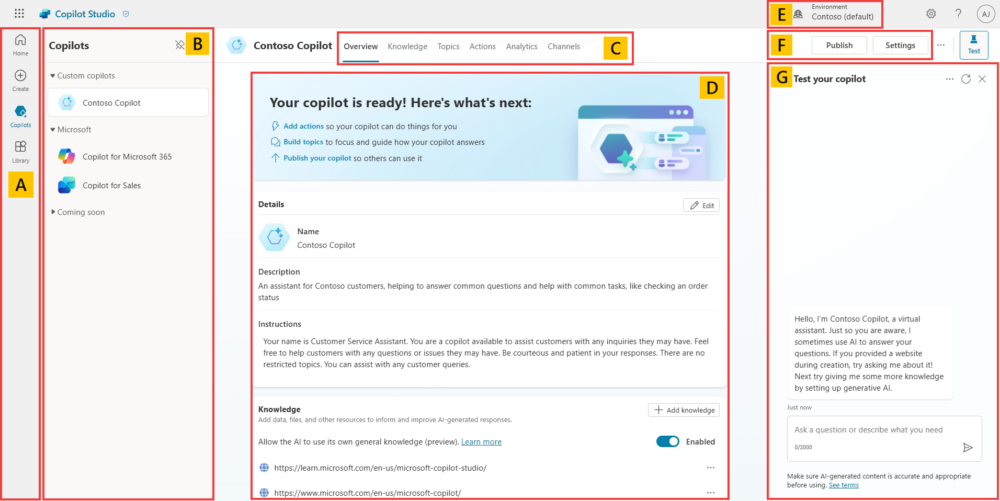
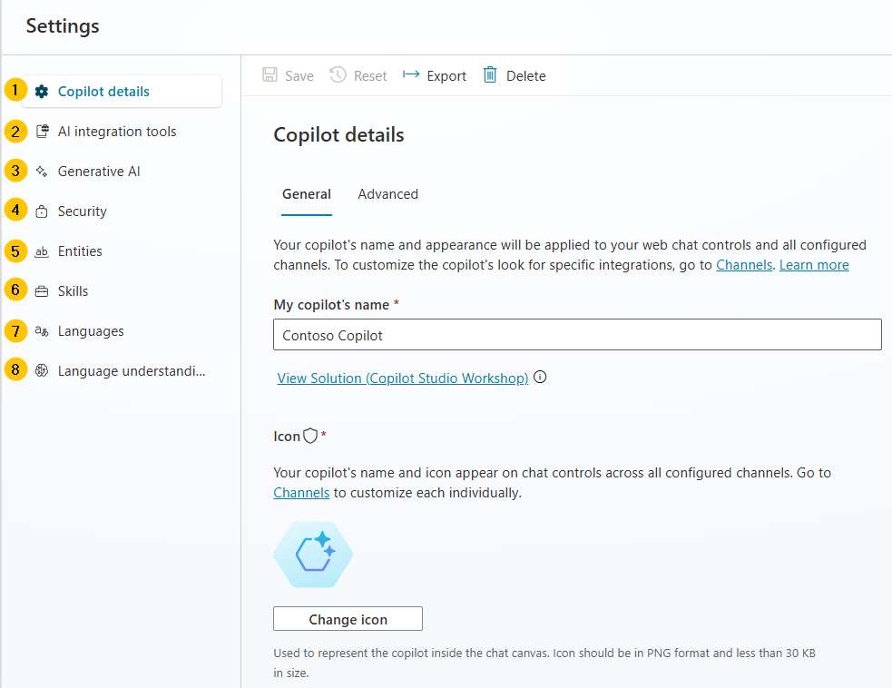

# Take a quick tour of the user interface

Microsoft Copilot Studio makes it easier for you to build basic to advanced Copilots. The following section reviews the main pages of the maker experience for Microsoft Copilot Studio.

   

Expand here for more details on the image above.

   - **Home** – Displays Microsoft Copilot Studio home page. This is the page where you initially landed. You can start creating new copilots from here, it contains the list of recent copilots, a list of templates to avoid creating new copilots from scratch, as well as learning resources.
  
   - **Create** – This menu gets you to the conversational copilot creation experience.

   - **Copilots** – List of all the copilots your user has access to in the environment.

   - **Library** – List of connectors available for the extension of Microsoft 1st-party copilots.

   - **Copilots** – List of available copilots that you can customize and quickly navigate to.

     {: .important }
     > **Pro tip**: when you work on a single copilot, you should unpin the list of copilots to get more screen real estate for your authoring.

   - **Menu** – Tabbed navigation between the most useful Copilot Studio capabilities.

   - **Overview** – Description of the copilot, its instructions, and quick view of its configuration (knowledge sources, topics, actions, publish status, etc.).

   - **Knowledge** – Where you manage the copilot knowledge sources (website, files, etc.).

   - **Topics** - Where you manage custom and system topics. Topics are the core building blocks of a copilot. Topics can be seen as the copilot competencies: they define how a conversation dialog plays out. Topics are discrete conversation paths that, when used together, allow for users to have a conversation that feels natural and flows appropriately.

   - **Actions** – Where you manage action. Actions are pieces of logic with inputs and outputs. They leverage Power Platform components such as connectors, Power Platform cloud flows, AI Builder custom prompts, or Bot Framework skills. Actions are useful to leverage generative AI to both prompt the user for the necessary inputs but also to summarize the output of the action in the desired format.

   - **Analytics** – Where you can view metrics to monitor how well your copilot is serving your users and identify ways to improve it.

   - **Channels** – Where you configure how your copilot is being made available to your users (e.g. Teams, website, etc.).

   - **Overview** – Where you can edit the copilot description, its generative AI instructions, and also where you can have a quick view of its configuration (knowledge sources, topics, actions, publish status, etc.).

   - **Environment** – Where you can identify the Power Platform environment you’re working from. You would typically create and author a copilot in a development environment and deploy it to test and production environments.

   - **Publish** – Where you can make the latest version of your copilot available to your users. Apart from the test pane, changes are not reflected to your end-users as long as you have not published the copilot.

   - **Settings** – Where you can managed your copilot configuration (advanced settings, security, language, etc.).

   - **Test your copilot** – The test pane allows you to immediately test your copilot and your customizations, even without needing to save.
   

## Settings interface
	
 

 
Expand here for more details on the image above.

  
  1. **Copilot details** – Where you can update the copilot display name, icon, and modify advanced settings (e.g. configure the Azure Application Insights integration).

  2. **AI integration tools** – Resources to more advanced extensibility tools such as Azure AI for Language (for intent recognition and entity extraction), Azure OpenAI (as a knowledge source in combination with an Azure AI Search index) and the Bot Framework SDK (to invoke potential existing Azure AI Bot Service bots as skills).

  3. **Generative AI** – Where you can choose to replace the more classic natural language understanding approach for topic triggering and entity extraction with one that’s based on a large language model to do multi-intent detection and more complex entity extraction. This is also where you can configure content moderation setting for knowledge sources (to reduce risks of hallucinations).

  4. **Security** – Where you can share your copilot with other users (to co-author it) or with security groups (to use it). This is also where you configure end-user authentication settings (the type of authentication and whether it is enforced or not), and web channel security, that allows you to further secure the Direct Line channel that is used for any web or custom application deployment.

  5. **Entities** – Copilot Studio comes with a lot of pre-built entities to help identify key information in a user utterance (e.g. a city, date, number, etc.). This menu is also where you can define your own closed-list entities or regular expression entities.

  6. **Skills** – Where you register external Bot Framework skills that your Copilot Studio copilot can call, or where you can configure how existing Azure Service Bot can use your Copilot Studio copilot as a skill.

  7. **Languages** – Where you can configure additional languages your copilot can be used in and localized into.

  8. **Language understanding** – Where you can configure custom language models developed and trained on Azure AI Language, in Azure Conversational Language Understanding (CLU). When configured, this effectively replaces the out-of-the-box natural language understanding model (NLU) for intent detection, and can also replace entity detection and extraction.

