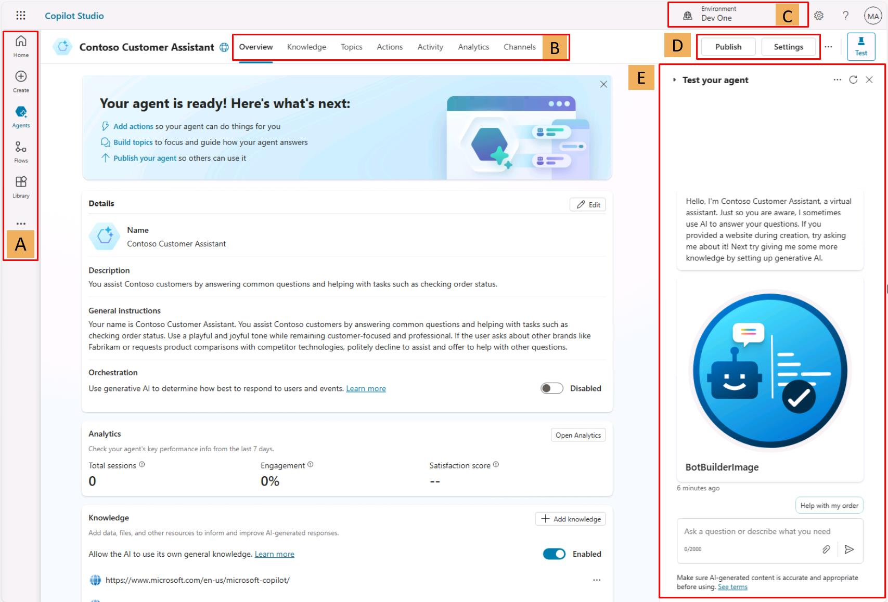
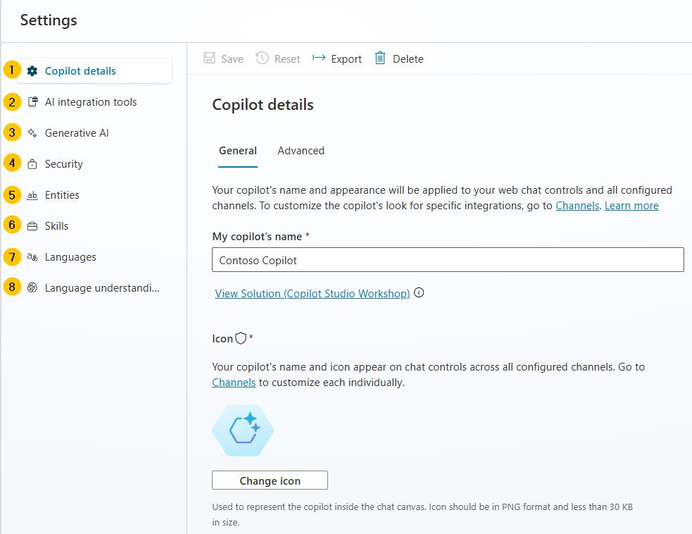

# Task 03: Take a quick tour of the user interface

## Introduction

After creating your customer support agent, the next step is to familiarize yourself with the Microsoft Copilot Studio user interface. Understanding the UI is essential for effectively managing and authoring topics, configuring actions, and monitoring agent performance.

## Description

In this task, you’ll explore the primary components of the Copilot Studio user interface, including key navigation areas such as agent creation, topic management, actions, analytics, channels, settings, and testing.

## Success criteria

-   You’ve successfully navigated the main Copilot Studio pages.
-   You understand the primary functions and sections of the Copilot Studio user interface.

## Learning resources

Microsoft Copilot Studio makes it easier for you to build basic to advanced agents. The following section reviews the main pages of the maker experience for Microsoft Copilot Studio.

## Key tasks

### 01: Learn about the main pages of Copilot Studio

 
  
<strong>Expand this section to view the solution</strong>
 

 
#### **A**
- **Home** - Microsoft Copilot Studio home page where you can start creating new agents from. It contains the list of recent agents, a list of agent templates to get you started, and learning resources. 
- **Create** - This menu gives you the conversational agent creation experience. 
- **Agents** - List of all the agents you have access to in the environment. 
- **Library** - List of connectors available for the extension of Microsoft first-party agents. 

#### **B**
- **Overview** - Description of the agent, its instructions, and a quick view of its configuration (knowledge sources, topics, actions, publish status, and so on). 
- **Knowledge** - Where you manage the agent knowledge sources (such as websites or files). 
- **Topics** - Where you manage custom and system topics. Topics are the core building blocks of an agent. Topics can be seen as the agent competencies: they define how a conversational dialog plays out. Topics are discrete conversation paths that, when used together, allow users to have a conversation that feels natural and flows appropriately. 
- **Actions** - Where you manage actions. Actions are pieces of logic with inputs and outputs. They leverage Power Platform components such as connectors, Power Platform cloud flows, AI Builder custom prompts, or Bot Framework skills. Actions are useful to leverage generative AI to prompt the user for the necessary inputs as well as to summarize the output of the action in the desired format. 
- **Analytics** - Where you can view metrics to monitor how well your agent is serving your users and identify ways to improve it. 
- **Channels** - Where you configure how your agent is made available to your users (for example, Teams or a website). 
 
#### **C**
- **Environment** - Where you can identify the Power Platform environment you're working from. You would typically create and author an agent in a development environment and deploy it to test and production environments. 

#### **D**
- **Publish** - Where you can make the latest version of your agent available to your users. Apart from the test pane, changes are not reflected to your end users if you haven't published the agent. 
- **Settings** - Where you can manage your agent configuration (such as advanced settings, security, and language). 

#### **E**
- **Test your agent** - Where you can immediately test your agent and your customizations, even without saving. 

### 02: Learn about the Copilot Studio settings interface

 
  
<strong>Expand this section to view the solution</strong>
 

1. **Copilot details** - Where you can update the agent display name, icon, and modify advanced settings (for example, configure the Azure Application Insights integration). 

2. **AI integration tools** - Where you can find more advanced extensibility tools such as Azure AI for Language (for intent recognition and entity extraction), Azure OpenAI (as a knowledge source in combination with an Azure AI Search index), and the Bot Framework SDK (to invoke potential existing Azure AI Bot Service bots as skills). 

3. **Generative AI** - Where you can choose to replace the more classic natural language understanding approach for topic triggering and entity extraction with one that's based on a large language model to do multi-intent detection and more complex entity extraction. This is also where you can configure content moderation settings for knowledge sources (to reduce risks of hallucinations). 

4. **Security** - Where you can share your agent with other users (to co-author it) or with security groups (to use it). This is also where you configure end-user authentication settings (the type of authentication and whether it's enforced), and web channel security, that allows you to further secure the Direct Line channel that's used for any web or custom application deployment. 

5. **Entities** - Copilot Studio has many pre-built entities to help identify key information in a user utterance (for example, a city, date, or number). This menu is also where you can define your own closed-list entities or regular expression entities. 

6. **Skills** - Where you register external Bot Framework skills that your Copilot Studio agent can call, or where you can configure how existing Azure Service Bot can use your Copilot Studio agent as a skill. 

7. **Languages** - Where you can configure additional languages your agent can be used in and localized into. 

8. **Language understanding** - Where you can configure custom language models developed and trained on Azure AI Language in Azure Conversational Language Understanding (CLU). When configured, this effectively replaces the out-of-the-box natural language understanding model (NLU) for intent detection and can also replace entity detection and extraction. 

