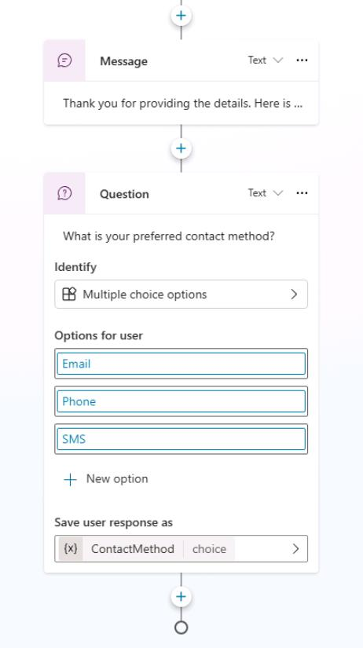

## Task 03: Create a topic

### Introduction

To address specific customer inquiries and requests at Contoso, you need to create customized conversation topics. In this task, you'll define a topic tailored to handling customer queries, such as checking order status, enabling the agent to manage real-world customer service scenarios effectively.

### Description

In this task, you'll manually create a new topic within Microsoft Copilot Studio, define trigger phrases, set up **Question** and **Message** nodes, and verify the conversational flow.

### Success criteria

- You've successfully created a new conversational topic.
- You've configured trigger phrases, **Questions**, and **Message** nodes correctly.
- You've verified the topic behavior through agent testing.

### Key tasks

---

### 01: Disable generative AI orchestration
In this section, you'll disable generative AI orchestration to force the agent to use content and behavior that you'll define when you create the topic.

1. On the command bar for the agent, select **Settings**.

    

1. On the **Settings** page, in the list of Settings, select **Generative AI**.

    

1. Set **Use generative AI orchestration for your agent's responses?** to **No** and then select **Save**.

    

1. Wait until the change is saved and then select **X** in the upper-right corner of the **Settings** page to close the page.

    

---

### 02: Review the topic user interface

Now that you've created your first topic, you can explore the authoring user interface (UI) to become more familiar with it.


1. **Topic title** - The name of the topic you're currently editing, visible on the **Topics** page.

1. **Productivity bar** - Provides access to tools, such as cut, copy, paste, and delete for the nodes (**Messages**, **Questions**, and so on).

1. **Copilot**, **Comments**, **Variables**, **Topic checker**, **Details**, **Analytics**, **Open code editor**, and **Reset to default** buttons - This area includes: Copilot, which helps you create and update topics using descriptions in natural language; **Comments**, where authors can collaborate and leave comments on nodes; the **Variables** menu, to see the list of topic-level and global variables, and their runtime value in the test tab; **Topic checker**, which you can run anytime from the authoring canvas to check if errors have occurred in your topic that the platform can detect (and if left unresolved would prevent you from publishing the agent); and **Details**, to access the topic properties.

1. **More** - Shows topic usage metrics; Open code editor switches the user interface from a no-code/low-code experience to a pro-code view of the underlying YAML configuration of the topic that developers can edit directly. For some system topics, an option is available to revert the topic content to its original state.

1. The **Save** button saves the topic changes.

1. The **Topic details** menu allows the agent author to update the topic Name, Display name, Description, and Status (active/inactive). When generative AI orchestration is enabled, the display name is replaced with model display name, and model description becomes available. This menu also allows the configuration of inputs and outputs. The inputs can be automatically slot filled when using generative AI as the orchestrator.

1. The **trigger switcher** button is present at the **Trigger** node of every topic. By default, new topics have the **Phrases** trigger (or are triggered by Copilot, when generative AI orchestration is enabled), but this can be switched to **Message received**, **Event received**, **Activity received**, **Conversation update received**, **Invoke received**, **Redirect**, and **Inactivity**.

1. **Add a new node** - Allows the agent author to add activities to a topic, such as sending a message, asking a question, and adding a condition, to build the dialog logic.

1. **Authoring canvas controls** - You can use these controls to navigate the authoring canvas, which can become large for extensive topics. The included controls are a map of the canvas, zoom, hand, selection, and reset.

---

### 03: Create the topic

1. On the command bar for the agent, select **Topics**.

   

1. On the **Topics** page, select **Add a topic** and then select **From blank**.

    

1. At the upper left of the page, select **Untitled** and then enter `Check Order Status`. Select **Enter** to save the name change.

    

    

1. Within the **Trigger** node, in the **User says a phrase** section, select **Edit**.

    

1. On the **Phrases** pane, in the **Add phrases** field, enter `order status` and then select **+**.

    

1. Repeat Step 5 for each of the following phrases and then close the **Phrases** pane.

    - `track my order`
    - `where is my package`
    - `check order status`
    - `has my order shipped`

    

    

1. On the command bar for the agent, select **Details**.

    

    {: .note }
    > You can use the **Details** pane to  provide a different **Display name** (what the end user will see) from the configured topic **Name** (what the maker sees).
    > 
    > The **Details** pane is also where you can configure topic input and output variables. 
    >
    > 

1. On the command bar for the agent, select **Save**.

    

---
### 04: Add content to the topic and test the topic

In this section, you'll add a single **Question** node, **Message** node, and configure topic redirection so that you can become familiar with the overall process of creating a topic, testing, and publishing in Microsoft Copilot Studio.

You use the **Question** node when you're expecting a response from the user and you want to do something based on that information. The user response is stored in a variable.

1. Below the **Trigger** node, select **+** and then select **Ask a question**.

   

1. In the **Question** node, in the text field, enter the following text: `What would you like to do with your order?`

    

1. In the **Identify** section, change the value from **Multiple choice options** to **User's entire response**.

    

1. In the **Save user response as** section, select **Var1**. This opens the **Properties** pane for the variable. 

    


1. In the **Variable name** field, enter `OrderRequest`.

    

    {: .important }
    > It's best practice to name variables so they can be clearly identified when you reference them in your logic. It also adds clarity when doing tests and checking the variable values at runtime.
    
1. At the upper right of the **Question** node, select the ellipses (**...**) and then select **Properties**. 

    
    
1. Select **Question behavior**.

    

1. In the **Skip behavior** section, select **Allow question to be skipped**.

    

    {: .important }
    > You can also define whether a user can jump to another topic without answering the question, and you can define the list of topics that are allowed in case of interruption. It's best practice to define retry prompts in case the user doesn't understand what's expected from them the first time. It's then appropriate to be much more explicit with the user when trying to help them properly answer a question.
    >
    > You can also use variables within **Message** nodes in the body of text displayed to the user, which is dynamic based on the data stored within the variables. This capability allows messages to be more personal, such as **Hello {System.User.FirstName}, I can get those order details for you, one moment**.


1. Below the **Question** node, select **+** and then select **Send a message**.

    

1. In the **Message** node, in the text field, enter the following text: `Thank you for your question!.`

    
    
    {: .note }
    > At this point, the agent can acknowledge that a user has asked a question. The agent does not take any other action. You'll add to the agent later in the lab to build out a response.

1. Below the **Message** node, select **+**. Select **Go to another topic** and then select **End of Conversation**

    

    {: .note }
    > The **End of Conversation** node redirects to a topic dedicated to ending a chat session. This topic asks the user if the question has been answered and suggests that the user completes a customer satisfaction survey.

    {: .important }
    > It's best practice to end discrete dialog paths with the **End of Conversation** topic. This allows the user to confirm that their question was addressed. When a user confirms, a customer satisfaction (CSAT) survey is displayed.  

1. Review your work. The topic that you created shouldresemble the following screenshot:

    

1. On the command bar for the agent, select **Save**.

    


1. In the **Test your agent** pane, select the **Refresh** to start a new conversation.

    

1. Enter the following prompt twice to validate that the agent behaves as expected: ```I'd like to check the status of my order please```

    

---

### 04: Use Copilot to create a topic

Creating topics in Microsoft Copilot Studio is more effortless than before. You can create a topic in Microsoft Copilot Studio by using natural language to describe what you want the topic to do. 

1. On the command bar for the agent, select **Topics**.

    

1. Select **Add a topic** and then select **Add from description with Copilot**.

    

1. Use the following information to complete the **Add from description with Copilot** dialog and then select **Create**.

    | Item | Value |
    | ---- | ----- |
    | **Name your topic** | `Support Ticket` |
    | **Create a topic to** | `Create a support ticket, including a title, severity (high / medium / low), description, and an email address to send update notifications to. Define variables following this naming pattern: Topic.TicketTitle.` |

    

    {: .note }
    > Copilot creates the topic, including trigger phrases, **Question** nodes, entity selection, variable naming, and **Message** node confirmation.

1. On the command bar for the agent, select **Copilot** to display the **Edit with Copilot** pane.

    

1. On the **Edit with Copilot** pane, in the  **What do you want to do?** field, enter the following text and then select **Update**:

    ```Before the last message, ask a question to find out the user's preferred contact method, choosing from email, phone, or SMS.```

    

    {: .note }
    > Copilot adds a **Question** node which asks the customer for their contact method and stores their choice in a variable.

    


1. On the command bar for the agent, select **Save**.

1. Leave the Copilot Studio page open. You'll publish the agent in the next task.
