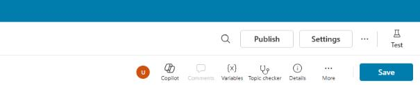
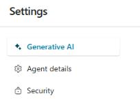
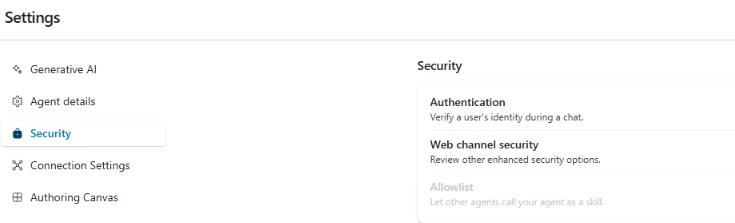
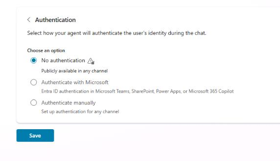
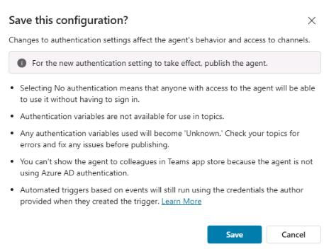
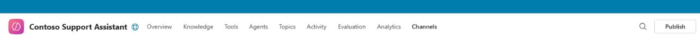
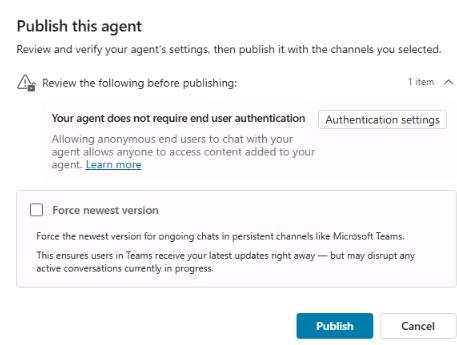
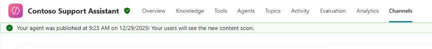
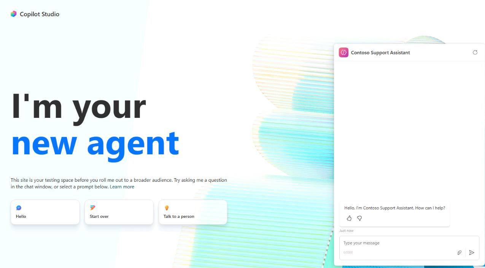

## Task 04: Publish the agent to the demo website for testing

### Introduction

To gather initial feedback from stakeholders at Contoso and validate the agent's readiness, you need to publish your newly created agent to a demonstration website. This step allows for practical testing in a simulated environment, helping ensure the agent meets customer service requirements.

### Description

In this task, you'll publish the Microsoft Copilot Studio agent to a demo website. You'll configure authentication settings, perform the publishing action, and validate that the agent is accessible and operational on the demo site.

### Success criteria

- You've successfully configured authentication settings for the demo environment.
- You've published the agent to the demo website.
- You've validated that the agent is accessible and responding correctly through the demo website.

### Key tasks

---

#### 01: Configure agent authentication

For the purposes of this lab, you'll set the agent to not require authentication so that anyone with a link to the demo site can test the agent.

1. On the command bar for the agent, select **Settings**.

	

1. On the **Settings** page, in the list of Settings, select **Security**.

	

1. On the **Security** page, select **Authentication**.

	

1. Select **No authentication**, then select **Save**.

	

1. In the **Save this configuration?** dialog, select **Save**.

   

1. Close the **Settings** page.

---

#### 02: Publish the agent

Microsoft Copilot Studio provides a demo website so that you can invite anyone to test your agent by sending them the URL. This demo website is useful for gathering feedback to improve your agent.

1. On the command bar for the agent, select **Publish**.

	

1. In the **Publish this agent** dialog, select **Publish**.

	

	{: .important }
	> You must publish the agent at least once before you can add the agent to channels to make it reachable by your customers.

1. Wait for publishing to complete. A banner will display at the top of the page to confirm status.

	

	{: .important }
	> Publishing to the demo website is a quick process, but publishing an agent for real-world use (for example, in Microsoft Teams) can take longer.
	> 
	> For Teams, you may need to initiate an approval workflow as an administrator before the agent is made available to users in the Teams channel. The publishing process ensures that all updates are properly validated and deployed across the environment.

1. On the command bar, select the ellipses (**...**) and then select **Go to demo website**.

	{: .note }
	> You can interact with the agent by typing in the chat window, or by selecting a starter phrase from the options provided on the left.

	

1. Close the Demo website page. Leave the Copilot Studio page open.