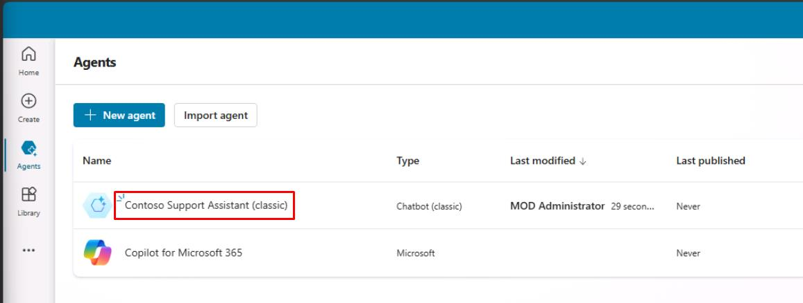
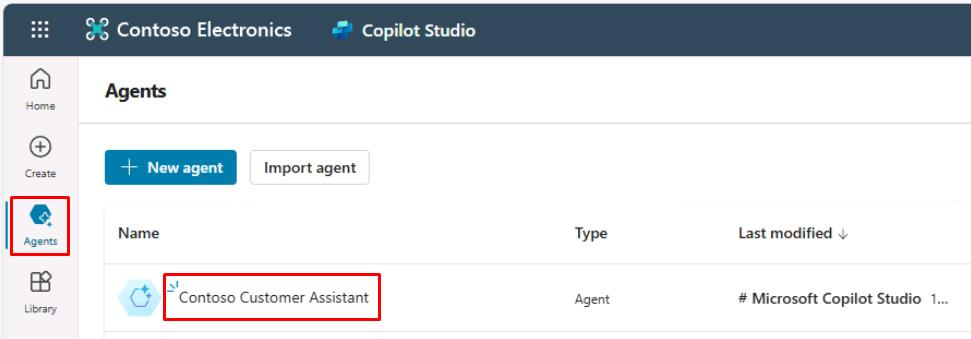
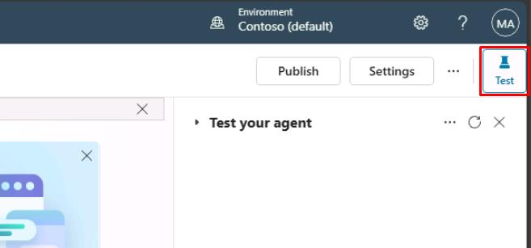
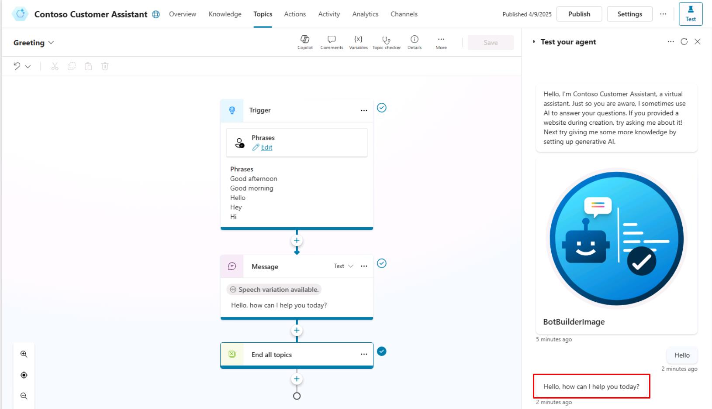

# Task 04: Test your agent

## Introduction

With the initial setup and configuration completed, you now need to verify that the agent responds as intended. In this task, you’ll test basic interactions to ensure the agent correctly interprets and responds to common user inputs, reflecting the intended customer service experience for Contoso.

## Description

In this task, you’ll use the built-in testing tool in Microsoft Copilot Studio to interact with your agent. You’ll test various conversation scenarios to verify that your agent responds appropriately to user prompts.

## Success criteria

-   You’ve successfully tested basic conversational scenarios with the agent.
-   You’ve validated that the agent responds correctly according to defined settings.

## Key tasks

### 01: Test your agent

 
  
<strong>Expand this section to view the solution</strong>
 

1. If not automatically opened, select the agent you just created.

	

	{: .warning } 
	> For those using the optional pre-built agent:
	> 
	> 1. Select **Agents** in the left menu.
	> 1. Select **Contoso Customer Assistant**.
	>	

1. You can always access the **Test your agent** pane by selecting **Test** in the upper-right corner of the window.

	

	{: .note }
	> The **Test your agent** pane shows that a message has already been sent to you from the agent. This message was sent from the **Conversation Start** topic, which begins automatically.

1. In the bottom text box of the **Test your agent** pane, enter `Hello`, then select **Enter**.

	

{: .important }
> You can select messages in the test pane to get redirected to the exact topic and node it was used in. You'll learn about topics and nodes shortly! 
> 
> 

