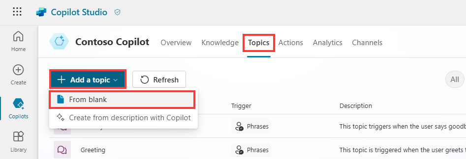
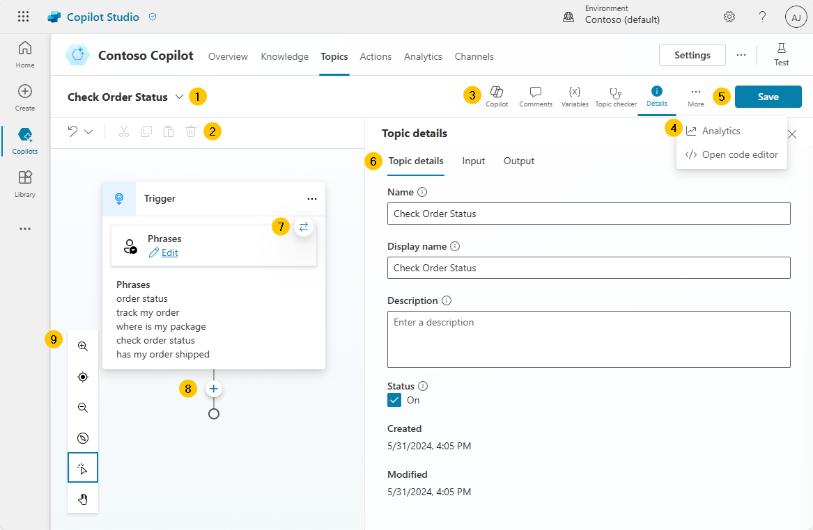
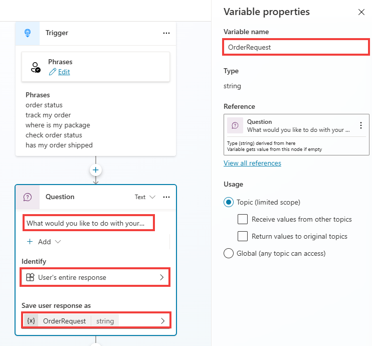
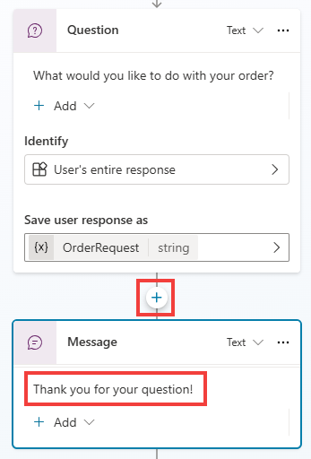
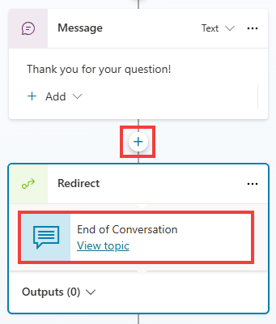
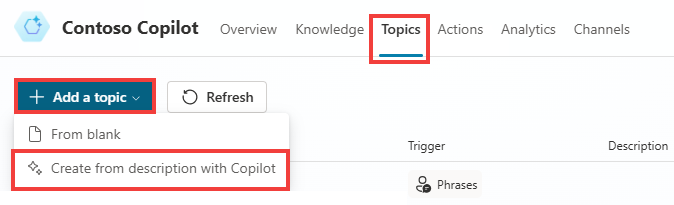
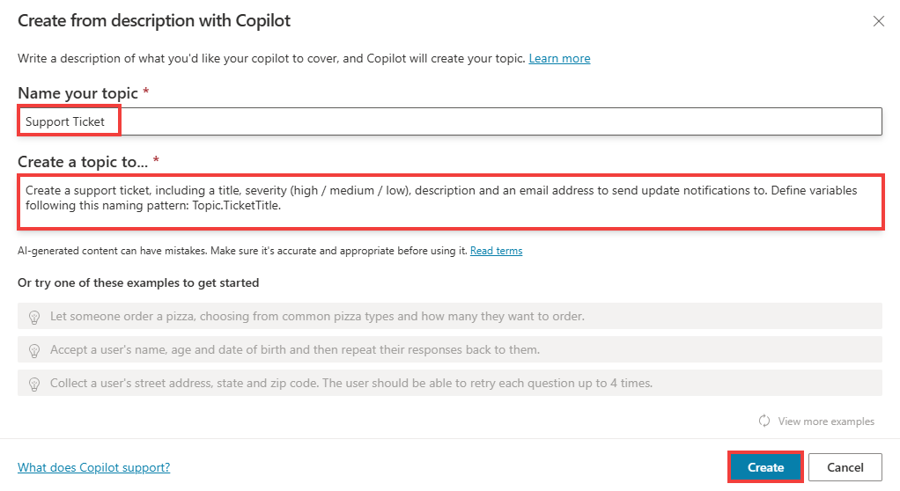
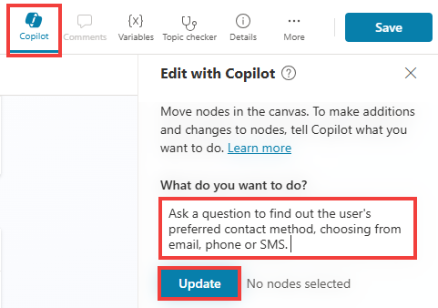
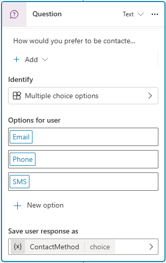
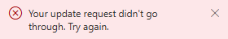

# Create your first topic

## Task 5.1: Create a new topic manually

In this first task, you manually create a new topic by following these steps:

1.	Select **Topics** in the left menu within Microsoft Copilot Studio.

2.	From the **Add a topic** drop down at the top of the screen, select the **From blank** option.

 	

3.	Rename your **topic title**, by clicking on **untitled** and renaming it to **Check Order Status**.

4.	Select **Phrases**, under the topic **Trigger**, and select **Edit**.

5.	Paste the following phrases, and hit enter.
	
 	```plaintext
	order status track my order where is my package check order status has my order shipped
	```
  	
1.	Select the **Details** button within the top right corner to open the **Topic details** pane.

	- This is where you can set a different Display name (what the end-user may see) from the configured topic Name (what the maker sees).

	{: .important }
	> **Pro tips**: The Display name is used in case of disambiguation (for example, when multiple topics match a user utterance, the user is prompted to choose between two or three recognized topics, in a “Did you mean…” question.  When generative AI orchestration is used instead of the built-in natural language understanding for topic triggering, the display name is called the Model display name and is used in addition to the Model description as part of the intent detection process. The Details pane is also where you can configure topic input and output variables. This is useful when the topic is invoked by another topic, or when generative AI orchestration is turned on, effectively using a large language model to slot fill the necessary variables and automatically prompting the user for missing inputs.

1.	Select **Save**.

---

## Task 5.2: Review the topic user interface

Now that you created your first topic, albeit without content except trigger phrases, you can explore the authoring user interface (UI) to become more familiar with it.

 


   <details>
    <summary>Expand here for more details on the image above.</summary>

1. **Topic title** – The name of the topic that you're currently editing, which is visible on the Topics page.

2. **Productivity bar** – Where you have access to tools, such as cut, copy, paste, and delete for the nodes (messages, questions, etc.).

3. **Copilot, Comments, Variables, Topic checker, Details, Analytics, Open code editor, and Reset to default buttons** – This area includes: Copilot, which helps you create and update topics using descriptions in natural language; Comments, where authors can collaborate and leave comments on nodes; the Variables menu, to see the list of topic-level and global variables, and their runtime value in the test tab; Topic checker, which you can run anytime from the authoring canvas to check if errors have occurred in your topic that the platform can detect (and if left unresolved would prevent you from publishing the bot); the Details button to access the topic properties.

4. **… More** – Analytics shows topic usage metrics; Open code editor switches the user interface from a no-code/low-code experience to a pro-code view of the underlying YAML configuration of the topic that developers can edit directly. For some system topics, a Reset to default option is available to revert the topic content to its original state.

5. The **Save button** saves the topic changes.

6. The **Topic details menu** allows the maker to update the topic Name, Display name, Description and Status (active/inactive). When generative AI orchestration is enabled, display name is replaced with Model display name and Model description becomes available. It also allows the configuration of inputs and outputs. The inputs can be automatically slot filled when using generative AI as the orchestrator.

7. The **trigger switcher** button is present at the Trigger node of every topic. By default, new topics have the Phrases trigger (or Triggered by copilot, when generative AI orchestration is enabled), but this can be switched to Message received, Event received, Activity received, Conversation update received, Invoke received, Redirect and Inactivity.

8. **Add a new node** – the add a new node button allows the maker to add activities to a topic, such as send a message, ask a question, add a condition, etc., to build the dialog logic.

9. **Authoring canvas controls** - You can use these controls to navigate the authoring canvas, which can become large for extensive topics. The included controls are a map of the canvas, zoom, hand, selection and reset.
    </details>

---

## Task 5.3: Add content to your topic

This task doesn't cover how to add a large amount of content to your topic; rather, it provides the steps to add a single question node, message node, and topic redirection so that you can become familiar with the overall process of creating a topic, testing, and publishing in Microsoft Copilot Studio. The Publish demo exercise in this module covers a more in-depth review of the authoring capabilities in Microsoft Copilot Studio.

The next section of this task covers foundational knowledge for understanding the central components of Microsoft Copilot Studio and creating topics.


As a copilot author, you should use the Question node when you're expecting a response from the user and you want to do something based on that information. The user response is stored in a variable, and question nodes can also use entities and slot filling features, both concepts that are covered later in this exercise.

The Question node uses many functions that a Message node does, such as rich text, speech authoring, and rich text response types such images, videos, and Adaptive Cards.

---

1.	In the topic that you have open from the previous task, select the **+** button below the existing node in the canvas and then select **Ask a question** to add a new Question node.

2.	In the field, enter
	```plaintext
 	What would you like to do with your order?
 	```
	Then, make sure that the **Identify value** is set to User's entire response. 

	{: .important }
	> This node is asking the question after the topic is triggered about what the user wants to do. The Publish demo exercise extends this task to using entities and slot filling.

4.	By default, the user response is saved as a variable named **Var1**. You can click on the variable name to change its name, for example to **OrderRequest**.

	{: .important }
	> **Pro tips**: It is a best practice to always properly name variables so they can be clearly identified when you reference them in your logic, and it also adds clarity when doing tests and checking the variable values at runtime. Customers and partners can define and follow naming conventions for their variables, for consistency and ease of maintenance.

       

	{: .important }
	> **Pro tips**: Question behavior can be customized by clicking on …, Properties, and Question behavior. From here, you can define if the question can be skipped, how many time it should be re-prompted to the user, validation rules, and what should happen if the user doesn’t answer as expected.  You can also define whether a user can jump to another topic without answering the question, and you can define the list of topics that are allowed in case of interruption.  It is a best practice to define retry prompts in case the user doesn’t understand what is expected from them the first time. It is then OK to be much more explicit with the user when trying to help them properly answer a question.

	> Fundamental knowledge: Message node

	> You can use the Message node to display a message to the user. This message can be simple based on the topic of the conversation. In direct contrast to the Question node, the Message node doesn't expect or store an answer from the user. The Message node also has rich text options that you can display in text, or advanced options like cards, images, videos, and Adaptive Cards.

	{: .important }
	> **Pro tips**: To make the copilot sound more natural and human, you can configure message variations, so that the copilot will send one of the configured messages, avoiding strict repletion of the same message.

	> You can also use variables within message nodes in the body of text displayed to the user, which is dynamic based on the data stored within them. This capability allows messages to be more personal, such as **Hello {System.User.FirstName}, I can get those order details for you, one moment**. Variables can also store data to perform automation or calculations on them. Later exercises cover variables more in depth. Last, you can also add Power Fx formulas to create even more dynamic content.

1.	To add another node, select the **+** button below the Question node. Then, select **Send a message**. Enter a message that acknowledges the customer's question, such as **Thank you for your question!**.


 	

1.	End the conversation for the customer in this demo scenario. 

1.	Select the **+** button below the message node within the authoring canvas. Hover over the **Topic management** option, and then select **Go to another topic** and select **End of conversation**. 

	

	{: .note }
	> This will redirect to a topic dedicated to ending a chat session, asking of the question has been answered and suggesting to fill a customer satisfaction survey.


	{: .important }
	> **Pro tip**: It is a best practice to end discrete dialog paths with the End of Conversation topic. That way, the end-user can confirm their question was addressed. When a user confirms, a customer satisfaction (CSAT) survey is displayed. Resolution rates and CSAT scores are both displayed in the copilot analytics.

1.	Within the top right hand corner of the screen, select the **Save** button.

2.	Use the Test pane to validate that your bot behaves as expected.

3. 	**Refresh** the page, then, enter the prompt below to perform a new test.

	```plaintext
 	I'd like to check the status of my order please
 	```

   	{: .important }
   	> **Pro tip**: Trigger phrases don’t need to be an exact match of all the utterances a user might say.

---

## Task 5.4: Use Copilot to create a topic

Creating topics in Microsoft Copilot Studio is more effortless than before. Now, you can create a topic in Microsoft Copilot Studio by using natural language to describe what you want the topic to do. With the Create from description with Copilot feature, you can automatically build a topic, reducing some manual steps that you experienced from the first task in this unit. In this task, you'll learn how simple and quick creating a topic with Copilot can be.

1.	On the left side of the screen, from the **navigation pane**, select **Topics**.

1.	Select the **+** Create drop down and choose Topic and then **Create from description with Copilot**. A new window appears, asking you to Name your topic and enter a description in the **Create a topic to…** space.

 	

1.	Enter **Support Ticket** in the **Name your topic** field.

1.	In the **Create a topic to** space, enter the description of what your topic should do.

	```plaintext
 	Create a support ticket, including a title, severity (high / medium / low), description and an email address to send update notifications to. Define variables following this naming pattern: Topic.TicketTitle.
 	```

1.	Select **Create**.

 	

 	{: .note }
	> Copilot creates your topic, including the trigger phrases, question nodes, entity selection, variable naming, and message node confirmation.

1.	Select the **Copilot** button in the upper part of the **authoring canvas** (if the Edit with Copilot panel isn't open already). 

1.	Within the **Edit with Copilot** panel, in the field **What do you want to do?** add the additional instructions below and then select **Update**.

	**Before the last message, ask a question to find out the user's preferred contact method, choosing from email, phone or SMS.**

	

	{: .note }
	> Copilot automatically adds a question node, which both asks the customer for their contact method, and stores their choice in a variable.

	

	{: .important }
	> You can skip this step if you run into the below error:
 
 	

	The Copilot feature in Microsoft Copilot Studio drastically reduces authoring time, allowing you to create new topics and edit topics by using natural language. Additionally, the Edit with Copilot panel shows what updates have been created, and it provides suggestions for what you can update in your topic.

1.	Save your new topic.

2.	Use the Test pane to validate that your bot behaves as expected.

	{: .important }
	> Don’t hesitate to use the refresh icon to start a new conversation as opposed to resuming an old one.

