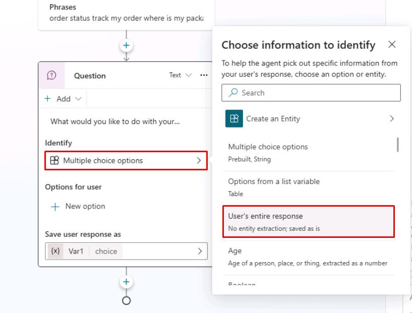
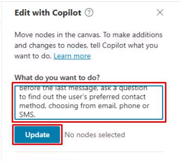

# Task 05: Create your first topic

## Introduction

To address specific customer inquiries and requests at Contoso, you need to create customized conversation topics. In this task, you'll define a topic tailored to handling customer queries, such as checking order status, enabling the agent to manage real-world customer service scenarios effectively.

## Description

In this task, you'll manually create a new topic within Microsoft Copilot Studio, define trigger phrases, set up **Question** and **Message** nodes, and verify the conversational flow.

## Success criteria

-   You’ve successfully created a new conversational topic.
-   You’ve configured trigger phrases, **Questions**, and **Message** nodes correctly.
-   You’ve verified the topic behavior through agent testing.

## Key tasks

### 01: Create a new topic manually In this first task, you'll manually create a new topic.

 
  
<strong>Expand this section to view the solution</strong>
 

1. In the same tab, select **Topics** on the top bar.

	

1. Select **Add a topic**, then select **From blank**.

	

1. Rename your topic title by selecting **Untitled** in the upper-left corner of the window, then enter `Check Order Status`.

	

1. Within the **Trigger** node, under **Phrases**, select **Edit**.

	

1. Under **Add phrases**, enter the following, then select **Enter** or the **+** button for each phrase.
	
	- `order status` 
	- `track my order` 
	- `where is my package` 
	- `check order status` 
	- `has my order shipped`

    
  	
1. Select the **Details** button in the upper-right of the main canvas pane.

	

	{: .note }
	> This is where you can set a different **Display name** (what the end user will see) from the configured topic **Name** (what the maker sees).

	{: .important }
	> The **Display name** is used in case of disambiguation (for example, when multiple topics match a user utterance, the user is prompted to choose between two or three recognized topics, with a "Did you mean..." question.
    >
    > When generative AI orchestration is used instead of the built-in natural language understanding for topic triggering, the display name is called the Model display name and is used in addition to the Model description as part of the intent detection process.
    >
    > The **Details** pane is also where you can configure topic input and output variables. This is useful when the topic is invoked by another topic, or when generative AI orchestration is turned on, effectively using a large language model to slot fill the necessary variables and automatically prompt the user for missing inputs.

1. Select **Save** in the upper-right part of the canvas to save the topic.

	

### 02: Review the topic user interface

 
  
<strong>Expand this section to view the solution</strong>
 

Now that you've created your first topic, albeit without content except trigger phrases, you can explore the authoring user interface (UI) to become more familiar with it.

1. **Topic title** - The name of the topic you're currently editing, visible on the **Topics** page. 

1. **Productivity bar** - Where you have access to tools, such as cut, copy, paste, and delete for the nodes (**Messages**, **Questions**, and so on). 

1. **Copilot**, **Comments**, **Variables**, **Topic checker**, **Details**, **Analytics**, **Open code editor**, and **Reset to default** buttons - This area includes: Copilot, which helps you create and update topics using descriptions in natural language; **Comments**, where authors can collaborate and leave comments on nodes; the **Variables** menu, to see the list of topic-level and global variables, and their runtime value in the test tab; **Topic checker**, which you can run anytime from the authoring canvas to check if errors have occurred in your topic that the platform can detect (and if left unresolved would prevent you from publishing the agent); and **Details**, to access the topic properties. 

1. **More** - Analytics shows topic usage metrics; Open code editor switches the user interface from a no-code/low-code experience to a pro-code view of the underlying YAML configuration of the topic that developers can edit directly. For some system topics, a Reset to default option is available to revert the topic content to its original state. 

1. The **Save** button saves the topic changes. 

1. The **Topic details** menu allows the agent author to update the topic Name, Display name, Description, and Status (active/inactive). When generative AI orchestration is enabled, the display name is replaced with model display name, and model description becomes available. This menu also allows the configuration of inputs and outputs. The inputs can be automatically slot filled when using generative AI as the orchestrator. 

1. The **trigger switcher** button is present at the **Trigger** node of every topic. By default, new topics have the **Phrases** trigger (or are triggered by Copilot, when generative AI orchestration is enabled), but this can be switched to Message received, Event received, Activity received, Conversation update received, Invoke received, Redirect, and Inactivity. 

1. **Add a new node** - Allows the agent author to add activities to a topic, such as sending a message, asking a question, and adding a condition, to build the dialog logic. 

1. **Authoring canvas controls** - You can use these controls to navigate the authoring canvas, which can become large for extensive topics. The included controls are a map of the canvas, zoom, hand, selection, and reset. 

### 03: Add content to your topic

 
  
<strong>Expand this section to view the solution</strong>
 

This task doesn't cover how to add a large amount of content to your topic; rather, it provides the steps to add a single **Question** node, **Message** node, and topic redirection so that you can become familiar with the overall process of creating a topic, testing, and publishing in Microsoft Copilot Studio. A subsequent exercise has more in-depth information about the authoring capabilities in Microsoft Copilot Studio.

The next section of this task covers foundational knowledge for understanding the central components of Microsoft Copilot Studio and creating topics.

As the author of an agent, you should use the **Question** node when you're expecting a response from the user, and you want to do something based on that information. The user response is stored in a variable, and **Question** nodes can also use entities and slot filling features, concepts that are covered later in this exercise.

The **Question** node uses many functions that a **Message** node does, such as rich text, speech authoring, and rich text response types such images, videos, and Adaptive Cards.

1. Select the **+** button below the **Trigger** node in the canvas, then select **Ask a question** to add a new **Question** node.

	

1. In the text box, enter:

	`What would you like to do with your order?`

1. Select the entry under **Identify**, then select **User's entire response**. 

	

	{: .important }
	> This node is asking the question after the topic is triggered about what the user wants to do. An upcoming exercise extends this task to using entities and slot filling.

1. Under **Save user response as**, the user response is saved as a variable named **Var1** by default. 

	Select **Var1**, then for the **Variable name** enter `OrderRequest`.

    

	{: .important }
	> It's best practice to always properly name variables so they can be clearly identified when you reference them in your logic. It also adds clarity when doing tests and checking the variable values at runtime.
    >
    > Customers and partners can define and follow naming conventions for their variables, for consistency and ease of maintenance.

	{: .important }
	> Question behavior can be customized by selecting the ellipsis, **Properties**, and **Question behavior**. From here, you can define if the question can be skipped, how many times it should be re-prompted to the user, validation rules, and what should happen if the user doesn't answer as expected.  
    >
    > You can also define whether a user can jump to another topic without answering the question, and you can define the list of topics that are allowed in case of interruption. It's best practice to define retry prompts in case the user doesn't understand what's expected from them the first time. It's then appropriate to be much more explicit with the user when trying to help them properly answer a question.
	>
	> **Fundamental knowledge: Message node**
	> - You can use the **Message** node to display a message to the user. This message can be simple based on the topic of the conversation. In direct contrast to the **Question** node, the **Message** node doesn't expect or store an answer from the user. The **Message** node also has rich text options that you can display in text, or advanced options like cards, images, videos, and Adaptive Cards.

	{: .important }
	> To make the agent sound more natural and human, you can configure message variations, so that the agent will send one of the configured messages, avoiding strict repetition of the same message.
	>
	> You can also use variables within **Message** nodes in the body of text displayed to the user, which is dynamic based on the data stored within the variables. This capability allows messages to be more personal, such as **Hello {System.User.FirstName}, I can get those order details for you, one moment**. 
    >
    > Variables can also store data to perform automation or calculations on them. Later exercises cover variables in more depth. 
    >
    > Lastly, you can also add Power Fx formulas to create even more dynamic content.

1. Select the **+** button below the **Question** node, then select **Send a message** to create a **Message** node. 

	

1. Enter a message that acknowledges the customer's question: 

	`Thank you for your question!`

1. Select the **+** button below the **Message** node, select **Topic management**, select **Go to another topic**, then select **End of Conversation**.
	
	

	{: .note }
	> This will redirect to a topic dedicated to ending a chat session, asking if the question has been answered, and suggesting filling out a customer satisfaction survey.

	{: .important }
	> It's best practice to end discrete dialog paths with the **End of Conversation** topic. That way, the end-user can confirm their question was addressed. When a user confirms, a customer satisfaction (CSAT) survey is displayed. Resolution rates and CSAT scores are both displayed in the agent analytics.

1. In the upper-right part of the canvas, select **Save** to save the topic.

	

1. In the **Test your agent** pane, select the refresh icon in the upper-right corner of the pane to start a new conversation. 

	

1. Enter this prompt twice to validate that the agent behaves as expected. 

	`I'd like to check the status of my order please`

	

{: .important }
> Trigger phrases don't need to be an exact match of all the utterances a user might say.

### 04: Use Copilot to create a topic

 
  
<strong>Expand this section to view the solution</strong>
 

Creating topics in Microsoft Copilot Studio is more effortless than before. Now, you can create a topic in Microsoft Copilot Studio by using natural language to describe what you want the topic to do. With the **Create from description with Copilot** feature, you can automatically build a topic, reducing some manual steps that you experienced from the first task in this exercise. In this task, you'll learn how simple and quick creating a topic with Copilot can be.

1. Select **Topics** on the top bar.

	

1. Select **Add a topic**, then select **Create from description with Copilot**. 

	

1. Enter the following in the new window:

    | Item | Value |
    |----------|---------------------------------------------------------|
    | **Name your topic** | `Support Ticket` |
    | **Create a topic to** | `Create a support ticket, including a title, severity (high / medium / low), description and an email address to send update notifications to. Define variables following this naming pattern: Topic.TicketTitle.` |

1. Select **Create** in the lower-right corner of the pane
 	
	

	{: .note }
	> Copilot creates your topic, including trigger phrases, **Question** nodes, entity selection, variable naming, and **Message** node confirmation.

1. If the **Edit with Copilot** pane is not already open, select **Copilot** at the top of the canvas. 

	

1. In the **Edit with Copilot** pane, under **What do you want to do?**, add the additional instructions below, then select **Update**.

	`Before the last message, ask a question to find out the user's preferred contact method, choosing from email, phone or SMS.`

	

	{: .note }
	> Copilot automatically adds a **Question** node at the bottom of the canvas, which asks the customer for their contact method and stores their choice in a variable.

	

	{: .warning }
	> Skip this step if you run into the following error:
	>
	> 

	{: .important }
	> The Copilot feature in Microsoft Copilot Studio drastically reduces authoring time, allowing you to create new topics and edit topics by using natural language. 
    >
    > Additionally, the **Edit with Copilot** panel shows what updates have been created, and it provides suggestions for what you can update in your topic.

1. Select **Save** in the upper-right part of the canvas to save the topic.

