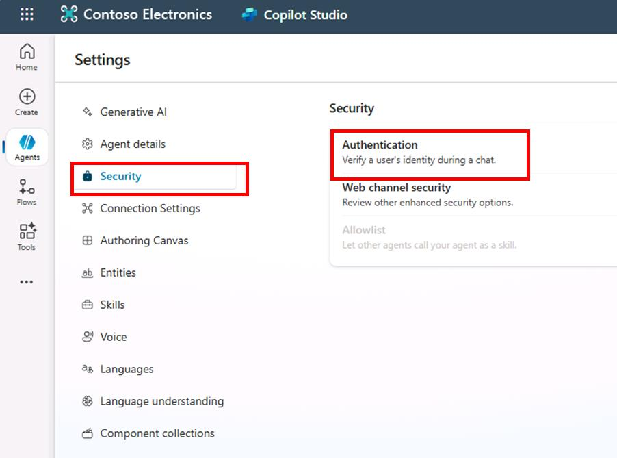
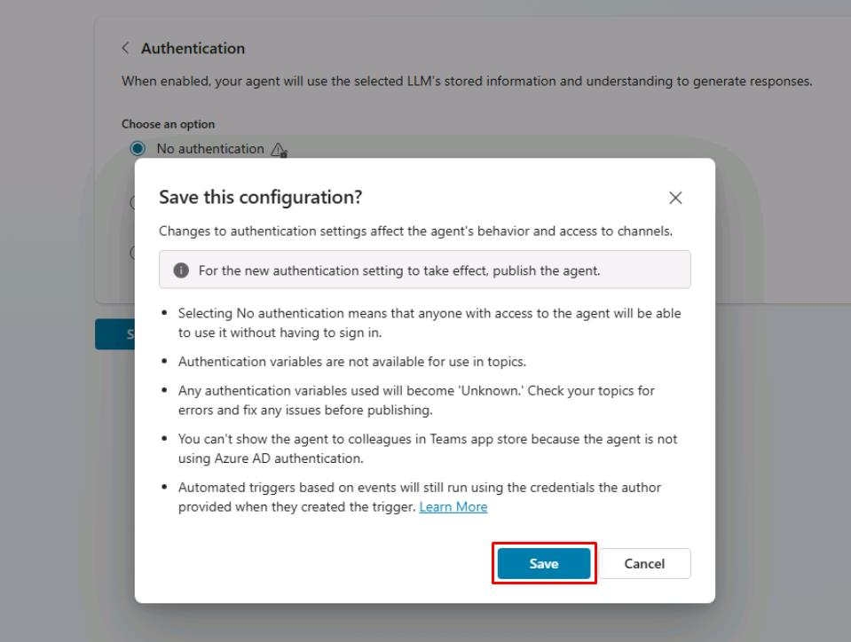
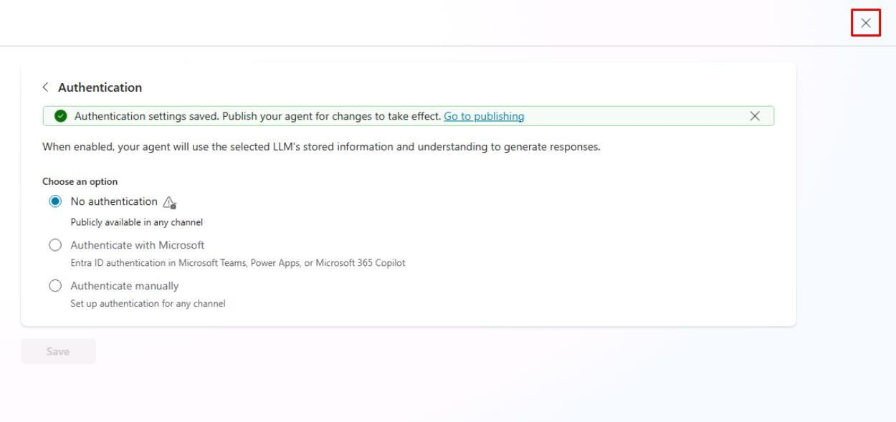
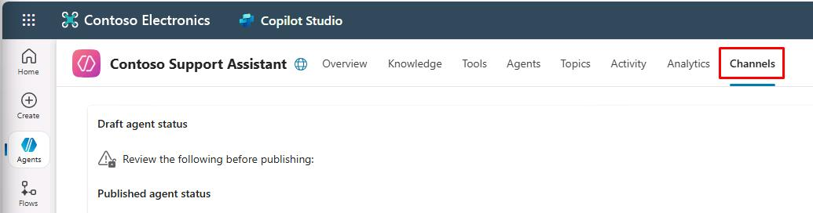
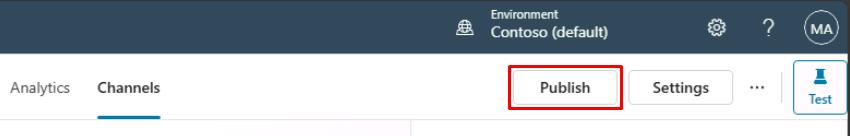
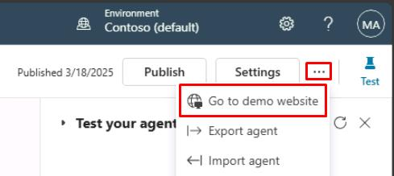
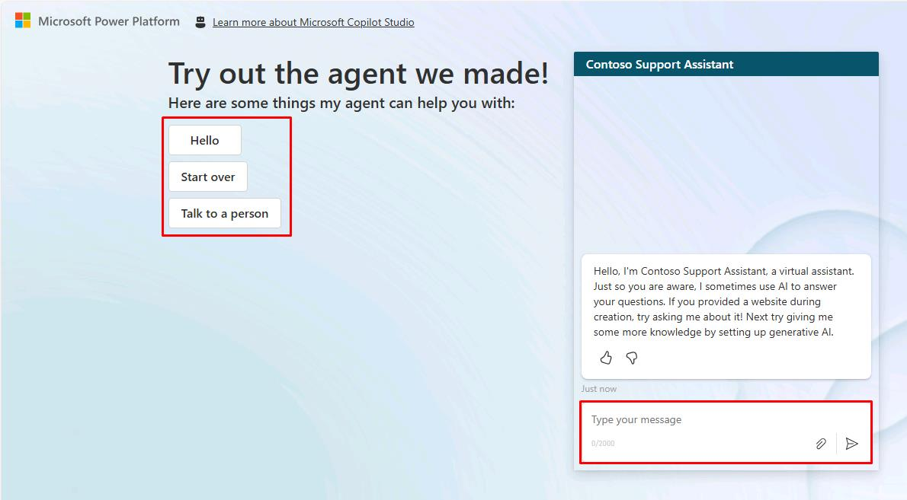

# Task 06: Publish your agent to the demo website for testing

## Introduction

To gather initial feedback from stakeholders at Contoso and validate the agent’s readiness, you need to publish your newly created agent to a demonstration website. This step allows for practical testing in a simulated environment, helping ensure the agent meets customer service requirements.

## Description

In this task, you'll publish your Microsoft Copilot Studio agent to a demo website. You'll configure authentication settings, perform the publishing action, and validate that the agent is accessible and operational on the demo site.

## Success criteria

-   You’ve successfully configured authentication settings for the demo environment.
-   You’ve published the agent to the demo website.
-   You’ve validated that the agent is accessible and responding correctly through the demo website.

## Key tasks

### 01: Change your agent authentication 

 
  
<strong>Expand this section to view the solution</strong>
 

For the purposes of this demo, you'll set the agent to not require authentication so that anyone with a link to the demo site can test it. 

1. Select **Settings** near the upper-right part of the window.

	

1. On the left settings menu, select **Security**.

1. Select **Authentication**.

	

1. Select **No authentication**, then select **Save**.

1. In the **Save this configuration?** dialog, select **Save**.
	
    

1. Select the **X** near the upper-right corner of the **Settings** page to return to your canvas.

	

### 02: Publish your agent

 
  
<strong>Expand this section to view the solution</strong>
 

Microsoft Copilot Studio provides a demo website so that you can invite anyone to test your agent by sending them the URL. This demo website is useful for gathering feedback to improve your content before you activate the agent for your real end-users.

1. Select **Channels** on the top bar of your agent.

	

	{: .important }
	> After publishing your agent at least once, you can add channels to make it reachable by your customers.

1. Select **Publish** in the upper-right part of the window to push the latest topic updates to the demo website.

	{: .note }
	> You'll need to complete this action before using the demo website for the first time, and after making any changes to the topics you want users to test.

	

	{: .important }
	> **Pro tips**:
	> - When you create a real agent, you'll publish whenever you want to make updated topics available in your deployed channels.
	> - The publishing process checks for errors in the topics whose Status is **On**. 
	> - Publication should take only a few minutes.

1. Select **Publish** again on the dialog that opens. You can ignore the risk from the lack of end-user authentication.

	

	{: .note }
	> A green banner notification will show at the top of the screen when publishing is complete.

	{: .important }
	> Publishing to the demo website is a quick process, but publishing an agent for real-world use (for example, in Microsoft Teams) can take longer. 
    >
    > For Teams, you may need to initiate an approval workflow as an administrator before the agent is made available to users in the Teams channel. The publishing process ensures that all updates are properly validated and deployed across the environment. 
    > 
	> See here for more details: [Publication fundamentals for publishing channels](https://learn.microsoft.com/en-us/microsoft-copilot-studio/publication-fundamentals-publish-channels?tabs=web)

1. Select the ellipsis in the upper-right corner of the agent page next to **Settings**, then select **Go to demo** website.
 	
    

1. You can interact with the agent by typing in the chat window, or by selecting a starter phrase from the options provided on the left.
 	
    

## Summary

Congratulations on completing Exercise 01! You’ve successfully:

 - Set up the Power Platform environment and enabled Dataverse.
 - Started a free Copilot Studio trial in the correct environment.
 - Created — or optionally imported — a customer‑support agent.
 - Explored the Copilot Studio UI and key settings.
 - Published the agent to the demo website and validated basic conversations.