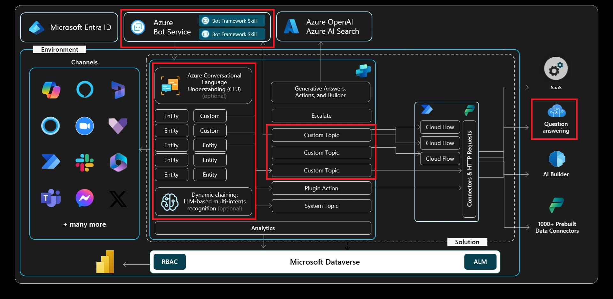

# Exercise 01: Create your first agent in Microsoft Copilot Studio

{: .warning } 
> For learners who are newer to Copilot agents and Copilot Studio, we’ve provided instructions (Task 01, Key Task 03) that will allow you to import a pre-built agent. This preconfigures everything built in Exercises 01-04. 

## Scenario

Contoso's customer service department has been overwhelmed with increased workloads due to growing customer inquiries. To alleviate the strain on Customer Service Representatives, Contoso decides to create an AI-powered customer service agent.

In this exercise, you'll take the first steps in creating this customer support agent, customizing its tone, establishing conversation boundaries, and connecting it to essential data sources. At the end, you’ll test the agent in a simulated environment, ensuring it meets Contoso’s requirements for a professional and engaging customer interaction.

## Objectives

After you complete this exercise, you'll be able to:

-   Create an agent for customer support, customize its tone, boundaries, and data sources.
-   Create a topic, add trigger phrases, and use the authoring user interface.
-   Publish your agent to a demo website for testing.
-   Test your agent, validate its behavior, ensure it meets the expected criteria.

## Architecture

## Duration

Estimated time: 60 minutes