## Task 01: Use entities and slot filling

### Introduction

To enhance your agent's ability to efficiently handle common inquiries from Contoso's customers, you'll import content directly from Contoso's existing website. This task helps the agent leverage accurate, consistent, and already-approved customer service information, streamlining responses to frequent customer requests.

### Description

In this task, you'll use Microsoft Copilot Studio to import content from a website. Copilot Studio analyzes the webpage content and generates suggested conversational topics automatically, reducing manual content creation.

Microsoft Copilot Studio uses natural language understanding (NLU) to interpret what a user is saying to try and match a user's utterance with an existing topic. NLU can also help the agent identify **entities** in a user's input. 

An entity represents key information you're trying to extract from a sentence and then saves it for later use.


### Example scenario

If the user enters "I want fifty red coffee machines" the agent can understand that:

- "**Fifty**" is the number "50" and it's also the number of products to purchase.
- "**Red**" is a color and is the color of the products to purchase.
- "**Coffee machine**" refers to the product that the person wants to purchase.


### Success criteria

- You've successfully imported topics from the provided website.
- You've reviewed and confirmed the topics created from the imported content.


### Key tasks

---
#### 01: Create an entity
In this section, you'll create an entity named **Order Action**.

1. On the command bar for the agent, select **Settings**.

	
	
1. On the **Settings** page, in the list of Settings, select **Entities**.

	

1. On the **Entities** page, select **Add an entity** and then select **+ New entity**.

   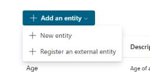

1. In the **Create an entity** dialog, select **Closed list**.

	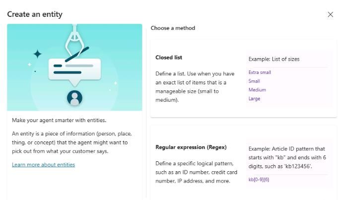

1. On the **Unnamed entity** pane, in the **Name** field, enter `Order Action`.

	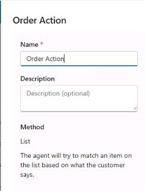

1. In the **List items** section, enter `Update ` and then select **Add**.

1. Repeat Step 6 to add the following items:

	- `Check`
	- `Cancel`

	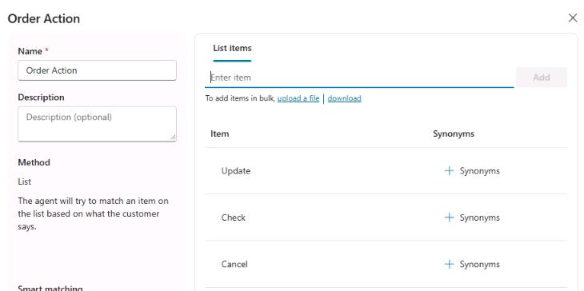
   
1. Set **Smart matching** to **on** and then select **Save**.

	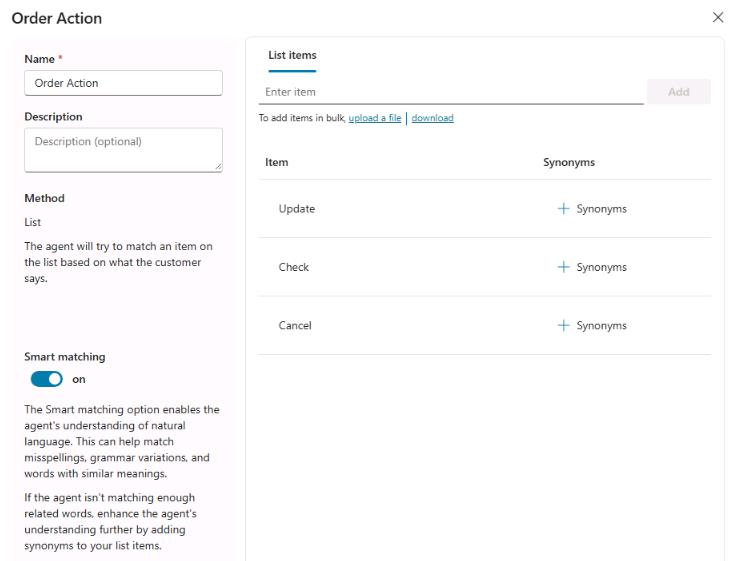
	

1. Select **Close**.

1. Close the **Settings** page.

---

#### 02: Update your topic to use the entity

1. On the command bar for the agent, select **Topics**.

	

1. Select the **Check Order Status** topic.

	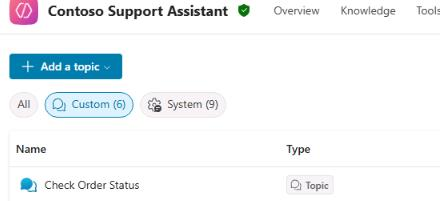

1. In the **Question** node, in the **Identify** section, select **User's entire response**.

	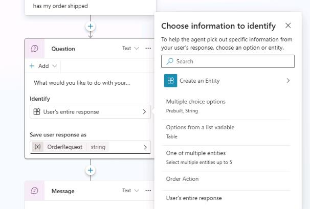


1. In the **Choose information to identify** dialog, search for and select the new `Order Action` entity.

	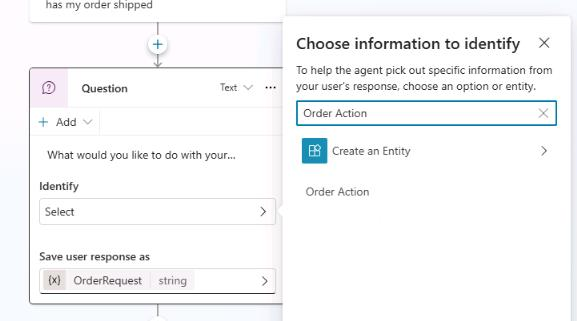

1. Select **Select options for user**.

	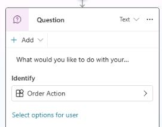

1. In the **User options for Order Action** dialog, select all three checkboxes and then close the dialog.

	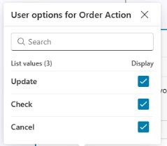

1. On the command bar for the agent, select **Save**.

	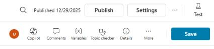

	{: .note }
	> By default, if the variable assigned to store the question's response already contains a value, the question is skipped and not presented.


---
#### 03: Test slot filling

To confirm the accuracy of information collection from customers, you'll test the slot filling capabilities of your agent. This helps ensure that the agent correctly identifies and stores critical details from customer interactions for Contoso's service requests.

1. In the **Test your agent** pane, select **Start new test session** to start a new conversation.

	

1. Submit the following prompt: 

	```
	Can I check on an order?
	```

1. On the command bar for the agent, select **Variables**.

	

1. In the **Variables** pane, select **Test** and then select **Topic**.

	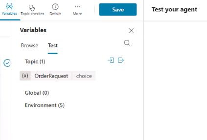

	{: .note }
	> You'll see the process is working because the user has triggered this topic with the intent to check an order, and the entity has been slot filled into the variable from the follow-up question after the trigger phrase.
	> 
	> As a result, the question is not asked and is skipped. This is because you used entities and slot filling to retrieve the information from the utterance the user submitted.
---

You've successfully configured a custom entity for your **Question** node. By default, if the variable assigned to store the question's response already contains a value, the question is skipped and not presented.