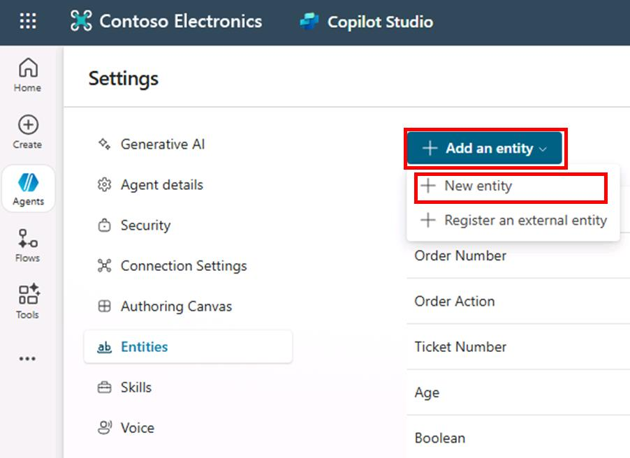
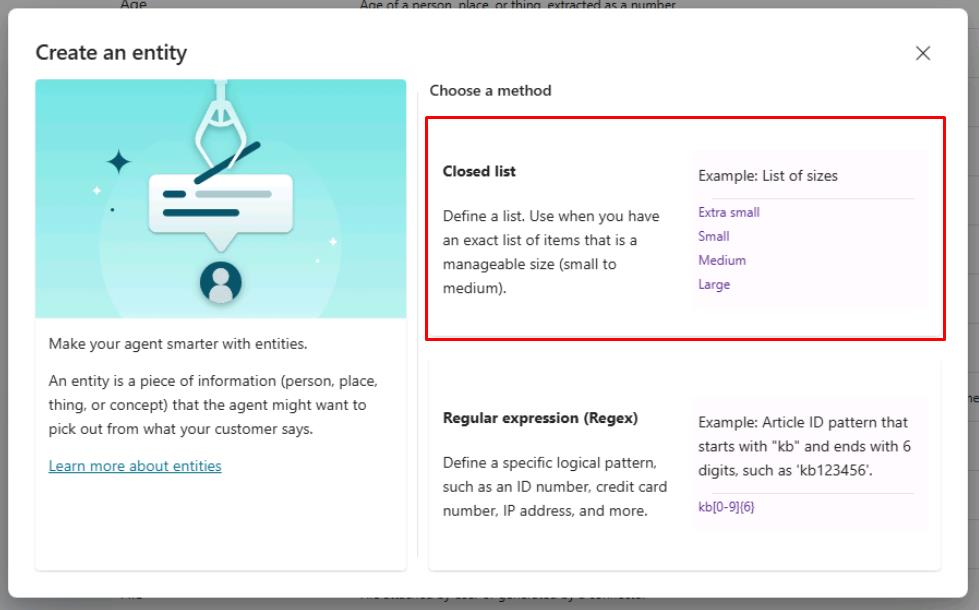
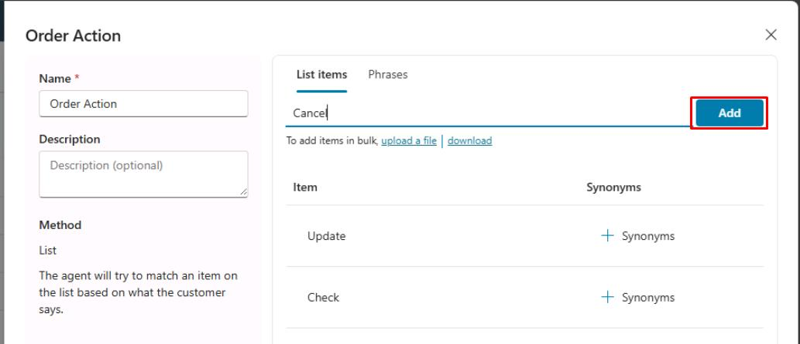
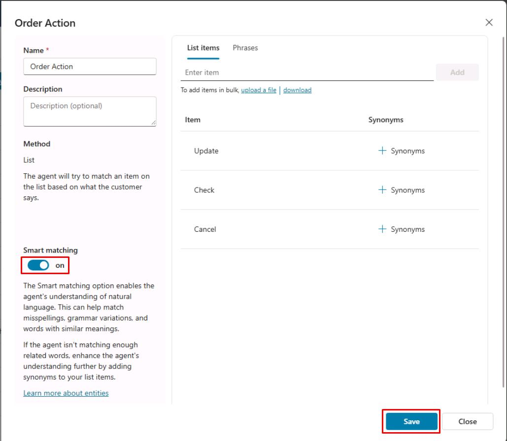
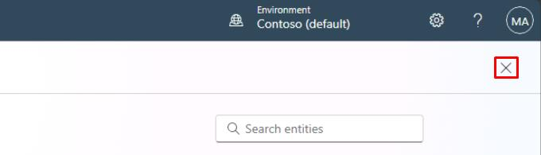
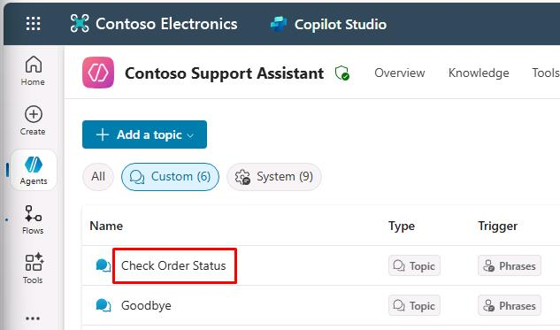
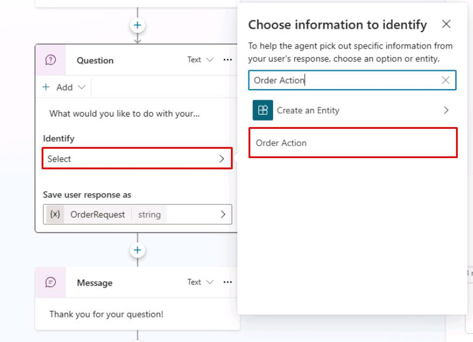
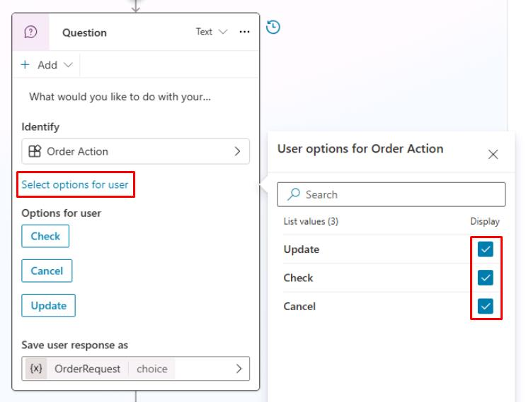

# Task 01: Use entities and slot filling

## Introduction

To enhance your agent’s ability to handle common inquiries from Contoso’s customers efficiently, you’ll import content directly from Contoso’s existing website. This task helps the agent leverage accurate, consistent, and already-approved customer service information, streamlining responses to frequent customer requests.

## Description

In this task, you’ll use Microsoft Copilot Studio to import content from a website. Copilot Studio analyzes the webpage content and generates suggested conversational topics automatically, reducing manual content creation.

Microsoft Copilot Studio uses natural language understanding (NLU) to interpret what a user 
is saying to try and match a user's utterance with an existing topic.  
 
If a user says, "I tried to use my gift card, but it doesn't work", the agent knows to 
route the user to the topic that's related to gift cards not working, even if that exact 
phrase isn't listed as a trigger phrase. This concept can also be referred to as **intent 
recognition**. 
 
NLU can also help the agent identify **entities** in a user's input. An entity represents 
key information you're trying to extract from a sentence. This can be a phone number, a zip 
code, a city, a case ID, a person's name, and so on. Your agent can recognize the relevant 
information from a user input and then save it for later use. 
 
Two types of entities: 
 
- **Prebuilt** - Represents the most-used information, such as age, color, number, and 
name. Microsoft Copilot Studio can recognize these entities automatically. 
 
- **Custom** - These are entities that you create. While the prebuilt entities cover 
commonly used information types, you'll sometimes need to teach the agent's natural 
language understanding model some domain-specific knowledge. For instance, you might need 
to create a list of all your product types. Or you may want to configure an entity to 
recognize specific text patterns like "INC-921279" for an IT support ticket. 
 
## Example Scenario 
 
If the user types, "I want fifty red coffee machines" the AI can understand that: 
 
- "**Fifty**" is the number "50," and it's also the number of products to purchase. 
- "**Red**" is a color and is the color of the products to purchase. 
- "**Coffee machine**" refers to the product that the person wants to purchase. 
 
In Microsoft Copilot Studio, some subjects (such as numbers and colors) have already been 
taught to the AI for the agent. The author of the agent would need to specify other 
entities, such as the fact that "coffee machine" is a product. 
 
## Success criteria

-   You’ve successfully imported topics from the provided website.
-   You’ve reviewed and confirmed the topics created from the imported content.

## Key tasks

### 01: Use entities and slot filling

 
  
<strong>Expand this section to view the solution</strong>
 

1. Go back to your **Microsoft Copilot Studio** tab.

1. Select **Settings** again near the upper-right part of the window.

	

1. On the left settings menu, select **Entities**.

1. Select **Add an entity** at the top, then select **New entity**.
 	
     

1. In the **Create an entity** dialog, select **Closed list**.

	

1. In the **Name** field, enter `Order Action`.

1. Under **List items** in the right pane, enter the following and select **Enter** or **Add** for each of the three items.

	- `Update`
    - `Check`
    - `Cancel`

	

	{: .note }
	> You can also choose to add synonyms by selecting synonyms for each option (optional for this task).

1. Select the **Smart matching** toggle to set it to **on**, then select **Save** in the lower-right corner of the window.
 	
    

	{: .note }
	> This creates a new entity called **Order Action** that you can use with the **Question** node in your topic to place the **User's entire response** with the **Order Action**.

1. Select **Close** on the pane, then select the **X** in the upper-right corner of the **Settings** page to return to your agent.

	

1. Select **Topics** on the top bar.

1. Select the **Check Order Status** topic you created.

	

1. Within the **Question** node, select the entry under **Identify**, then search for and select the new `Order Action` entity. 

	

1. Select **Select options for user**, then select all the checkboxes to display them to the user.

	

1. Select **Save** in the upper-right part of the canvas to save the topic.

---

You've successfully configured a custom entity for your **Question** node. By default, if the variable assigned to store the question's response already contains a value, the question is skipped and not presented.