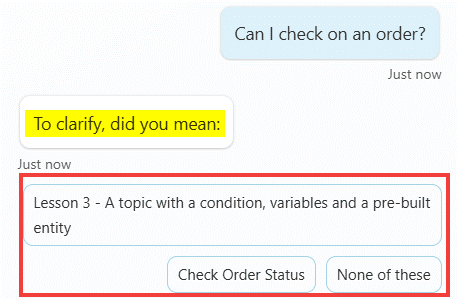
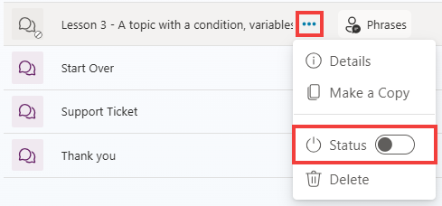

# Testing and addressing ambiguity issues

{: .highlight }
> Use the Test pane to try how entities and slot filling work by entering one of your trigger phrases.

1. 	Enter the following trigger phrase.

	```plaintext
	Can I check on an order?
 	```

	If you're following the lab scenarios and if you have kept the lesson topics, you should get a disambiguation question (e.g., *“Did you mean…”*, asking to selected the most relevant topic) because two or more topics have been configured with similar trigger phrases related to **orders**.

	

	{: .important }
	> **Pro tip**: To avoid this ambiguity in your copilot, you can: 
	> - Deactivate one of the overlapping topics. 
	> - Update the trigger phrases of the overlapping topics. 
	> - Exclude a specific topic from the disambiguation mechanism, by going to the desired topic’s Phrases properties, advanced, and unchecking Include in multiple topic matches.
	> - Fine tune your topic strategy by setting up catch all parent topics that then use redirects to call the appropriate child topics after applying your own disambiguation questions.

1.	Go to the list of **Topics**.

1.	Click on the **…(elipses)** option and toggle the **Status** setting to turn the topic **off**.

 	

 	In the list of topics, a visual indicator shows what topics are disabled.
