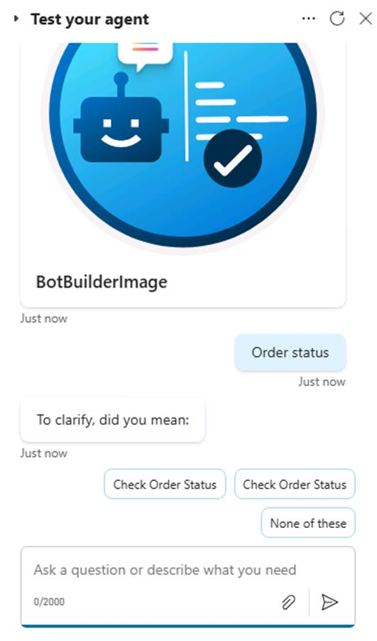
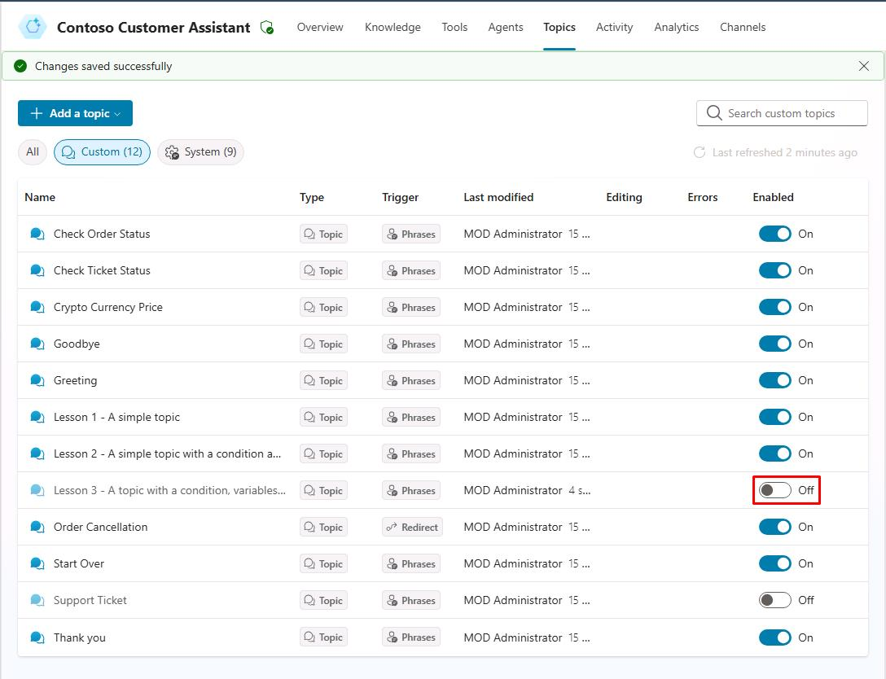

# Task 02: (Optional) Test and address ambiguity issues

## Introduction

Customer conversations may sometimes be ambiguous, potentially causing confusion in the agent’s responses. In this optional task, you'll test and address such ambiguity by refining the agent's ability to clarify customer inputs, improving response accuracy.

## Description

You’ll test ambiguous conversation scenarios, identify where the agent struggles to interpret user intent, and adjust the agent’s configuration to clarify or prompt users for more information when necessary.

## Success criteria

-   You’ve tested ambiguous inputs.
-   You’ve improved agent responses to clarify customer intent accurately.

## Key tasks

### 01: Test and address ambiguity issues

 
  
<strong>Expand this section to view the solution</strong>
 

{: .warning }
> If you created the agent, skip this task. This is only for users who imported the pre-built solution.

You'll use the **Test** pane to see how entities and slot filling works by entering one of your trigger phrases.

1. In the **Test your agent** pane, select the refresh icon in the upper-right corner of the pane to start a new conversation.

1. Enter the following trigger phrase.

   `Order status`

1. If prompted, select one of the options it provides.

   

	{: .note }
	> You may get a disambiguation question using the pre-built agent (for example, *"Did you mean…"*, asking to select the most relevant topic) because two or more topics have been configured with similar trigger phrases related to **orders**.

	{: .important }
	> **Pro tip**: To avoid this ambiguity in your agent, you can: 
	> - Deactivate one of the overlapping topics. 
	> - Update the trigger phrases of the overlapping topics. 
	> - Exclude a specific topic from the disambiguation mechanism, by going to the desired topic's Phrases properties, advanced, and unchecking **Include in multiple topic matches**.
	> - Fine tune your topic strategy by setting up catch-all parent topics that then use redirects to call the appropriate child topics, after applying your own disambiguation questions.

1. Go to your **Topics**.

1. On the line for **Lesson 3...**, toggle off **Enabled**.

	

	{: .note }
	> In the list of topics, a visual indicator shows what topics are disabled.

