## Task 02: Use variables

### Introduction

Contoso's customer service scenarios often require storing temporary information during interactions.

### Description

In this task, you'll configure conversation variables, enabling the agent to retain and use customer-provided details effectively throughout a conversation. You'll create and use conversation variables within Copilot Studio to temporarily store and reuse information provided by customers during interactions.

### Success criteria

- You've created and implemented variables within conversational topics.
- You've confirmed correct handling and storage of variable data during conversations.

### Key tasks

---
#### Learn about variable types

Variables let you save responses from your end-users to help guide the conversation (such as determining whether to provide different instructions for returns based on the purchase price of the item). You can use variables directly in the conversational response from the agent (for example, "I can help you return your {Topic.ProductName}").

By default, you can only use a variable's value in the topic where the variable is created. However, if you want the agent to reference the same value across other topics, you can choose to make it a global variable. 

You can use the following types of variables:

- **System** - These variables are normally populated with system data. System variables may include user ID, email, first name, and so on. 

- **Topic** - These variables are user-made from either topic Inputs, the **Set a Variable Value** node, the **Question** node or as the output of other nodes or actions (for example, cloud flows, HTTP requests, connectors, custom prompts, and plugin actions). These variables are available only in the topic that's being created and no other topics. 

- **Global** - These variables are available from any topic, and they're a good way to store data that multiple topics use to help the conversation, regardless of how many topics are triggered within it. If you embed your agent in a website or application, you can pass context data (for example, current page or user language) as global variables to your agent.

You can use variables in several places, including the **Question**, **Condition**, and **Set variable value** nodes. The variable can be a custom value that uses Power Fx, a user-entered value, a response from a question, or system variable values.

---

### 01: Review the process to assign a value to a variable

1. Between the **Trigger** node and the **Question** node, select **+**, select **Variable management**, and then select **Set a variable value**.

	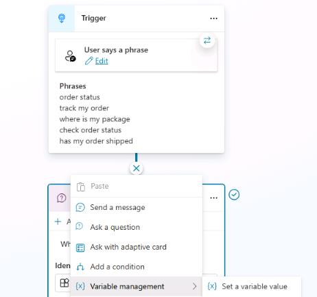

1. In the **Set variable value** node, select **Select a variable**. 

	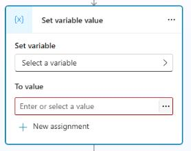

1. In the dialog that displays, select **Create new**.

   

1. Select **Var1**. Then, in the **Variable properties** pane, change the value for **Variable name** to `TestDelete`.

	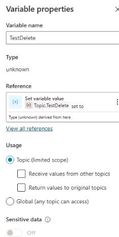

	{: .important }
	> It's best practice to name your variables something descriptive based on the data that's being stored. This approach helps you in the future and helps other agent authors.

1. Select the **X** in the upper-right corner of the **Variable properties** pane to close the pane.

1. In the **Set variable value** node, in the **To value** field, select the ellipsis (**...**).

	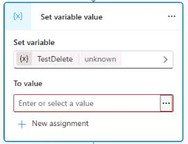

1. In the dialog that displays, select the **System** tab.

	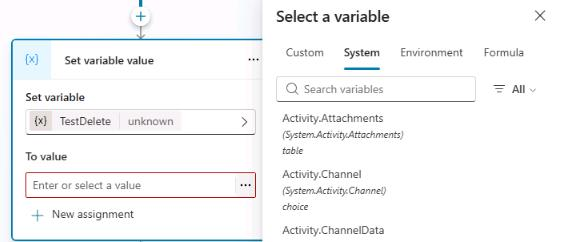

1. View all variables that Microsoft Copilot Studio uses. These variables contain data that Microsoft Copilot Studio populates, and you can also use this data in your own variables. 

1. At the upper right of the **Set variable value** node, select the ellipses (**...**) and then select **Delete** to remove the node.


---

### 02: Use global variables


1. In the **Question** node, in the **Save user response as** field, select the **OrderRequest** variable.

	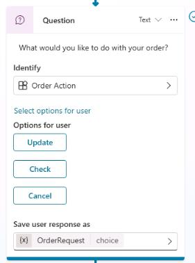

1. In the **Variable properties** pane, in the **Usage** section, select **Global**. This allows other topics to access the variable. 

	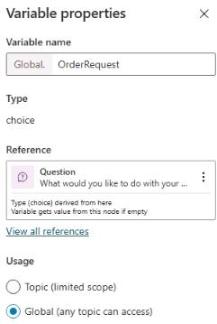
1. In the **Message** node, replace the text **Thank you for your question!** with the following text:

	```
	No problem. We can that for you. Let us look at that now and get your information.
	```

	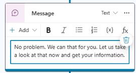

1. Place the text cursor in the space between "**can**" and "**that**" in the message, select **Insert variable** (the **{x}**  icon), and then select the **OrderRequest** variable.

	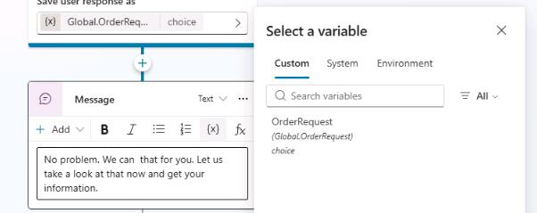

	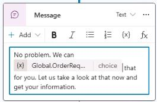

1. On the command bar for the agent, select **Save**.

	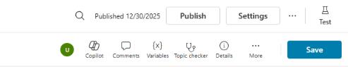

1. On the command bar for the agent, select **Test**.


1. In the upper-right corner of the **Test your agent** pane, select **Start new test session** to start a new conversation.

	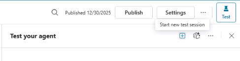

1. Submit the following prompt:  `Help me with an order.` Copilot should display a set of three possible actions.

	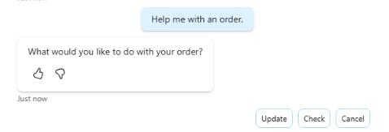

1. Select **Cancel**.

   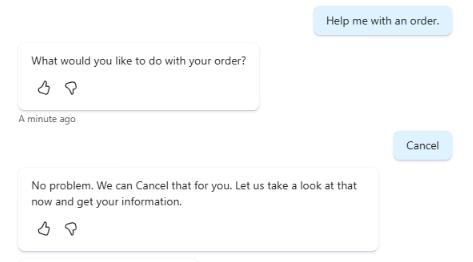

	{: .note }
	> Observe that the word **Cancel** still has its first letter capitalized. To address this grammatical issue, you can use a formula to change this to lowercase instead of directly referencing the variable value.

1. In the **Message** node, delete the variable **{Global.OrderRequest}** and then select **Insert Power Fx expression** (the **fx** icon).

	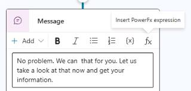

1. In the dialog that displays, in the **fX** field, enter the following  Power Fx expression and then select **Insert**.

	```
	Lower(Global.OrderRequest)
	```

	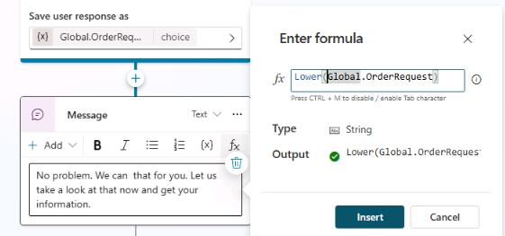

1. On the command bar for the agent, select **Test**.


1. In the upper-right corner of the **Test your agent** pane, select **Start new test session** to start a new conversation.

	

1. Submit the following prompt:  `Help me with an order.` Copilot should display a set of three possible actions.

	

1. Select **Cancel**.

   

1. Test again in a new conversation to see the changes.

	```
	Help me with an order.
	```

	

1. On the command bar for the agent, select **Save**.

	


---

### 03: Use variables in conditions


1. Below the **Message** node, select the **+** button and then select **Add a condition**.

	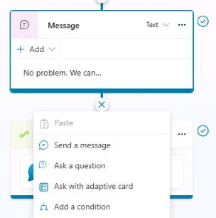

	{: .note }
	> Two new nodes will appear. One is your **Condition** and the other is an exception for **All other conditions**.

1. In the **Condition** node, select **Select a variable** and then select the **OrderRequest** global variable.

	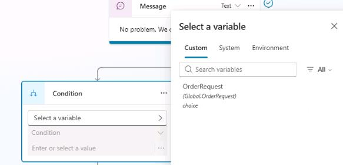

1. In the **Enter or select a value** field, select **Update**.

	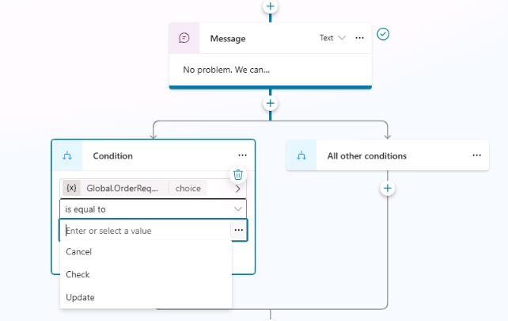

1. Select the **+** button between the **Message** node and the branching **Condition** nodes. Then, select **Add a condition** to add another branch.

	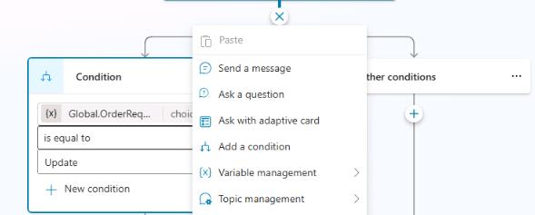

1. In the new **Condition** node, select **Select a variable** and then select the **OrderRequest** global variable. Then, in the **Enter or select a value** field, select **Check**.

	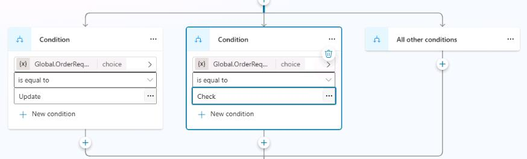

1. Select the **+** button between the **Message** node and the branching **Condition** nodes. Then, select **Add a condition** to add another branch.


1. In the new **Condition** node, select **Select a variable** and then select the **OrderRequest** global variable. Then, in the **Enter or select a value** field, select **Cancel**.

	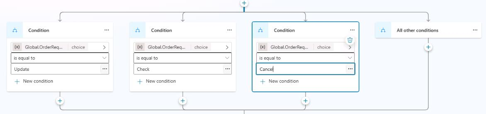

1. Below each of the three **Condition** nodes, select the **+** button and then select **Send a message**. Use the following messages as appropriate:

	```One moment while I update that order.```

	```Let me check on that order for you.```

	```No problem. Give me just a moment to cancel that order.```

	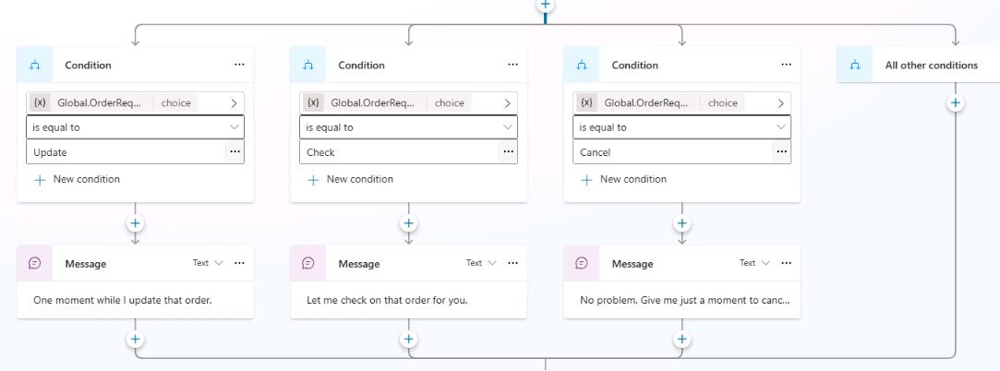

	{: .important }
	> If you select a node, you can copy the node by using the **Copy** action on the command bar. Once copied, the node is available to be pasted, using the same tools menu or when using the **+** button to add a new node.
	> 
	> 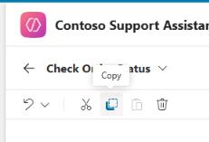

1. On the command bar for the agent, select **Save**.

	

1. On the command bar for the agent, select **Test**.


1. In the upper-right corner of the **Test your agent** pane, select **Start new test session** to start a new conversation.

	
	
1. Explore the different trigger phrases and conditions that lead the user to view different message outcomes.
