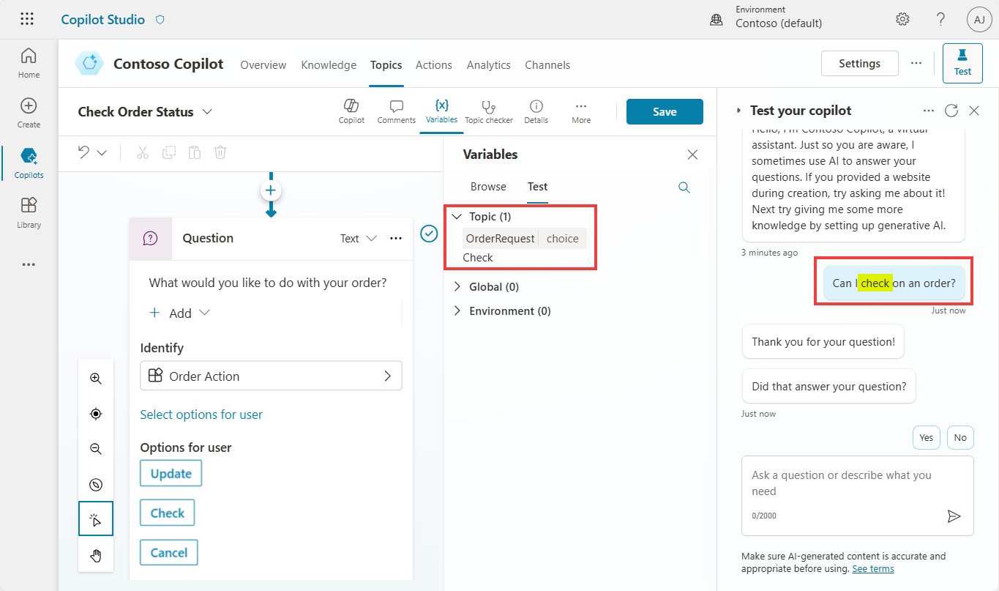

# Testing slot filling

1.	Display the Test pane.

1.	Use the refresh button to start a new conversation.

1.	Try out how entities and slot filling work by entering a sentence matching one of your trigger phrases.

	```plaintext
 	Can I check on an order?
	```

1.	Go the to **Check Order Status** topic, and display the Variables pane, and in the Test tab, expand the **Topic variables**.
 	
	You will observe the process working because the user has triggered this topic with the intent to "check" an order, and the entity has been slot filled into the variable from the follow-up question after the trigger phrase.
	
 
 	**As a result, the question isn't asked and is skipped**. This is because you've used entities and slot filling to retrieve the information from utterance the user submitted. This approach avoids you needing to ask the user a question that they've already provided information for.

 	
