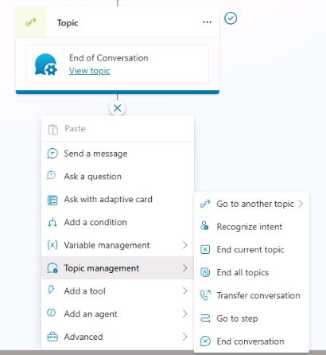
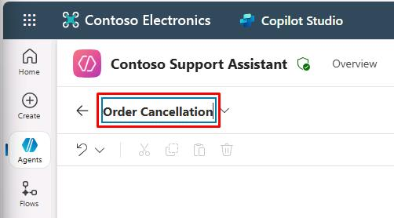
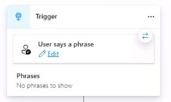
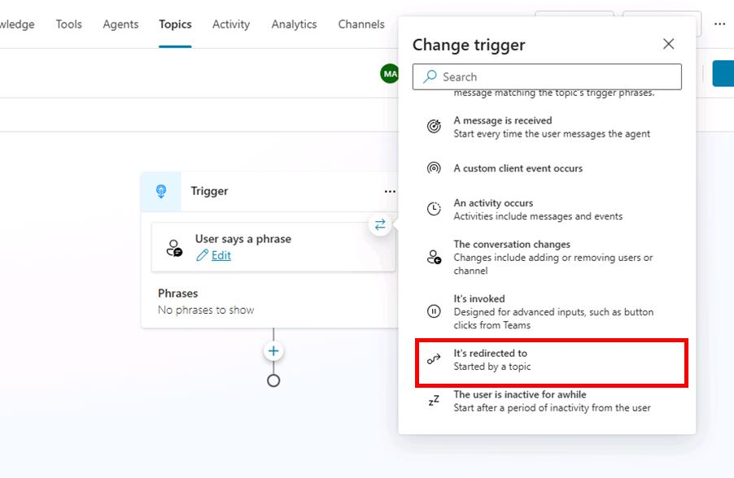
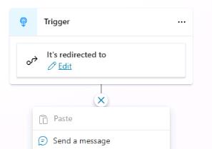
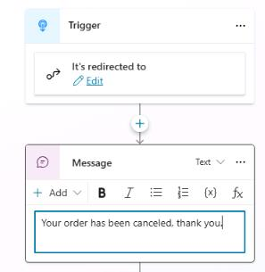
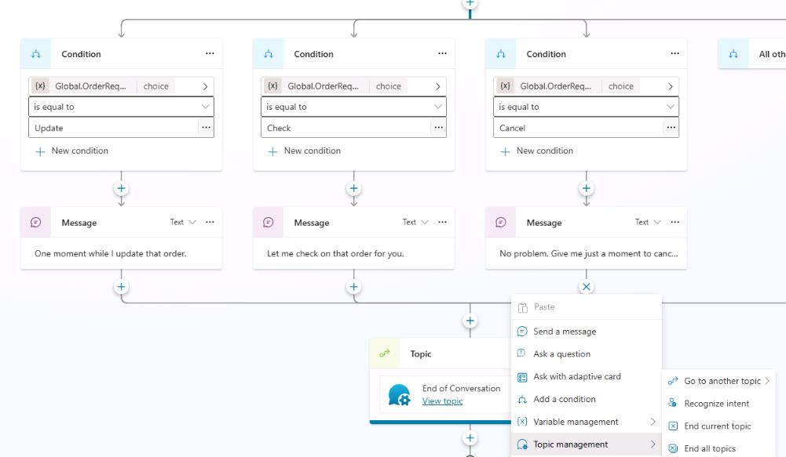
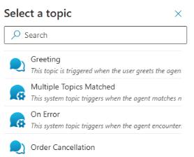
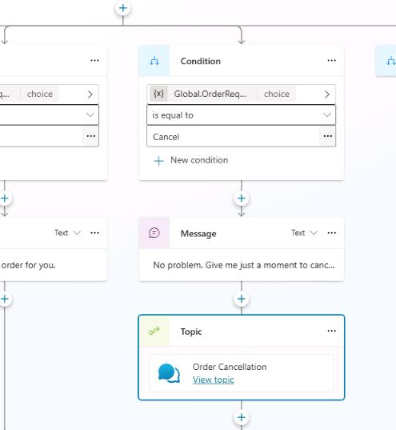
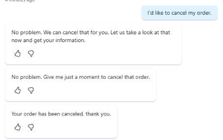

## Task 03: Use topic nodes

### Introduction

Structuring the conversation effectively is crucial for clear customer interactions.

### Description

In this task, you'll use topic nodes to clearly organize the agent's conversation logic, ensuring Contoso's customers receive structured and coherent responses.

### Success criteria

- You've created and organized topic nodes effectively.
- You've verified correct conversational flow in tests.

### Key tasks

---

### 01: Become familiar with topic nodes

1. Below the **End of conversation** node, select **+** band then select **Topic management**.

	

1. You should see the following options:

	- **Go to another topic** - Go to another topic that you need to select.
	- **End current topic** - End the current topic. Typically, you'd use this option where the topic was called from another topic. 
	- **End all topics** - This node ends all active topics. The next message from the user is considered a new conversation and triggers the most appropriate topic based on that user message, starting a new active topic.
	- **Transfer conversation** - Select this option to transfer to an agent and send a contextual message.
	- **Go to step** - Go to another node in the open topic. This option is useful for looping scenarios or if you want to gather more information from the user.
	- **End conversation** - Sends an **endOfConversation** activity. This can be useful for a client chat widget (for example, deployed to your website), to know that the chat session is over.

---

### 02: Create a new topic for order cancellations

1. On the command bar for the agent, select **Topics**.

	

1. On the **Topics** page, select **Add a topic** and then select **From blank**.

	

1. Select **Untitled** in the upper-left part of the window, then change the topic name to `Order Cancellation`.

	

1. Within the **Trigger** node, hover over the **Phrases** section, then select the **Change trigger** button that appears in the upper-right part of the node.
	
	

1. []In the **Change trigger dialog** select **It's redirected to**.

	

1. Below the **Trigger** node, select the **+** button and then select **Send a message**.

	

1. In the message field, enter the following text:  

	```
	Your order has been canceled, thank you.
	```

	

1. On the command bar for the agent, select **Save**.

---

### 03: Configure a node to go to another topic

1. On the command bar for the agent, select **Topics**.

1. Select the **Check Order Status** topic.

1. Within the **Condition** branch for **Cancel**, below the **Message** node, select the **+** button, select **Topic management**, then select **Go to another topic**.

	

1. Select the **Order Cancellation** topic from the list.

	
	

1. On the command bar for the agent, select **Save**.

1. On the command bar for the agent, select **Test**.

1. In the upper-right corner of the **Test your agent** pane, select **Start new test session** to start a new conversation.

	

1. Submit the following prompt and review the response: 

	```
	I'd like to cancel my order.
	```

	