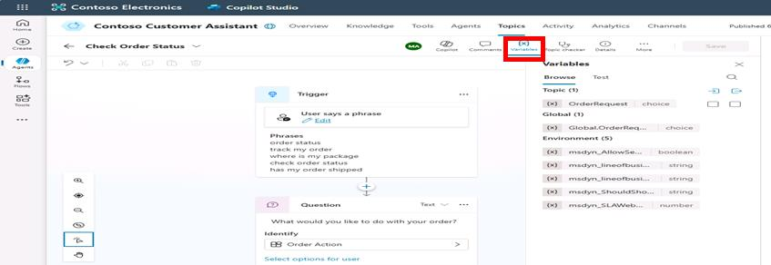

## Introduction

To confirm the accuracy of information collection from customers, you'll test the slot filling capabilities of your agent. This helps ensure that the agent correctly identifies and stores critical details from customer interactions for Contoso’s service requests.

## Description

You’ll systematically test conversations that utilize slot filling to verify the agent accurately prompts and collects user-supplied information.

## Success criteria

-   You’ve tested and validated slot-filling interactions.
-   You’ve confirmed accurate collection and storage of required customer information.

## Key tasks

### 01: Test slot filling

 
  
<strong>Expand this section to view the solution</strong>
 

1. In the **Test your agent** pane, select the refresh icon again to start a new conversation.

1. See how entities and slot filling work by entering a sentence matching one of your trigger phrases.

	`Can I check on an order?`

1. Select **Variables** on the top bar of the canvas. 

	

1. In the **Variables** pane, select the **Test** tab, then select **Topic** to expand.

	
 	
	{: .note }
	> You'll see the process is working because the user has triggered this topic with the intent to "Check" an order, and the entity has been slot filled into the variable from the follow-up question after the trigger phrase.
	>
    > As a result, the question is not asked and is skipped. This is because you used entities and slot filling to retrieve the information from the utterance the user submitted. This approach avoids you needing to ask the user a question that they've already provided information for.

