## Task 04: Add rich text capabilities to a **Message** node

### Introduction

Clear communication is vital when providing instructions or important information.

### Description

In this task, you'll use rich text formatting to ensure that information provided to Contoso's customers is easily understood.

### Rich text options for **Message** and **Question** nodes

Microsoft Copilot Studio provides positive conversational experiences for customers. One central feature is the rich text authoring capabilities that are available for the **Message** and **Question** nodes.

The available options include:

- **Image** - You can add an image, which displays on a card. You can add the URL of the image and a title.

- **Video** - You can add the URL for a publicly available MP4 file. You can also use a YouTube video URL.

- **Basic card** - This option includes simple cards that provide adaptive cards, such as visuals.

- **Adaptive Card** - You can add Adaptive Cards, which are platform-agnostic cards that are designed to be flexible to suit the needs at the time.

- **Quick reply** - This option allows users to select from specific options rather than needing to enter the response in text-based scenarios. You should use these replies to provide common suggestions or to help give the user ideas about the type of information that's being asked for.
 
### Success criteria

- Applied rich text formatting to messages.
- Verified clear and formatted text presentation during agent interactions.


### Key tasks

---

#### 01: Add rich text to the Conversation Start topic


1. On the command bar for the agent, select **Topics**.


1. On the **Topics** page, select **System**.

	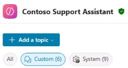

1. On the **System** topics page, select **Conversation Start**.

	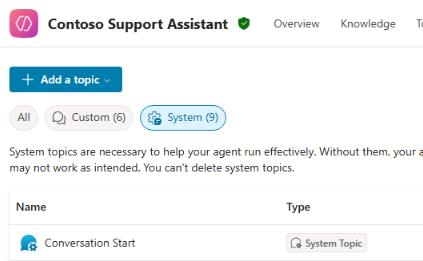

1. Select the **Message** node, select **+ Add**, and then select **Image**.

	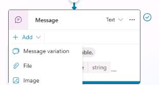

1. In the **Image properties** pane, in the **Image URL** field, enter:

	```
	https://learn.microsoft.com/en-us/training/achievements/build-effective-bots.svg
	```

	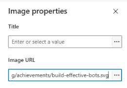

1. Close the **Image properties** pane.

1. Select the **Message** node, select **+ Add**, and then select **Quick reply**.

	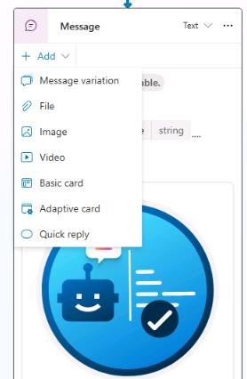

1. In the **Quick replies** section,  enter the following text:

	```
	Help with my order
	```

	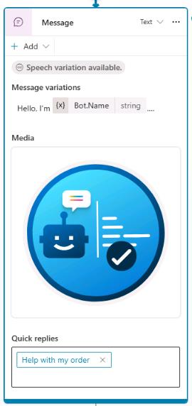

1. On the command bar for the agent, select **Save**.

---

#### 02: Add a regular expression entity

1. On the command bar for the agent, select **Topics**.

1. Select the **Check Order Status** topic.

1. Below the **Trigger** node, select the **+** button, then select **Ask a question** .

	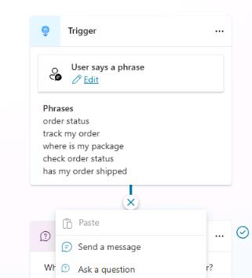

1. In the **Question** node, enter the following text:

	```
	Could you please provide your order number?
	```

	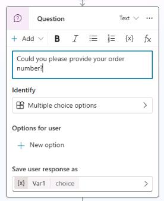

1. In the **Identify** section, select **Multiple choice options**. Then, in the **Choose information to identify** dialog, select **Create an Entity**.

	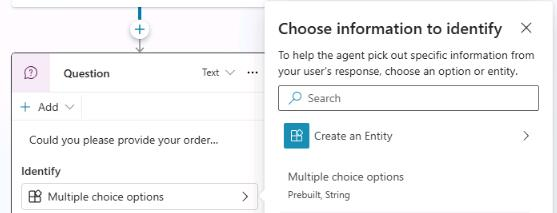

1. Select **Regular expression (Regex)**.

	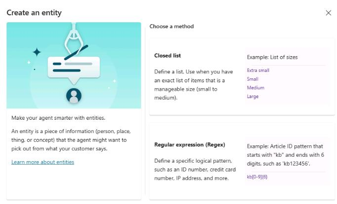

1. Use the following values to configure the entity and then select **Save**:

	| Item | Value |
	| ---- | ----- |
	| **Name** | `Order Number` |
	| **Pattern** | `ORD-[0-9]{6}` |

	{: .note }
	> This pattern will automatically detect IDs like ORD-123456.

	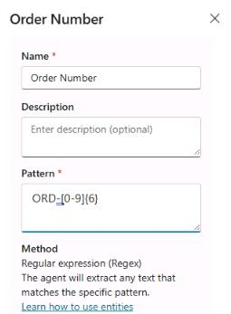
	


1. In the same **Question** node, select **Var1**.

1. In the **Variable properties** node, in the **Variable name** field, enter `OrderNumber`.

	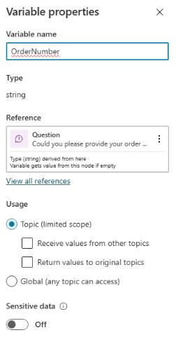

1. On the command bar for the agent, select **Save**.


---

#### 03: Add message variations

In this task, you'll add a **Message variation** to an existing node.

1. Locate the **Condition** branch for **Check** and then select the **Message** node.

1. Select **+ Add** and then select **Message variation**.

	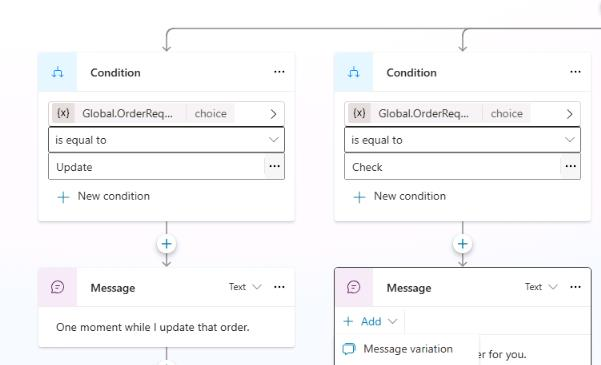

1. Add a message variation the agent should use:

	```
	Sure thing. Give me a moment to check on that.
	```

	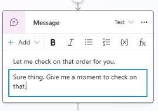

1. Now add the following variation to the **Message** node under the **Update** condition path:

	```
	I'll get that updated right away.
	```

	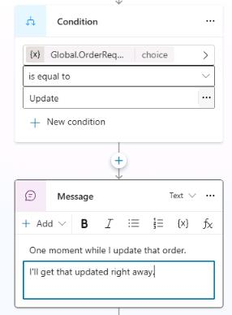

1. On the command bar for the agent, select **Save**.


1. Leave the **Check Order Status** topic open.