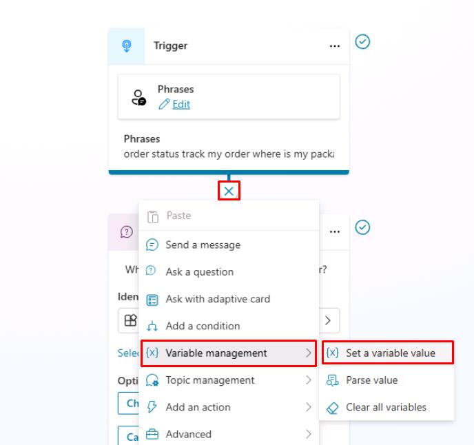
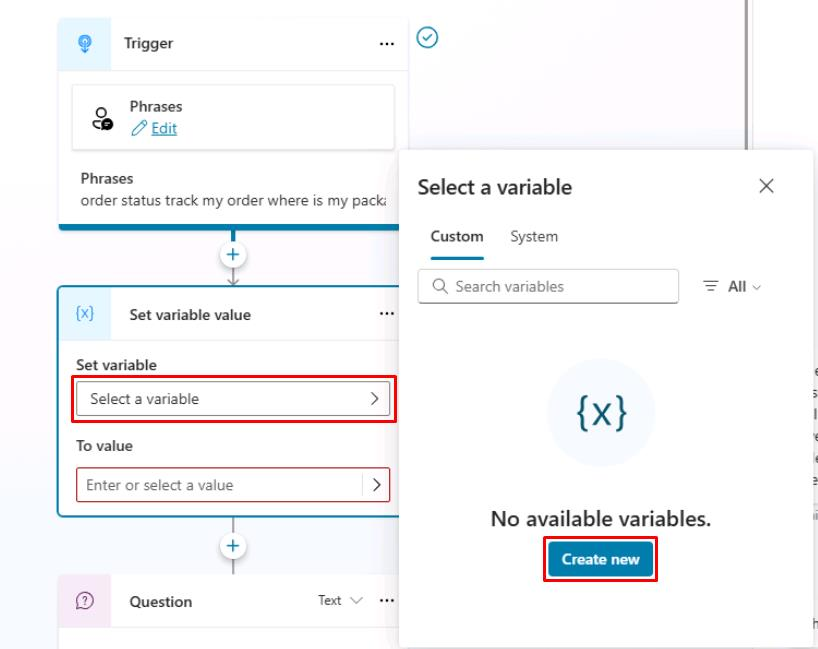
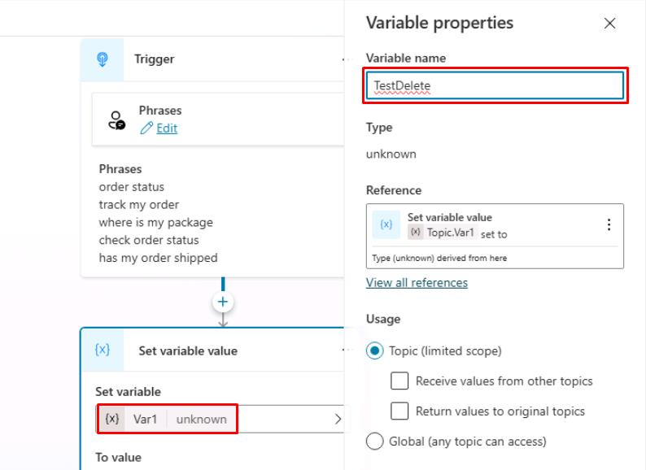
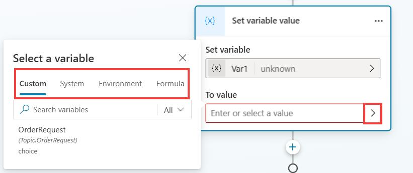
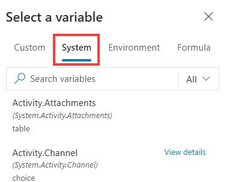
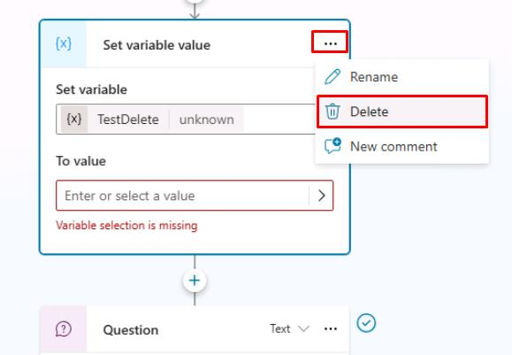
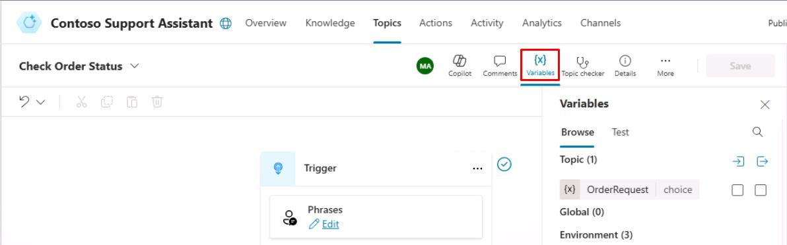

# Task 04: Use variables
 
## Introduction

Contoso's customer service scenarios often require storing temporary information during interactions.

## Description

In this task, you'll configure conversation variables, enabling the agent to retain and use customer-provided details effectively throughout a conversation. You'll create and utilize conversation variables within Copilot Studio to temporarily store and reuse information provided by customers during interactions.

## Success criteria

-   You’ve created and implemented variables within conversational topics.
-   You’ve confirmed correct handling and storage of variable data during conversations.

### Learn about variable types

Variables let you save responses from your end-users to help guide the conversation (such as determining whether to provide different instructions for returns based on the purchase price of the item). And you can use them directly in the conversational response from the agent (for example, "I can help you return your {Topic.ProductName}").

By default, you can only use a variable's value in the topic where the variable is created. However, if you want the agent to reference the same value across other topics, you can choose to make it a global variable (you might know this concept from other applications). Basically, when the conversation moves to a different topic, the agent can remember and use variable values that have been filled in from previous topics in the conversation. In Microsoft Copilot Studio, you can set up variables by using Power Fx formulas and functions, outside of a **Question** node, by using the **Set a Variable Value** node.

Different types of variables in Microsoft Copilot Studio include:

- **System** - These variables are normally populated with system data. System variables aren't user-made and are part of the platform. For example, if your agent requires end-user authentication, system variables may include user ID, email, first name, and so on. You can access system variables in the authoring canvas from the variable selection, under System.

- **Topic** - These variables are user-made from either topic Inputs, the **Set a Variable Value** node, the **Question** node or as the output of other nodes or actions (for example, cloud flows, HTTP requests, connectors, custom prompts, and plugin actions). These variables are by default limited in scope and available only in the topic that's being created and no other topics. Two options are available to expand this scope for topic variables if they can receive values from other topics and return values to other topics. With these options set, a topic variable is no longer limited to only being used in the topic; other topics can use it. You can access topic variables in the authoring canvas from the variable selection, under **Custom**.

- **Global** - These variables are user-made and are available from any topic, and they're a good way to store data that multiple topics use to help the conversation, regardless of how many topics are triggered within it. If you embed your agent in a website or application, you can pass context data (for example, current page or user language) as global variables to your agent, if these are configured to accept external sources setting values for them. You can access Global variables in the authoring canvas from the variable selection, under **Custom**.

You can use variables in several places, including the **Question**, **Condition**, and **Set variable value** nodes. The variable can be a custom value that uses Power Fx, a user-entered value, a response from a question, or system variable values.

## Key tasks	
You're beginning to enhance the topic that you created in the previous section, where you used entities and slot filling to automatically detect the data from a user's sentence and store specific data in a variable. Now, you'll learn how to use the data that you obtained from the question in a variable and then display it within a message.

### 01: Review variables

 
  
<strong>Expand this section to view the solution</strong>
 

Use this task to become familiar with the **Set variable value** node and to review the different types of variables. This task involves creating a new node, creating a new variable, renaming the variable, and determining other variables that you can use within Microsoft Copilot Studio at the system level. At the end of this task, you'll delete this node.

1. Under the **Trigger** node, select the **+** button, select **Variable management**, then select **Set a variable value**.

	

	{: .note }
	> This task is for exploring variable options, so it isn't critical that you add the variable in a specific location. You'll delete it later.

1. Under **Set variable**, select **Select a variable**, then select **Create new** in the flyout pane.

	

	{: .note }
	> Your new variable is made and is, by default, called **Var1** (or a different number if you already created a variable with this name, such as Var2 or Var3).
 	
	 
1. Select **Var1**, then for **Variable name** enter `TestDelete`.

	

    {: .important }
    > It's best practice to name your variables something descriptive based on the data that's being stored. This approach helps you in the future and helps other agent authors.
    >
    > You can also change the scope of a variable from **Topic** or **Global**. 

1. Select the **X** in the upper-right corner of the **Variable properties** pane to close it. 

	{: .important }
	> Determine what data you can use to store in the variable. You can use other variables that you created in your authoring canvas, or you can use system variables or formulas. 

1. Under **To value**, select the chevron **(>)**. 

	

	{: .note }
	> A flyout pane appears that contains separate tabs named **Custom**, **System**, **Environment**, and **Formula** (using Power Fx, which is covered later in this lab).

1. Select the **System** tab.

	

	{: .note }
	> You'll be able to view all variables that Microsoft Copilot Studio uses. These variables contain data that Microsoft Copilot Studio populates, and you can also use this data in your own variables. Review these options so that you know what's available by default.

1. Delete the **Set variable value** node now that you reviewed the options available to you within it.

	Select the ellipsis in the upper-right corner of the node, then select **Delete**.

	

1. From anywhere within the authoring canvas, you can select **Variables** at the top to review all variables within the topic, including global variables. 

	

	{: .important }
	> It's beneficial to review all variables within a topic, especially topics that are large.