## Task 05: Use code view and Power Fx

### Introduction

To meet specific interaction requirements for Contoso's customer service scenarios, advanced customization may be necessary.

### Description

In this task, you'll use the code view in Copilot Studio and employ Power Fx formulas to implement advanced conversational logic beyond default node capabilities.

### Success criteria

- You've successfully utilized code view and Power Fx formulas.
- You've confirmed that advanced conversational logic behaves as intended.

### Key tasks

---

### 01: Explore the code editor

1. On the command bar, select the ellipses (**...**) and then select **Open code editor**.

	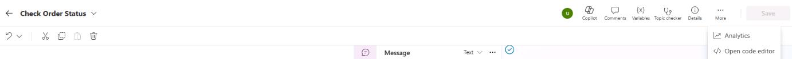

1. The code editor displays YAML code for the topic.

	{: .note }
	> YAML is an acronym for "YAML Ain't Markup Language." It's a human-readable data serialization format often used for configuration files and data exchange between languages with different data structures.

	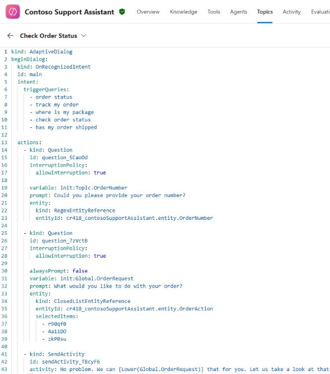

1. On the command bar, select **Close code editor** after exploring the code.

	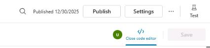

---
### 02: Use Power Fx to modify how the date displays

1. Locate the **Condition** branch for **Check**.

1. Below the **Condition** node, select **+**, select **Variable management**, and then select **Set a variable**.

	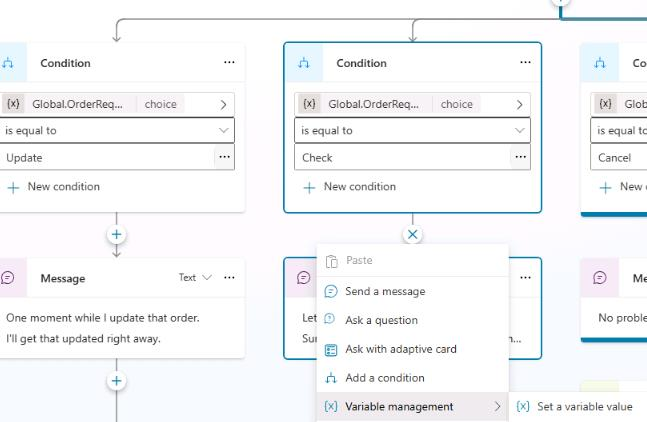

1. Select  **Create a new variable**.

	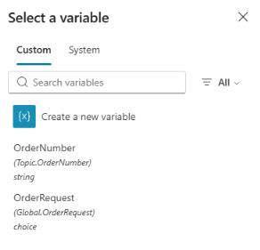

1. Select the **Var1** variable. Then, in the **Variable properties** pane, set **Variable name** to `OrderDeliveryDate`.

	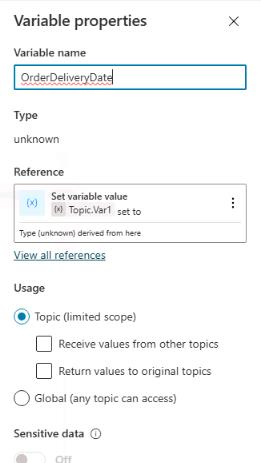
	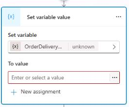

1. In the **To Value** field, select the ellipsis (**...**), select the **Formula** tab, and then enter the following function:

	```
	Text(
		DateAdd(
			Now(),
			2,
			TimeUnit.Days
		),
		DateTimeFormat.LongDate
	)
	```


	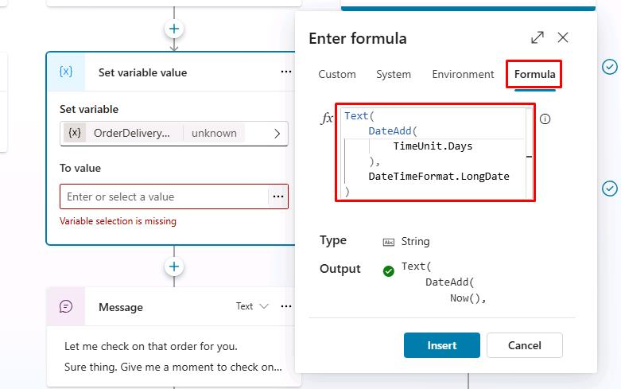

	{: .note }
	> The function takes today's date and time (for example, 5/31/2026 8:00 AM), adds two days to it, and then formats the date in a long date format (for example, Saturday, June 2, 2026). 


1. Select **Insert**.

	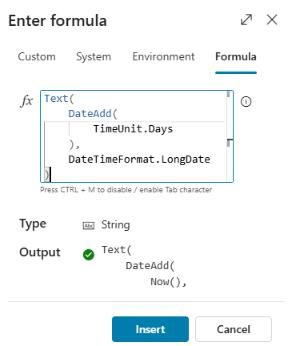

1. Add a **Message** node to the bottom of the **Check** branch, below the existing **Message** node.

	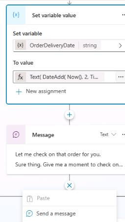

1. Enter the following message:

	```
	Your order {Topic.OrderNumber} should be delivered by {Topic.OrderDeliveryDate}.
	```

	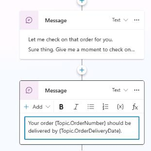

1. On the command bar for the agent, select **Save**.

1. On the command bar for the agent, select **Test**.

1. In the upper-right corner of the **Test your agent** pane, select **Start new test session** to start a new conversation.

	

1. Submit the following prompt and review the response: 

	```
	Hi, could you check the status of order ORD-001342?
	```

	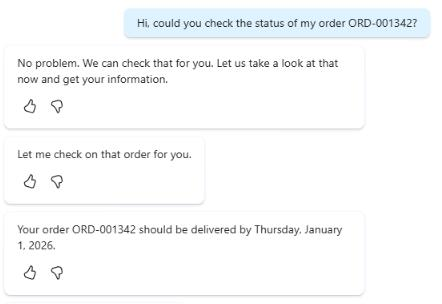