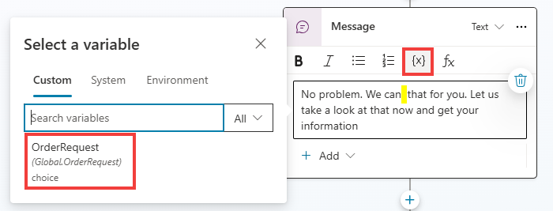
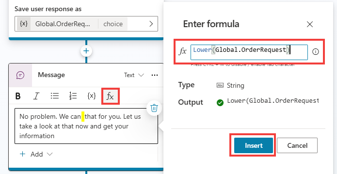

# Use global variables

In this task, you learn how to use the data from the previous task in the first exercise, Check Order Status. At this point, you should have the Question node in your topic linked to an entity.

1.	In the right panel that opens – *if not already done in the previous lab* – rename the **Variable name** to **OrderRequest** and then select **Global** to change the scope from local (topic) to **Global** so that other topics can access it, as shown in the following screenshot.

	

1.	Now, you use the variable that you completed from the question or trigger phrase in the message as dynamic data. Select the existing **Thank you for your question!** Message node, and change the text to:
	
 	```plaintext
  	No problem. We can that for you. Let us take a look at that now and get your information.
  	```

1.	Place the cursor between the 2 spaces, and select the **{x}** variable icon and then select the **Global.OrderRequest** variable that you recently created. This action is common to insert a variable in place of the literal word, making it dynamic based on data provided from the user or customer's question.

1. Enter the following prompt:

	```plaintext
 	No problem. We can {Global.OrderRequest} that for you. Let us take a look at that now and get your information.
 	```

	

1.	Select **Save**.

1.	Select the **Test** option to test the behavior of the Copilot and the changes that you made by triggering the topic with a trigger phrase. The following screenshot shows this process in action.

1. 	Enter the following prompt:

	```plaintext
 	I unfortunately have to cancel my order, can you help me please?
 	```

       

1.	Notice how the **OrderRequest** value still has its first letter capitalized. To address this grammatical issue, you can choose to use a formula to lower the word, instead of directly referencing the variable value. Go back to the Message node, remove the initial variable value {Global.OrderRequest}, and instead, select the **𝒇𝓍** button, and use the Lower() Power Fx formula. See how the variable values can be referenced within the formula.


1. 	Enter the following prompt:

   	```plaintext
    	ower(Global.OrderRequest)
	```
    
   	

	{: .important }
	> **Pro tip**: Within the Variable management options is the Clear all variables option, which clears all variable values. This option is useful if you want to begin or loop back into the same topic but take new values, especially if you've set up question behavior properties where a question could be skipped if it already had a value.


**Variables** are the best way to store dynamic data or data that you want to perform conditions or checks on to drive conversational behavior in a particular way, as you'll observe in the next task.

Congratulations on completing this task. You've now reviewed variables and the different types in Microsoft Copilot Studio.
