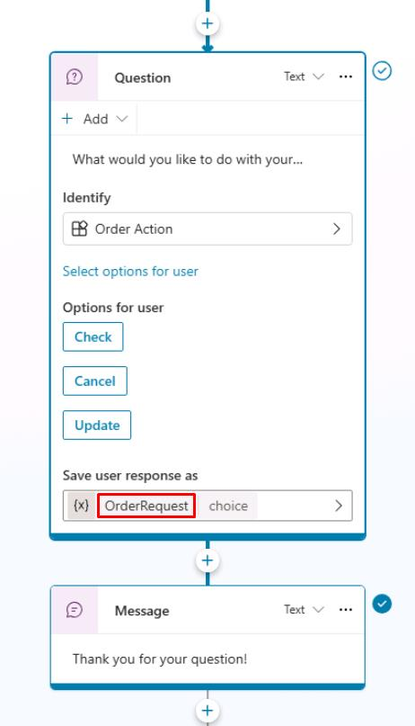
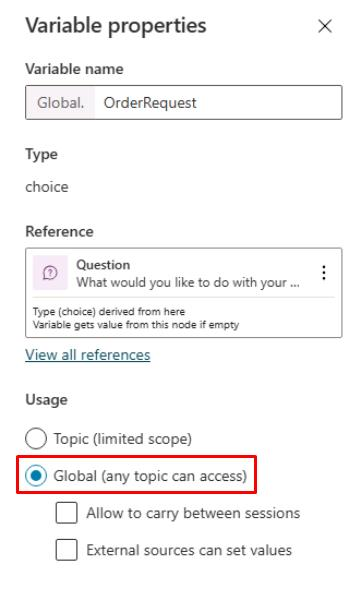
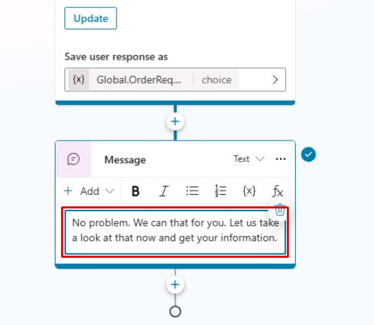
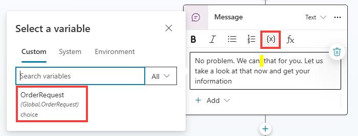
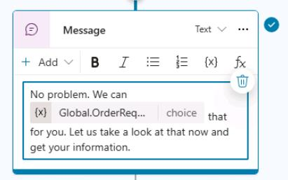
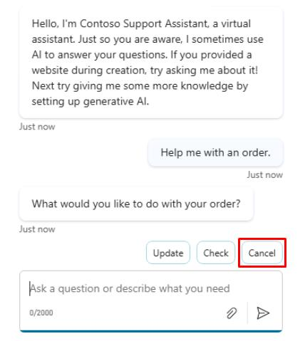
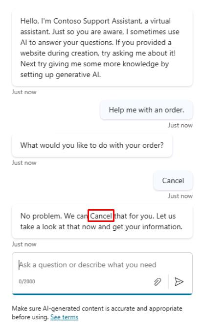
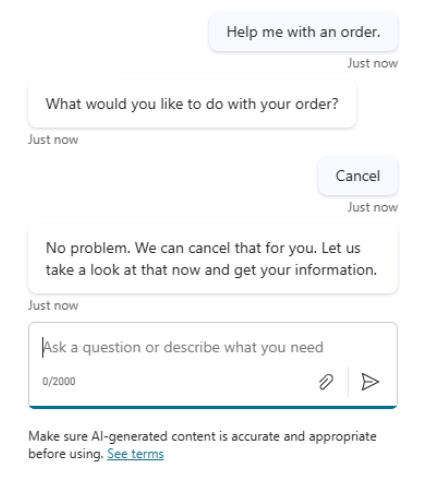

# Task 05: Use global variables

## Introduction

Certain information needs to be accessible across multiple conversation topics for efficiency, such as customer identifiers or common details. Global variables are needed to share critical data seamlessly across Contoso’s agent interactions.

## Description

In this task, you’ll define global variables in Copilot Studio, allowing information to persist and remain accessible across different conversation topics and sessions.

## Success criteria

-   You’ve defined and configured global variables.
-   You’ve validated accessibility of global variables across multiple conversation topics.


## Key tasks

### 01: Use global variables

<details markdown="block"> 
  <summary><strong>Expand this section to view the solution</strong></summary> 


In this task, you learn how to use the data from the previous task, Check Order Status. At this point, you should have the **Question** node in your topic linked to an entity.

1. In the **Question** node, select the **OrderRequest** variable. 

	

1. In the **Variable properties** pane, under **Usage**, select **Global** so that other topics can access it.

	

1. Now use the variable that you configured in the **Question** or **Trigger** phrase in the **Message** node as dynamic data. Replace the text in the **Message** node:
	```
	No problem. We can that for you. Let us take a look at that now and get your information.
	```

	

1. Select and place the text cursor in the space between "**can**" and "**that**" in the message, select the **{x}** variable icon, then select the **OrderRequest** variable.

	

    

	{: .important }
	> It's common to insert a variable in place of words, making the text dynamic based on data provided by the end user.

1. Enter the text the following way if you know the value of your variables.

	```
	No problem. We can {Global.OrderRequest} that for you. Let us take a look at that now and get your information.
	```

	{: .note }
	> This also fixes a spacing issue between the variable and surrounding words in the previous step.

1. Select **Save** in the upper-right part of the canvas to save the topic.

1. If not open, select **Test** in the upper-right part of the window to test the changes you made by triggering the topic with a trigger phrase.

1. Select the refresh icon in the upper-right corner of the **Test your agent** pane to start a new conversation.

1. Enter the following:

	```
	Help me with an order.
	```

1. Select **Cancel**.

	

    

	{: .note }
	> Note how the **OrderRequest** value still has its first letter capitalized. To address this grammatical issue, you can use a formula to change this to lowercase instead of directly referencing the variable value. 
    
1. In the **Message** node, delete the variable value **{Global.OrderRequest}**, then select the **fx** button.

1. Enter the following **Lower()** Power Fx formula, then select **Insert**.

   	`Lower(Global.OrderRequest)`

    

    {: .note }
	> See how the variable values can be referenced within the formula.

	{: .important }
	> Within the **Variable management** options is the **Clear all variables** option, which clears all variable values. This option is useful if you want to begin or loop back into the same topic but take new values, especially if you set up question behavior properties where a question could be skipped if it already had a value.

1. Test again in a new conversation to see the changes.

	```
	Help me with an order.
	```

	

1. Select **Save** in the upper-right part of the canvas to save the topic.

{: .important }
> **Variables** are the best way to store dynamic data or data that you want to perform conditions or checks on to drive conversational behavior in a particular way, as you'll observe in the next task.

</details>

Congratulations on completing this task. You've now reviewed variables in Microsoft Copilot Studio.