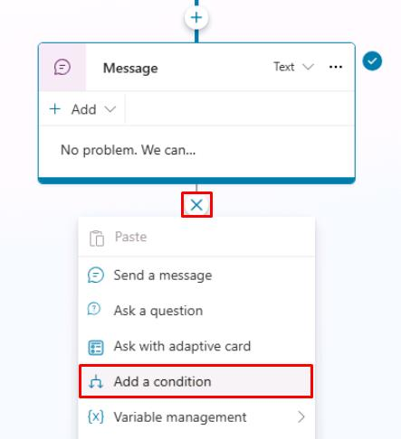
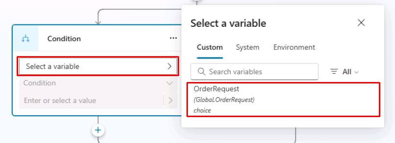
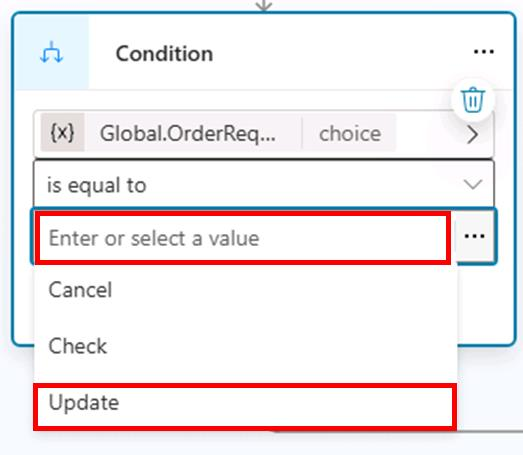
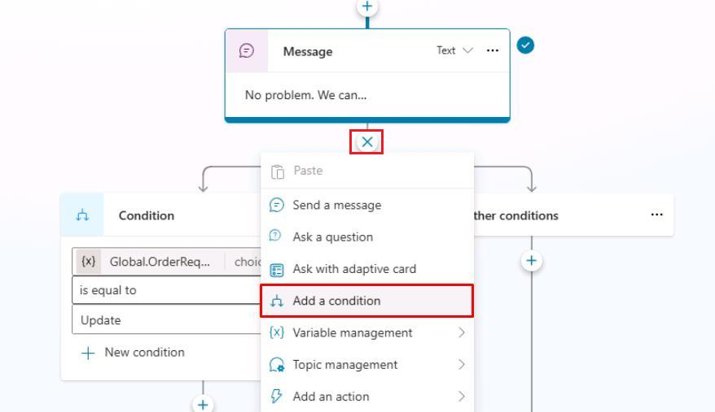
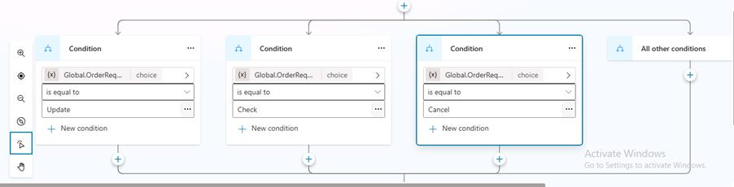
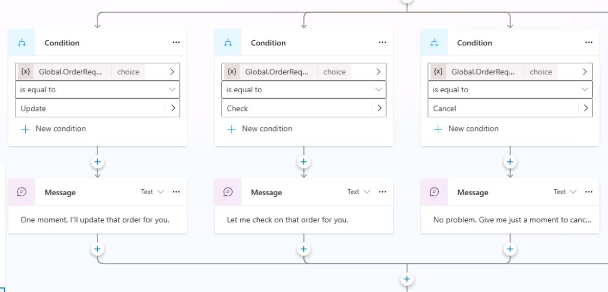
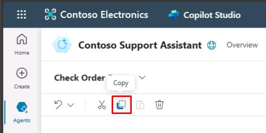
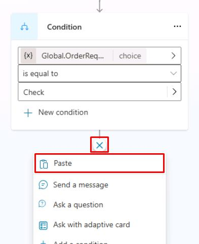

# Task 06: Use variables in conditions

## Introduction

To provide tailored responses based on customer input, Contoso’s agent must utilize conditions based on stored data. In this task, you'll configure conversation conditions using variables to dynamically guide the conversation according to specific scenarios.

## Description

In this task, you’ll set conditions in conversational topics based on variable values, directing the conversation flow appropriately depending on user inputs or previously collected information.

## Success criteria

-   You’ve created conditional logic based on variable values.
-   You’ve tested and confirmed correct conversational branching based on variables.

## Learning resources

{: .important }
> For more information on conditions, see [Authoring using conditions](https://learn.microsoft.com/microsoft-copilot-studio/authoring-using-conditions).

## Key tasks

### 01: Use variables in conditions

 
  
<strong>Expand this section to view the solution</strong>
 

1. Under the **Message** node, select the **+** button, then select **Add a condition**.
 	
    

	{: .note }
	> Two new nodes will appear. One is your **Condition** and the other is an exception for **All other conditions**.

1. In the **Condition** node, select **Select a variable**, then select your **OrderRequest** global variable.
 	
    

1. Keep the condition operator as **is equal to**.

1. Select the text box for **Enter or select a value**, then select **Update**.
 	
    

1. Select the **+** button between the **Message** node and the branching **Condition** nodes, then select **Add a condition** to add another branch.

	

1. In the new **Condition** node, repeat steps 2 and 3, then set the value to **Check**.

1. Repeat the same steps to add a **Condition** node for **Cancel**. 

	

1. Under each **Condition** node, select the **+** button, then select **Send a message** to add a **Message** node.

1. Set different messages depending on the condition:

	`One moment while I update that order.`

    `Let me check on that order for you.`

    `No problem. Give me just a moment to cancel that order.`
 
	

	{: .important }
	> Do things faster by selecting a node and copying it using the upper-left productivity tools menu. Once copied, the node is available to be pasted, using the same tools menu or when using the **+** button to add a new node.
    >
    > 
    >
    > 

1. Select **Save** in the upper-right part of the canvas to save the topic.

1. Select the refresh icon in the upper-right corner of the **Test your agent** pane to start a new conversation.

1. Explore the different trigger phrases and conditions that lead the user to view different message outcomes.

{: .important }
> Conditions are foundational tools that help you create tailored experiences based on what the user has selected or answered in previous questions. You can nest conditions within other conditions for more complex logic.

Congratulations, you've now completed the basics of using conditions and using variables as parameters within them.