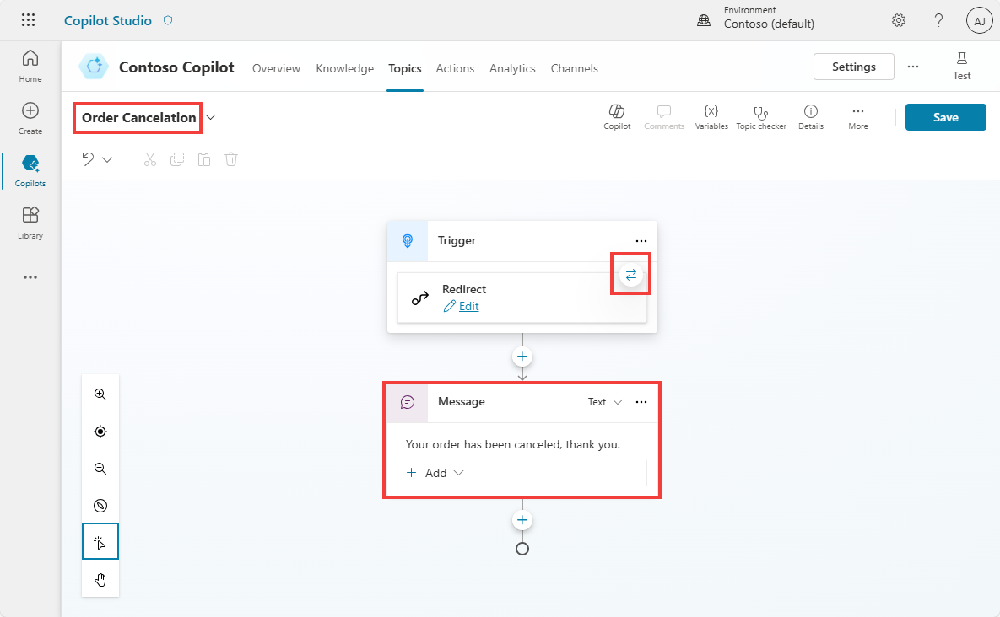
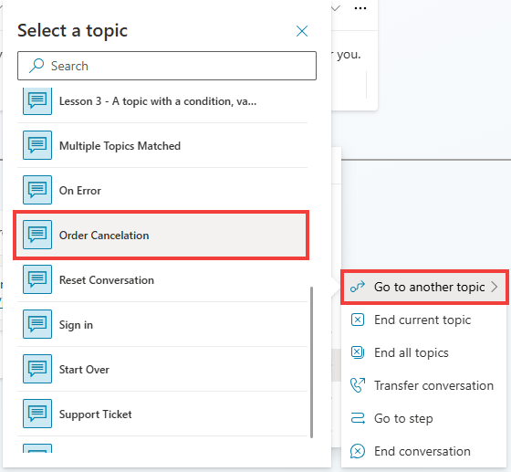
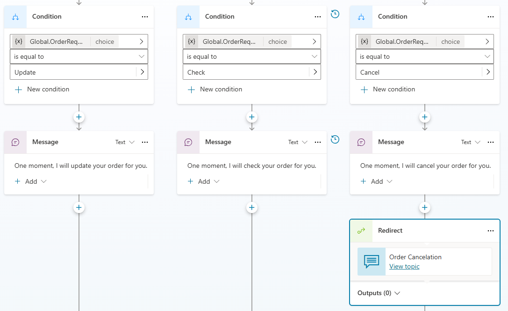
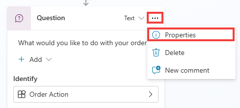
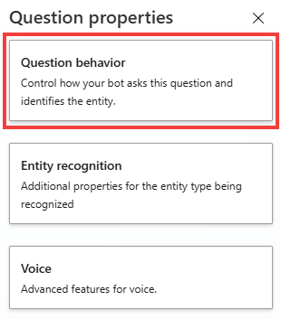
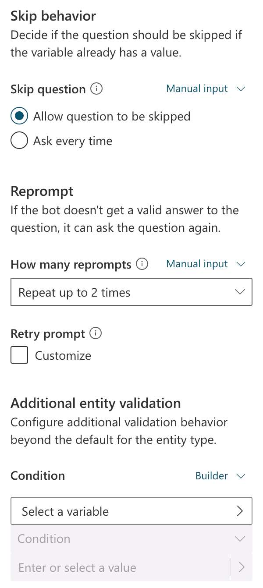
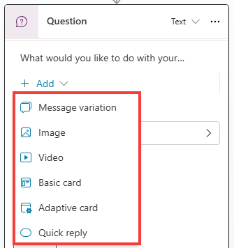

# Use the Go to another topic node

In this task, you learn how to use the **Go to another topic node**.

1.	In your topic, ensure that you completed the last task and that you have a **Condition** node in your authoring canvas.

2.	Return to the **Topics** page where all your topics are displayed in a list view. 

2. Create a new blank topic called +++Order Cancellation+++. As this topic doesn’t need trigger phrases, change the trigger type to **Redirect**. Add a single **Message** node that acknowledges the cancellation and then save this topic.

	+++Your order has been canceled, thank you.+++

    

1.	**Save** this topic.

2.	Return to the original topic that you created called **Check Order Status** that has the **Condition** branch within it. 

2.	Within the branch that had the condition set as **Cancel**, create a new node beneath the **message** node and then select **Topic management**. Then, in the flyout menu, select **Go to another topic** and then find and select your **Order Cancellation** topic in the list (you can search for a topic by name or scroll through the list of topics to find a given topic), as shown in the following screenshot.

 	

3.	The three conditions from the previous task should display. The Cancel conditional branch should contain a redirect to another topic, which sends an acknowledgment message by redirecting to the new topic that you created. Test the behavior by Saving your topic and then selecting the Test option.

 	
 	Congratulations, you're now familiar with the available actions under the Topic management menu. It would be useful for you to review the other options under Topic management before you continue; however, it's not essential for moving on to the next task.

===

## Question node behavior

Previously, this lab covered the basics of the **Question** node and built on this concept by using entities and slot filling. In addition to storing a user's response, the **Question** node has more behavior options that you can set up. 

Expand here for more details.

One option is the ability to skip the asking of a question if the variable that it's linked to already contains a value. You observed this process in action in a previous task where the question was skipped when the copilot was asked to check an order. The question was skipped because, by using entities and slot filling, you allowed Microsoft Copilot Studio to retrieve data from the sentence that the user asked and then store the data within the variable. After the **Question** node was reached by Microsoft Copilot Studio, it already contained data, so the question didn't need to be asked again. This approach is more efficient because, when the user or customer is talking to a copilot, they won’t need to answer the same question multiple times.

4.	Within the **Check Order Status** topic, select the **Question** node. Then, select the ellipsis within the top right corner of the **Question** node to extend the menu, as shown in the following screenshot, and then choose **Properties** from the menu.

 	

5.	Select **Question behavior** from the **Question properties** panel that appears.
 	

The **Question** node has several configurable options so that you're able to better identify what the user's response is to the question that you're asking. This component is important when you're developing conversational applications. Because regardless of the type of AI that's behind the scenes managing the natural language responses, a user might provide unexpected or unidentifiable answers. The ability to handle the copilot's behavior in those circumstances help you provide an improved customer experience. This scenario also happens in real life, when you ask a question to another person, and they don't understand the question. For the best experience and conversation, it's important to rephrase or act differently than to repeat the same question that wasn't originally understood.

The following question behavior controls are available for you to choose from in the Question behavior property window:

•	**Skip behavior/Skip question** – A copilot author can skip the question if the variable already has a value. The variable in the question could have a value that was set somewhere else in the topic, in another topic, or through slot filling and by using entities. This behavior allows the copilot author to skip the question, or if the variable has a value, to ask the question anyway. Other available options include using Power Fx to create a condition, and if that condition is true, to skip the question.

•	**Reprompt/How many reprompts** – You can set up the behavior to repeat the question a specific number of times, and you can select from the dropdown menu to **not repeat**, **repeat once**, or **repeat up to two times**. Similar to the skip question option, you can also use Power Fx to set the condition for this behavior to occur. You can modify the **Retry prompt** option, which only occurs if you have retries selected to repeat the question. By selecting the **Retry prompt** option, you can add a different message to reword the question, and you can add message validations to make the question sound more natural and be more helpful to the customer or user.

•	**Additional entity validation/Condition** – This behavior is important if you have specific conditions to validate if an entity is valid to be slot filled and is dependent on the entity type. You can also use the same prompt behavior to change the prompt, if the conditions aren't met, to encourage the user to provide a different input.

•	**No valid entity found/Action if no entity found** – If no entity is found, rather than skip the question, you can specify the behavior, such as leave the variable empty, set the variable to something specific or dynamic (by using Power Fx), or call the escalate system topic.

•	**Interruptions** – You can indicate whether a customer should be able to switch to a different topic than the current topic that the **Question** node is in. This option is useful if a customer is likely to answer a question with another question and you want to continue the conversation without needing to handle all exceptions within a single question node.

Now that you're aware of the core functionality of the Question node and associated behavior, you can explore the rich text responses in the Message and Question nodes.

===

#Rich text options for message and question nodes

Microsoft Copilot Studio includes several extended capabilities for creating copilots, and it provides positive conversational experiences for customers. One central feature is the rich text authoring capabilities that are available for the **Message** and **Question** nodes.

The types of rich text authoring options that are available include:

•	**Image** – You can add an image, which is displayed on the card. Add the URL of the image and a title (optional).

•	**Video** – You can add a video URL, which needs to be a publicly available MP4 or a YouTube video URL.

•	**Basic card** – This option includes simple cards that provide adaptive cards, such as visuals; however, this option requires standard input such as the title, messages, and the ability to add buttons with basic actions.

•	**Adaptive Card** – You can add Adaptive Cards, which are platform-agnostic cards that are designed to be flexible to suit the needs at the time, including requesting action, displaying information so that it's displayed with emphasis on specific information, or more. Microsoft Copilot Studio supports Adaptive Cards v.1.5 at the time when these labs were written.

•	**Quick reply** – This option allows users to select from specific options rather than needing to enter the response in text-based scenarios. Quick replies are optional, so a user can still type or speak their own response. You should use these replies to provide common suggestions or to help give the user ideas about the type of information that's being asked.
 	Message variations are covered in the next task. Now, you set up a few of these options so that you can become familiar with their behavior.
