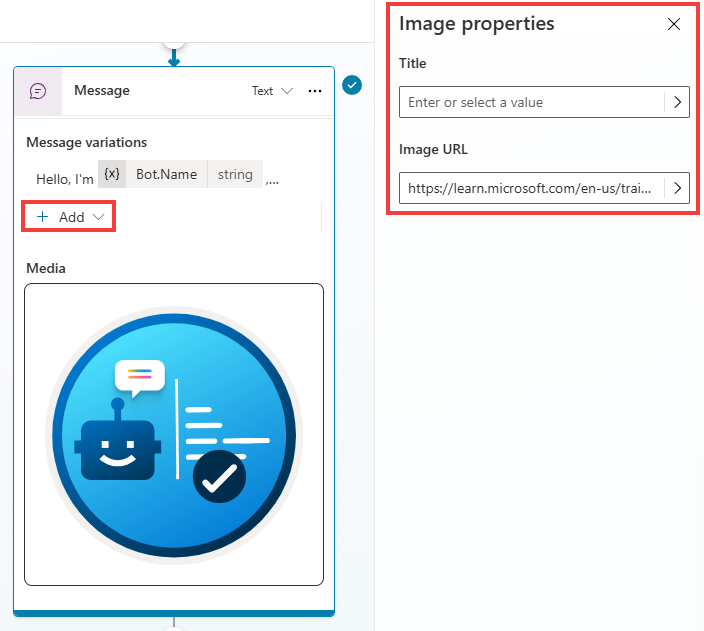
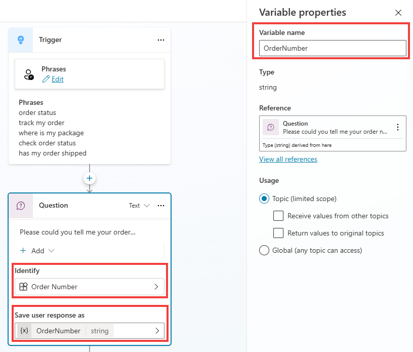
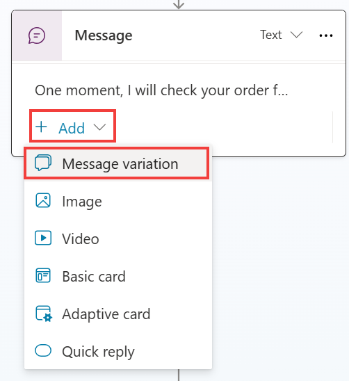

# Use rich text capabilities in a message node

1.	Go the **Topics** tab, select the System tab, then enter the **Conversation Start** topic.

1.	In the existing **Message** node, select **+ Add**, and then choose **Image**. 

1.	Select the image block that appears, as shown in the following screenshot. The **Title** and **Image** text boxes display. You need to enter the Image URL to a publicly available image. Optionally, you can also add a name for the image by using the **Title** field.


	```plaintext
 	https://learn.microsoft.com/en-us/training/achievements/build-effective-bots.svg
 	```

	

1.	Still in the same topic and message, choose + Add again, and then choose Quick reply.

1. 	Enter the following prompt:

	```plaintext
 	Help with my order
  	```

	{: .important }
	> **Pro tip**: quick replies are a great way to suggest available options for a user to choose from, driving a conversation to successful outcomes by proactively proposing the most common actions.

1.	Save the Conversation Start Topic

1.	Go to the Check Order Status topic.

1.	Add a new Question node after the trigger.
	
 	```plaintext
  	Please could you tell me your order number?
   	```

1.	Change the Identify property and select Create an Entity.

	Select Regular expression (Regex), name it Order Number, and for its pattern use a regular expression that will automatically detect IDs such as ORD-123456
	**ORD-[0-9]{6}**

1.	Select the Save user response as variable menu in the new Question node, and in the variable properties panel to the right, change the variable name to OrderNumber.

	

	Next steps: Take some time to repeat this process with the following different rich response types to become familiar with the different properties before you move on to the next task.
	
 	For more information, see **Send a message**.

	- Image

	- Video

	- Basic card

	- Adaptive card

	- Quick reply

	{: .important }
	> **Pro tip**: For Adaptive Cards samples and authoring experiences, check these websites: 
	>- [https://adaptivecards.io/samples/](https://adaptivecards.io/samples/)
	>- [https://adaptivecards.io/designer/](https://adaptivecards.io/designer/) 	
	>- [https://amdesigner.azurewebsites.net](https://amdesigner.azurewebsites.net)

---

#Message variations

You can use the **Message** node to display a message to the user. Fundamentals of the **Message** node were covered in a previous lab and previous task in this lab. **Message** and **Question** nodes also support message variations. A **Message variation** allows you to add up to 15 messages in a single node so that, when the copilot is triggered, it randomly selects a message variation. Message variations allow a copilot author to add different styles of sentence in the same **Message** node, where at runtime, Microsoft Copilot Studio will randomly select one message variation when the topic is triggered. This feature provides authors with the ability to create natural sounding interaction and provides customers with a more natural sounding experience when they're interacting with copilots over time.

{: .highlight } 
> *Because message variations are selected randomly when a topic is triggered, you can add multiple versions of the same message if you want to provide an experience that leans on a certain style while providing smaller degrees of probability that still offers differentiation on some occasions.*

In the following task, you'll add a **Message variation** node on an existing **Message** node.

1.	Open the** Check Order Status** topic that you've been working with in this lab. Select the **Message** node that you want to add a **Message variation** to, such as the one in the check order **Condition** branch shown in the preceding image.

2.	Within the **Message** node, select **Add > Message variation**.

 	

3.	Add at least one message variation of your choice, or you can use the following example to observe how message variations stack in the message node. For example, under the **Update** condition path:


	```plaintext
 	Absolutely. One moment and I'll get the order for you.
	```

Congratulations, you've now completed the basics of using the Message node. Now, you can practice testing your message variations by selecting the Test option and then trigger the condition multiple times to observe it working.


The **Message** node has other properties, which is an advanced feature that's not covered in these labs.

---

# Speech Authoring

#### Within Microsoft Copilot Studio, Copilot makers can use Speech Synthesis Markup Language (SSML) tags in **Message** and **Question** nodes so that they can extend the behavior when they're using Microsoft Copilot Studio for speech-enabled copilots. You can use Microsoft Copilot Studio for text authoring and speech authoring. By default, on voice-enabled channels, the message text that's entered in the message node will be used for text display and voice. You can override this behavior by providing different behavior for text and speech. For example, you'd override the behavior when you want to provide more emphasis on certain areas of a sentence or on an image message because you want to provide an alternative description that can be read aloud.

#### When using SSML, you can set up how the text will be converted to synthesized speech to ensure that it sounds like natural speech. You can use SSML tags like Audio, Break, Emphasis, and Prosody, to change the behavior of how your sentence is spoken.

- **Audio** - Add prerecorded audio.

- **Break** - Insert pauses or breaks between words.

- **Emphasis** - Add levels of stress to words and phrases.

- **Prosody** - Specify changes to pitch, contour, range, rate, and volume.

 	For more information, see [Speech Synthesis Markup Language](https://learn.microsoft.com/en-us/azure/cognitive-services/speech-service/speech-synthesis-markup/).
