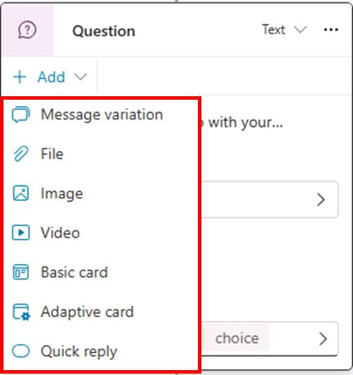
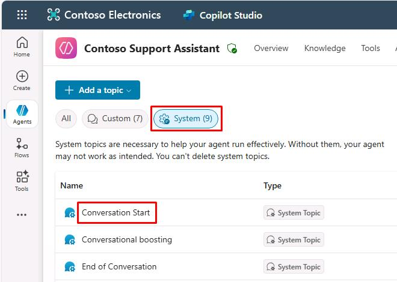
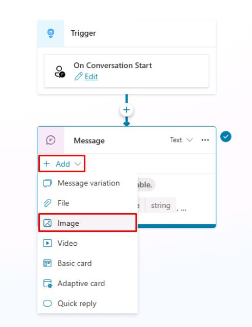
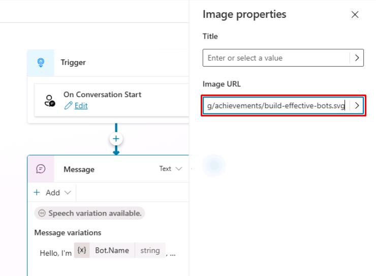
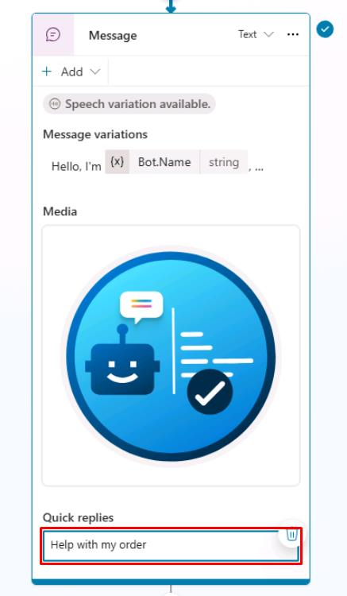
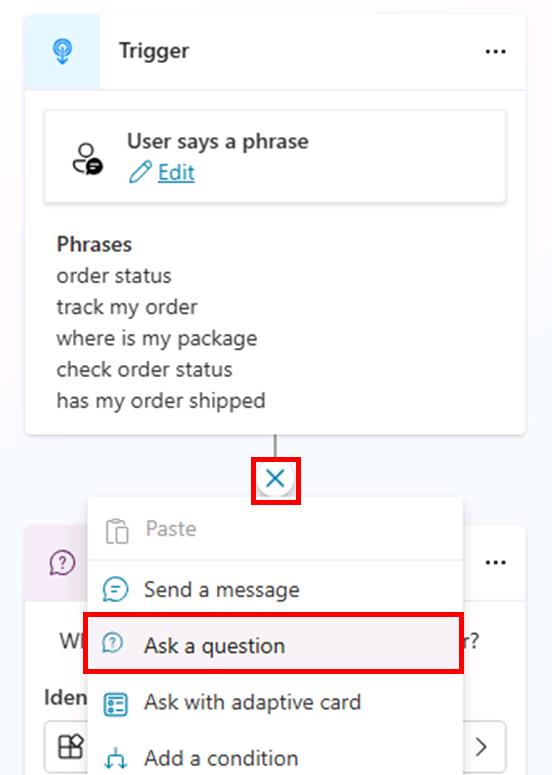
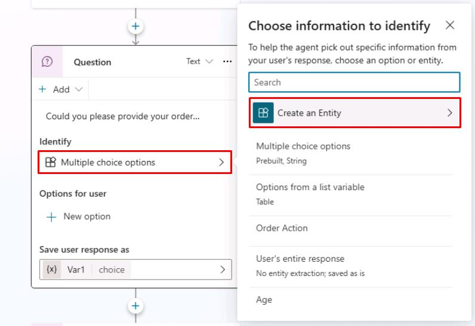
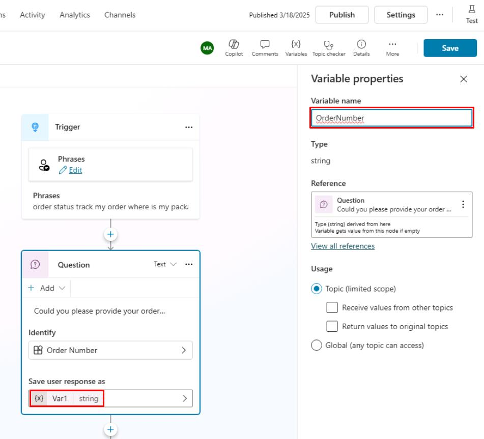

# Task 09: Use rich text capabilities in a **Message** node

## Introduction

Clear communication is vital when providing instructions or important information.

## Description

You'll use rich text formatting to improve clarity in your agent’s messages, ensuring information provided to Contoso’s customers is easily understood.

## Rich text options for Message and **Question** nodes

Microsoft Copilot Studio includes several extended capabilities for creating agents, and it provides positive conversational experiences for customers. One central feature is the rich text authoring capabilities that are available for the Message and **Question** nodes.



The types of rich text authoring options that are available include:

- **Image** - You can add an image, which is displayed on the card. Add the URL of the image and a title (optional).

- **Video** - You can add a video URL, which needs to be a publicly available MP4 or a YouTube video URL.

- **Basic card** - This option includes simple cards that provide adaptive cards, such as visuals; however, this option requires standard input such as the title, messages, and the ability to add buttons with basic actions.

- **Adaptive Card** - You can add Adaptive Cards, which are platform-agnostic cards that are designed to be flexible to suit the needs at the time, including requesting action, displaying information so that it's displayed with emphasis on specific information, or more. Microsoft Copilot Studio supports Adaptive Cards v.1.5 at the time when these exercises were written.

- **Quick reply** - This option allows users to select from specific options rather than needing to enter the response in text-based scenarios. Quick replies are optional, so a user can still type or speak their own response. You should use these replies to provide common suggestions or to help give the user ideas about the type of information that's being asked.
 
## Success criteria

-   Applied rich text formatting to messages.
-   Verified clear and formatted text presentation during agent interactions.


## Key tasks

### 01: Add rich text to Conversation Start

<details markdown="block"> 
  <summary><strong>Expand this section to view the solution</strong></summary> 

1. Select **Topics** on the top bar. 
    
1. Select the **System** filter near the upper-left corner of the window, then select the **Conversation Start** topic.

    

1. Select the **Message** node, select **Add**, then select **Image**. 

	

1. In the **Image URL** text box, enter:

	```
	https://learn.microsoft.com/en-us/training/achievements/build-effective-bots.svg
	```

    

	{: .note }
	> Optionally, you can also add a name for the image by using the **Title** field.

1. Select **Add** again in the **Message** node, then select **Quick reply**.

1. Enter the following under **Quick replies**:

	```
	Help with my order
	```

    

	{: .important }
	> Quick replies are a great way to suggest available options for a user to choose from, driving a conversation to successful outcomes by proactively proposing the most common actions.

1. Select **Save** in the upper-right part of the canvas to save the topic.

</details>

### 02: Add a regular expression entity

<details markdown="block"> 
  <summary><strong>Expand this section to view the solution</strong></summary> 

1. Select **Topics** on the top bar. 

1. Select the **Check Order Status** topic.

1. Below the **Trigger** node, select the **+** button, then select **Ask a question** to add a new **Question** node.

	
	
1. Enter the following:

  	```
	Could you please provide your order number?
	```

1. Select the entry under **Identify**, then select **Create an Entity**.

	

1. Select **Regular expression (Regex)**.

1. Enter the following for the new entity:

    | Item | Value |
    |---------|-------------|
    | **Name** | `Order Number` |
    | **Pattern** | `ORD-[0-9]{6}` |

	{: .note }
	> This pattern will automatically detect IDs like ORD-123456.

1. Select **Save** at the bottom of the pane.

1. In the same **Question** node, select **Var1**, then for **Variable name** enter `OrderNumber`.

	

1. Select **Save** in the upper-right part of the canvas to save the topic.

</details>

--- 

Take some time to repeat the process with the following different rich response types to become familiar with the different properties before you move on to the next task.

- Video
- Basic card
- Adaptive card
- Quick reply

{: .important }
>   For Adaptive Cards samples and authoring experiences, visit these sites:
>   - <https://adaptivecards.io/samples/>
>   - <https://adaptivecards.io/designer/>
>   - https://amdesigner.azurewebsites.net
