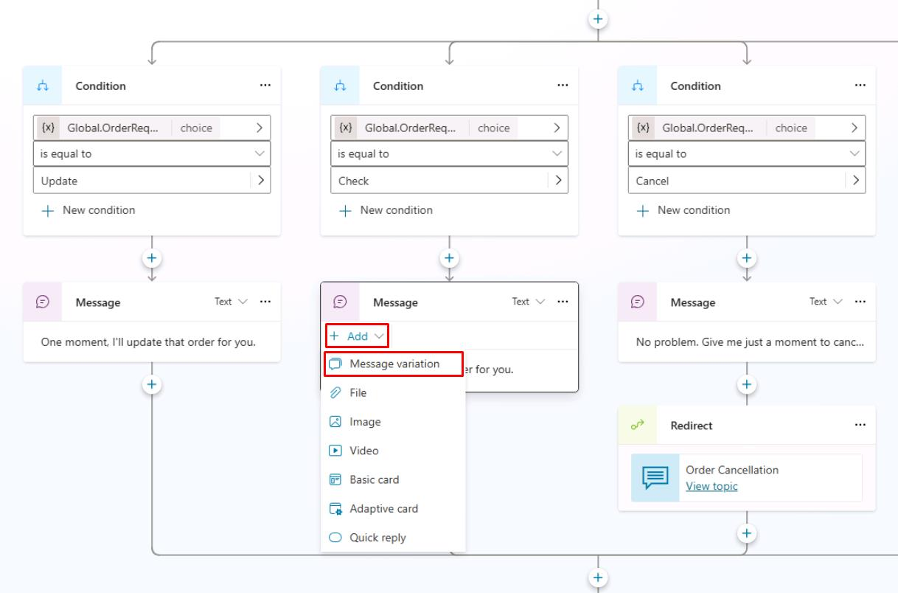

# Task 10: Add message variations

## Introduction

To enhance the natural conversational experience for Contoso’s customers, you'll introduce message variations. This approach ensures the agent communicates in a less repetitive, more engaging manner during multiple interactions.

## Description

You'll create message variations within Copilot Studio, allowing the agent to randomly select from multiple similar message responses to reduce redundancy.

## Success criteria

-   You’ve created multiple variations of agent messages.
-   You’ve verified randomized message selection during testing.


## Key tasks

Both Message and **Question** nodes support message variations, allowing you to add up to 15 different message options within a single node. When the agent is triggered, Microsoft Copilot Studio randomly selects one of these variations, enhancing conversational diversity. This feature helps agent authors create more natural and engaging interactions, providing users with dynamic and varied experiences over time.

### 01: Add message variations

<details markdown="block"> 
  <summary><strong>Expand this section to view the solution</strong></summary> 

In this task, you'll add a **Message variation** to an existing node.

1. Move through the **Check Order Status** canvas, and below the **Condition** branch for **Check**, select the **Message** node .

1. Select **Add**, then select **Message variation**.

	

1. Add a message variation the agent should use:

	```
	Sure thing. Give me a moment to check on that.
	```

1. Now add a variation to the **Message** node under the **Update** condition path:

	```
	I'll get that updated right away.
	```

1. Select **Save** in the upper-right part of the canvas to save the topic.

</details>

---

Congratulations, you've now completed the basics of using the **Message** node. Now, you can test out your message variations by selecting the **Test** option to trigger the conditions.

The **Message** node has additional advanced features not covered in the context of this exercise.


## Speech authoring

Within Microsoft Copilot Studio, authors of agents can use Speech Synthesis Markup Language (SSML) tags in Message and **Question** nodes to extend the behavior of speech-enabled agents. You can use Microsoft Copilot Studio for text authoring and speech authoring. By default, on voice-enabled channels, the message text that's entered in the **Message** node will be used for both voice and text display. You can override this behavior by providing different behavior for text and speech. For example, you can override when you want to provide more emphasis on certain areas of a sentence, or for an image message because you want to provide an alternative description that can be read aloud.

When using SSML, you can control how text is converted into synthesized speech to make it sound more natural. SSML tags like Audio, Break, Emphasis, and Prosody allow you to modify the way a sentence is spoken.

- **Audio** - Add pre-recorded audio.
- **Break** - Insert pauses or breaks between words.
- **Emphasis** - Add levels of stress to words and phrases.
- **Prosody** - Specify changes to pitch, contour, range, rate, and volume.

{: .important }
> For more information, see [Speech Synthesis Markup Language](https://learn.microsoft.com/en-us/azure/cognitive-services/speech-service/speech-synthesis-markup/).
 