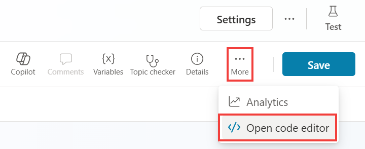
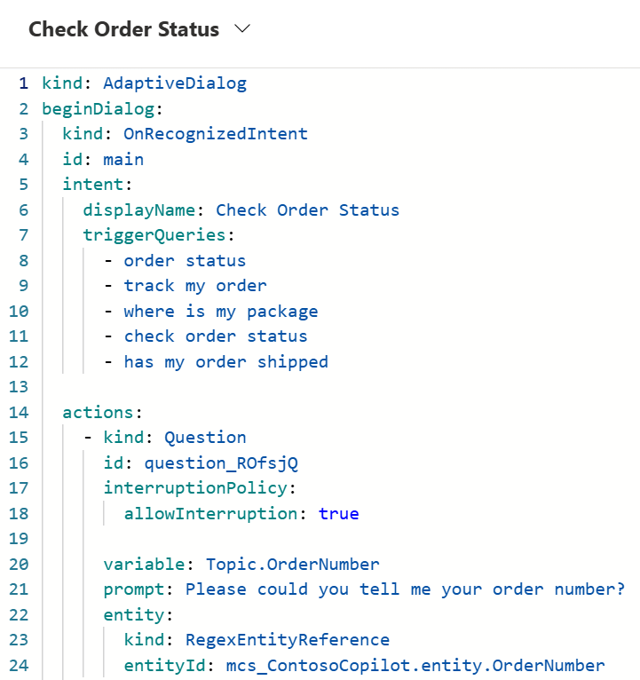

# Code view and Power Fx

Now that you're more familiar with the authoring fundamentals in Microsoft Copilot Studio, you can explore some extended capabilities that you can use to set up and further customize the Copilot experience. The following sections cover two capabilities: **code view** for pro developers and **Power Fx** (for Microsoft Power Platform makers and professional developers).
 	
Microsoft Copilot Studio has the capability to view the code behind a topic. This capability is incredibly useful for advanced makers and pro-code developers, where they can view and edit the syntax directly within the web browser, and when saved, the syntax is immediately visible in the graphical authoring canvas. As a result, the process of copying and editing multiple actions becomes faster and easier. Some specific actions are only available in the code editor view.

## Access the code editor
Follow these steps to access the code editor.

1.	  Open the topic that you've been working with in this lab titled **Check Order Status**.

1.    In the upper right of the topic, next to the **Save** icon, select the extended **(...)** menu and then select **Open code editor**, as shown in the following screenshot.

 	  

1.	  The code editor should open, where you can view your dialog in the code view (YAML code).

 	  

1.	  Select **Close code editor** in the upper right after exploring this feature.

