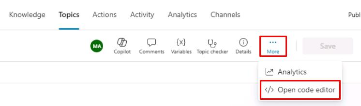
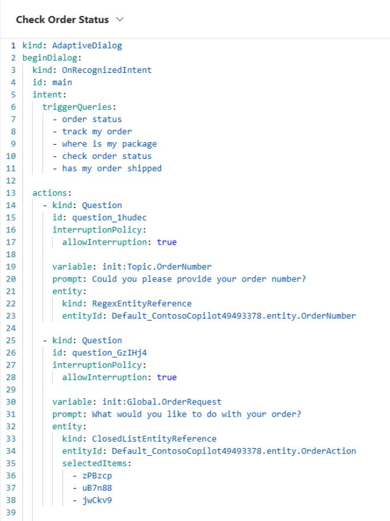

# Task 11: Use code view and Power Fx

## Introduction

To meet specific interaction requirements for Contoso’s customer service scenarios, advanced customization may be necessary.

## Description

You'll use the code view in Copilot Studio and employ Power Fx formulas to implement advanced conversational logic beyond default node capabilities.

## Success criteria

-   You’ve successfully utilized code view and Power Fx formulas.
-   You’ve confirmed advanced conversational logic behaves as intended.

## Key tasks

Now that you're more familiar with the authoring fundamentals in Microsoft Copilot Studio, you can explore some extended capabilities that you can use to set up and further customize the agent experience. The following sections cover two capabilities: **code view** for pro developers and **Power Fx** (for Microsoft Power Platform makers and professional developers).
 	
Microsoft Copilot Studio has the capability to view the code behind a topic. This capability is incredibly useful for advanced authors and pro-code developers. They can view and edit the syntax directly within the web browser, and when saved, the syntax is immediately visible in the graphical authoring canvas. As a result, the process of copying and editing multiple actions becomes faster and easier. 

Some specific actions are only available in the code editor view.

### 01: Access the code editor

 
  
<strong>Expand this section to view the solution</strong>
 

1. In **Check Order Status**, select **More** (ellipsis) in the upper-right part of the canvas next to **Save**, then select **Open code editor**.

	

1. Here you can see your dialog in YAML code view.

	

1. Select **Close code editor** in the upper-right corner of the pane after exploring the feature.

{: .warning } 
> If the option is unavailable, please refresh the page to return to the canvas.

