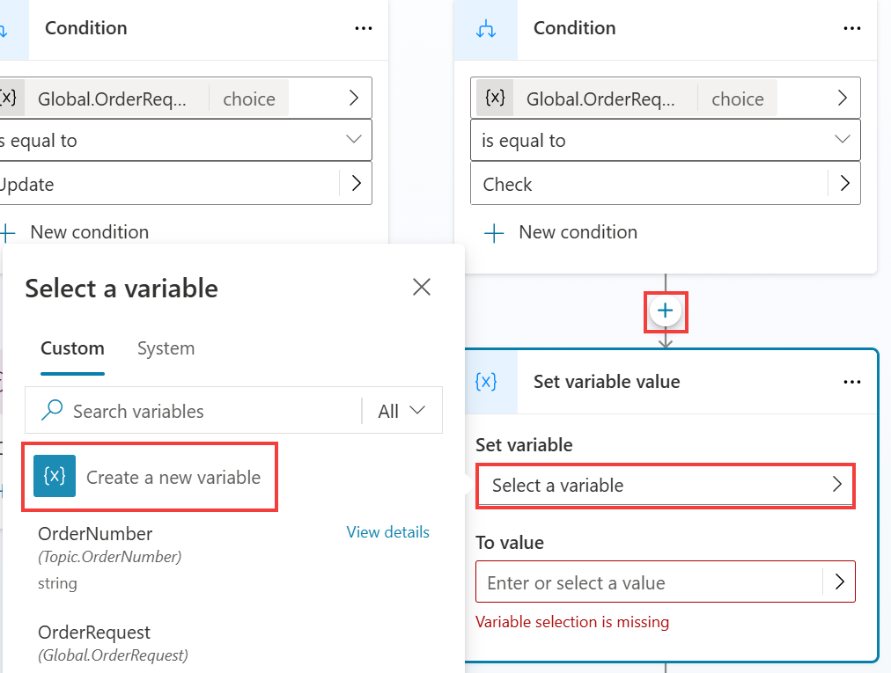
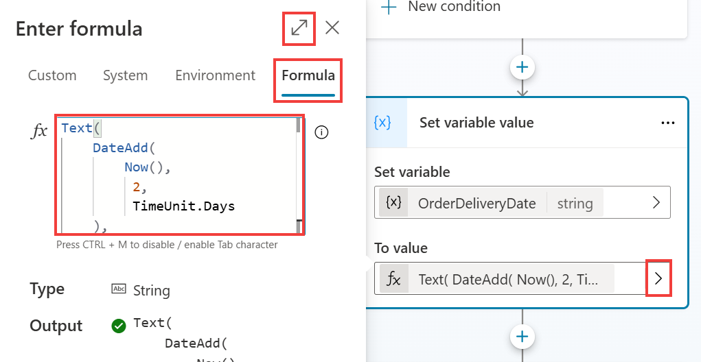
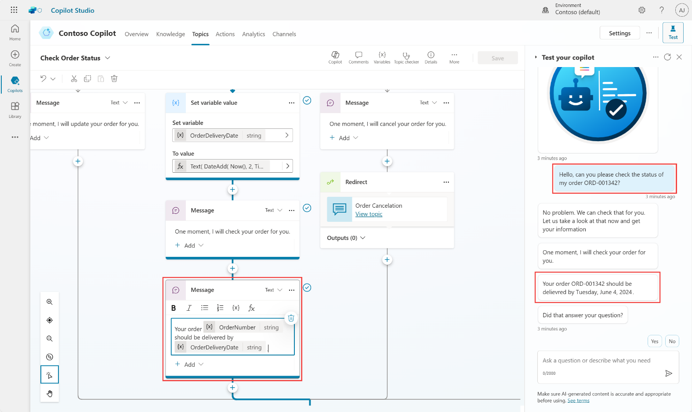

# Use Power Fx across Microsoft Copilot Studio

Power Fx is available in Microsoft Copilot Studio. With Power Fx, you can add functions, similar to how makers currently do in canvas apps from Microsoft Power Apps or Dataverse within the Microsoft Copilot Studio authoring canvas. You can use Power Fx in **Message** and **Question** nodes, when you're using the **Set a variable** value node, and in other areas such as **Conditions**, **Actions**, **Question behavior** configuration and **Adaptive Cards**. This feature gives you greater control over the data that's displayed to customers and users within the conversational interface. Additionally, it allows you to perform common operations in the runtime of Microsoft Copilot Studio.
 	
The following task goes through a basic scenario of using Power Fx within a variable and then displaying the value to the user.

## Use Power Fx to modify how the date is displayed

Follow these steps to use Power Fx to modify how the date is displayed.

1.	Open the **Check Order Status** topic that you've been working with during these labs.

1.	Under the **Check** condition branch, add **Set a variable value** node, and choose **Create a new variable**.

 	

1.	Selecting the new variable opens the **Variable properties** window to the right. Change the name of the variable to **OrderDeliveryDate**.

1.	On the **Set variable value** node, under **To Value**, select the flyout menu and then select **Formula** to open the **Enter formula** panel. Optionally, you can select the **expand** icon at the top-right of the **Enter formula** window to enlarge the area for entering a formula, and paste the below one.

1.	In the formula bar, enter the following function and then select **Insert**, as follows:

	```
	Text(
		DateAdd(
			Now(),
			2,
			TimeUnit.Days
		),
		DateTimeFormat.LongDate
	)
	```

	

	This function takes today's date and time, which technically has a specific date and time format (e.g., 5/31/2024 8:00 AM), adds 2 days to it, and then formats it in a long date format (e.g., Friday, May 31, 2024). This approach is important if you want to display simple date formats that are user-friendly or if you want to store the date as a string, in text format.

1.	For demo purposes, you can update the last Message in the Check path, to use the news variables you have configured:

	```
 	Your order {Topic.OrderNumber} should be delivered by {Topic.OrderDeliveryDate}.
	```

1.	Select **Save**.

1.	Test your Copilot by opening the testing pane, trigger the topic, and then follow the topic prompts to reach your **Message** node, as shown in the following screenshot.

	```
 	Hello, can you please check the status of my order ORD-001342?
  	```

	

Congratulations, you've successfully worked through all labs on the central authoring features in Microsoft Copilot Studio unified authoring.

