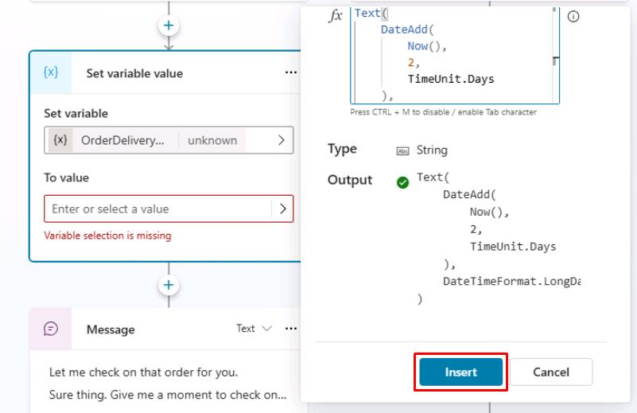

# Task 12: Use Power Fx across Microsoft Copilot Studio

## Introduction

Extending the Contoso agent's functionality beyond standard conversational logic requires deeper integration. To do this, you’ll need to apply Power Fx expressions across Microsoft Copilot Studio and customize customer interactions for Contoso.

## Description

You’ll incorporate Power Fx expressions throughout Copilot Studio, enhancing the agent's capability to handle complex scenarios and interactions comprehensively.

## Success criteria

-   You’ve implemented Power Fx expressions effectively in various conversational topics.
-   You’ve verified agent behavior aligns with intended advanced logic during interactions.


## Key tasks

Power Fx is available in Microsoft Copilot Studio. With Power Fx, you can add functions, in the same way authors currently do in canvas apps from Microsoft Power Apps or Dataverse, within the Microsoft Copilot Studio authoring canvas. You can use Power Fx in Message and **Question** nodes when you're using the Set a variable value node, and in other areas such as Conditions, Actions, Question behavior configurations, and Adaptive Cards. 

This feature gives you greater control over the data that's displayed to customers and users within the conversational interface. Additionally, it allows you to perform common operations in the runtime of Microsoft Copilot Studio.
 	
The following task goes through a basic scenario of using Power Fx within a variable and then displaying the value to the user.

### 01: Use Power Fx to modify how the date is displayed

1. Under the **Condition** node for **Check**, select the **+** button, select **Variable management**, then select **Set a variable value**.

    

1. Select the entry under **Set variable**, then select **Create a new variable**.

1. Select the **Var1** variable, then set the **Variable name** to `OrderDeliveryDate`.

1. Under **To Value**, select the chevron **(>)**, select the **Formula** tab, and enter the following function.

	{: .warning }
    > Using the **Copy** option in the upper-right corner of the code block and pasting with **Ctrl+V** will be quicker than using **Type**. 

	```
	Text(
		DateAdd(
			Now(),
			2,
			TimeUnit.Days
		),
		DateTimeFormat.LongDate
	)
	```

	

	{: .note }
    > You can select the **expand** icon in the upper-right corner of the **Enter formula** pane to enlarge the area.

	

1. Move through the **Enter formula** pane and select **Insert** at the bottom, or in the lower-right part of the expanded view.

	

	{: .note }
    > This function takes today's date and time (for example, 5/31/2035 8:00 AM), adds two days to it, and then formats it in a long date format (for example, Saturday, June 2, 2035) . This approach is important if you want to display simple date formats that are user-friendly, or if you want to store the date as a string in text format.

1. Add a **Message** node to the bottom of the **Check** branch, under the existing **Message** node.

1. Add a message using the new variables you configured:

	```
    Your order {Topic.OrderNumber} should be delivered by {Topic.OrderDeliveryDate}.
    ```

	

1. Select **Save** in the upper-right part of the canvas to save the topic.

1. Select the refresh icon in the upper-right corner of the **Test your agent** pane to start a new conversation.

1. Trigger the topic with a relevant prompt:

	```
    Hi, could you check the status of my order ORD-001342?
    ```

	

</details>

## Summary

Congratulations, you've successfully worked through all the tasks on the central authoring features in Microsoft Copilot Studio unified authoring. In this exercise you:

 - Defined and used custom entities and slot‑filling to capture user intent automatically.
 - Stored customer data in topic and global variables for later use.
 - Added conditions to branch conversations based on variable values.
 - Practised using the Test your agent pane to trace variable values and dialog flow. 