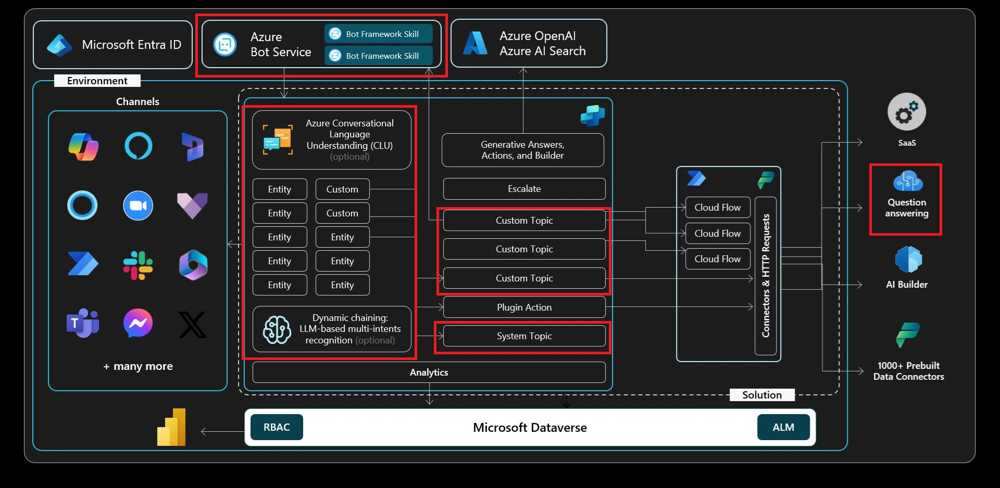

# Exercise 02: Learn basic authoring

## Scenario

After successfully setting up the basic Copilot Studio agent, Contoso now needs the agent to handle specific customer inquiries about equipment orders.

This exercise focuses on expanding the agent's capabilities by teaching it to recognize different customer requests. You'll define custom entities, implement slot-filling techniques to automatically extract information from customer messages, and configure variables to dynamically manage conversations. This refinement helps streamline Contoso's service request handling, significantly reducing manual input from service reps.

## Objectives

This exercise covers the following topics:

-   Learn the fundamentals of the message and **Question** nodes.
-   Discover the fundamentals of entities and slot filling.
-   Learn how to use variables in Microsoft Copilot Studio.
-   Explore the extensibility capability, including Power Fx and extended node properties.

## Architecture

## Duration

Estimated time: *60 minutes*.