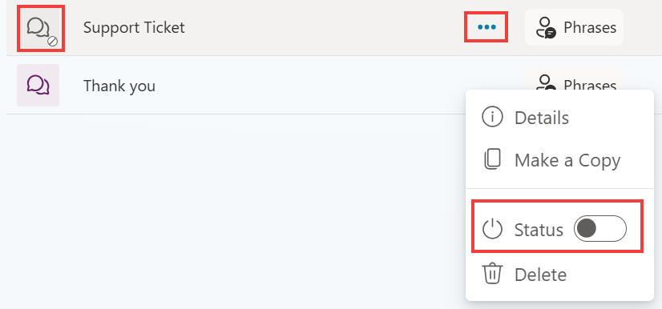
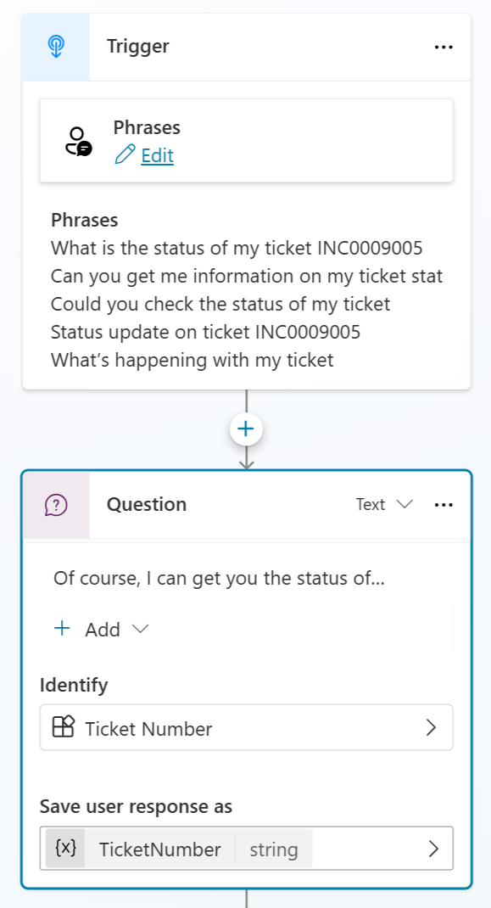

# Tast 01: Create a new topic

1.	To avoid confusion with topics created in previous labs, **disable** any topic related to **Support Ticket**.

 	

2.	Open the Copilot Studio authoring canvas’ **Topics** page and click **Add a topic** drop down at the top of the screen, select the **From blank** option. Name your topic **Check Ticket Status**.

3.	Add some trigger phrases that a user may ask such as the below ones:

	```
	What is the status of my ticket INC0008001
	Can you get me information on my ticket status
	Could you check the status of my ticket
	Status update on ticket INC0009005
	What’s happening with my ticket INC1234567
	```


1.	Create a new Question node and enter text: **Of course, I can get you the status of your ticket. What is your ticket number?**.

2.	In **Identify**, choose **Create an Entity** of type **Regular expression (Regex)**, call it **Ticket Number** and with this pattern: **INC[0-9]{7}**.

3.	Rename the Var1 variable to **TicketNumber**.

 	

4.	**Save** your topic.
