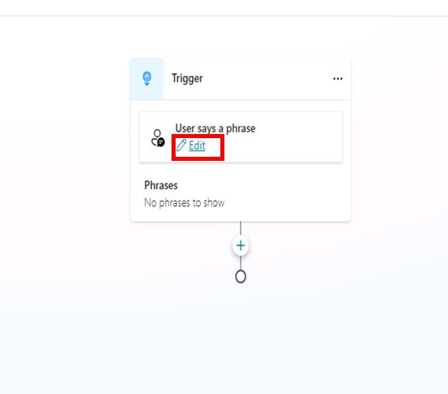

# Task 01: Create a new topic

## Introduction

Contoso regularly receives customer inquiries about existing service tickets, equipment status, and maintenance schedules. To improve efficiency in handling these requests, the AI-powered agent must be equipped to gather specific details directly from customers during their interactions.

## Description

In this task, you'll create a new conversational topic in Microsoft Copilot Studio. This topic will include trigger phrases customers might use to request information, as well as questions to collect necessary details such as ticket numbers.

## Success criteria

-   You’ve created and named a new conversational topic.
-   You’ve defined suitable trigger phrases.
-   You’ve added a **Question** node to collect required customer information.


## Key tasks

### 01: Create a new topic

<details markdown="block"> 
  <summary><strong>Expand this section to view the solution</strong></summary> 

1. Select **Topics** on the top bar.

	{: .note }
	> To avoid confusion with the **Support Ticket** topic created in a previous task, you'll disable it here.
	
1. On the line for **Support Ticket**, select the toggle under the **Enabled** column to set it to **Off**.

	

1. Select **Add a topic** in the upper-left part of the window, then select **From blank**. 

	

1. Select **Untitled** in the upper-left part of the window, and rename the topic to `Check Ticket Status`.

1. Within the **Trigger** node, under **Phrases**, select **Edit**.

	

1. Under **Add phrases**, enter the following, then select **Enter** or the **+** button for each phrase.

	- `What is the status of my ticket INC0008001`
	- `Can you get me information on my ticket status`
	- `Could you check the status of my ticket`
	- `Status update on ticket INC0009005`
	- `What's happening with my ticket INC1234567`

1. Add a new **Question** node under the **Trigger** node, then enter: 

	```
	Absolutely. Could you provide me with your ticket number?
	```

1. Select the entry under **Identify**, then select **Create an Entity**.

	

1. Select **Regular expression (Regex)**

1. Enter the following for the new entity:

    | Item | Value |
    |----------|-----------------|
    | **Name** | `Ticket Number` |
    | **Pattern** | `INC[0-9]{7}` |

1. Select **Save** at the bottom of the pane.

1. Select the **Var1** variable, then for **Variable name** enter `TicketNumber`.

1. Select **Save** in the upper-right part of the canvas to save the topic.


</details>
