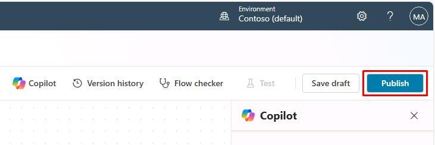

## Task 01: Create a new topic and agent flow

### Introduction

Contoso regularly receives customer inquiries about existing service tickets, equipment status, and maintenance schedules. To improve efficiency in handling these requests, the AI-powered agent must be equipped to gather specific details directly from customers during their interactions.

### Description

In this task, you'll create a new conversational topic in Microsoft Copilot Studio. This topic will include trigger phrases customers might use to request information, as well as questions to collect necessary details such as ticket numbers.

### Success criteria

- You've created and named a new conversational topic.
- You've defined suitable trigger phrases.
- You've added a **Question** node to collect required customer information.

### Key tasks

---

#### 01: Create a new topic

1. On the command bar for the agent, select **Topics**.

1. On the line for **Support Ticket**, select the toggle under the **Enabled** column to set it to **Off**.

	

1. On the **Topics** page, select **Add a topic** and then select **From blank**.

	

1. Select **Untitled** in the upper-left part of the window and rename the topic to `Check Ticket Status`.

	

1. Within the **Trigger** node, in the **User says a phrase** section, select **Edit**.

	

1. In the **Phrases** pane, add each of the following phrases and then close the **Phrases** pane.

	- ```What is the status of my ticket INC0008001```
	- ```Can you get me information on my ticket status```
	- ```Could you check the status of my ticket```
	- ```Status update on ticket INC0009005```
	- ```What's happening with my ticket INC1234567```

	

1. Add a **Question** node below the **Trigger** node and enter the following text:

	

1. In the **Identify** section, select **Multiple choice options** and then select **Create an Entity**.

	

1. Select **Regular expression (Regex)**.

	

1. Use the following information to configure the entity and then select **Save**:

	| Item | Value |
	| ---- | ----- |
	| **Name** | `Ticket Number` |
	| **Pattern** | `INC[0-9]{7}` |

	

1. In the **Question** node, select the **Var1** variable.

1. In the **Variable properties** pane, in the **Variable name** field, enter `TicketNumber`.

1. On the command bar for the agent, select **Save**.

1. Leave the topic page open.


---
#### 02: Create an agent flow
In this section you'll use simulated ServiceNow data. If you were using a live connection to ServiceNow, you would add a ServiceNow List Records node and configure the connection there.

1. Select the **+** button below the **Question** node. Select **Add a Tool**, and then select **New Agent flow**.

	


1. Select the **Respond to Copilot** node in the flow.

	

1. Select **Add an output**, then select **Text**.

	

1. Set the name to ```SNTicketInfo```.

	

1. Select the text box to the right of **SNTicketInfo** for its value field.

	

1. Paste the following payload sample into the text field:


	```JSON
	{
		"parent": "",
		"made_sla": "true",
		"caused_by": "",
		"watch_list": "",
		"upon_reject": "Cancel all future Tasks",
		"sys_updated_on": "2018-12-12 23:18:55",
		"child_incidents": "0",
		"hold_reason": "",
		"origin_table": "",
		"task_effective_number": "INC0009005",
		"approval_history": "",
		"number": "INC0009005",
		"resolved_by": "",
		"sys_updated_by": "admin",
		"opened_by": "System Administrator",
		"user_input": "",
		"sys_created_on": "2018-08-31 21:35:45",
		"sys_domain": "global",
		"state": "New",
		"route_reason": "",
		"sys_created_by": "admin",
		"knowledge": "false",
		"order": "",
		"calendar_stc": "",
		"closed_at": "",
		"cmdb_ci": "",
		"delivery_plan": "",
		"contract": "",
		"impact": "1 - High",
		"active": "true",
		"work_notes_list": "",
		"business_service": "",
		"business_impact": "",
		"priority": "1 - Critical",
		"sys_domain_path": "/",
		"rfc": "",
		"time_worked": "",
		"expected_start": "",
		"opened_at": "2018-08-31 21:35:21",
		"business_duration": "",
		"group_list": "",
		"work_end": "",
		"caller_id": "David Miller",
		"reopened_time": "",
		"resolved_at": "",
		"approval_set": "",
		"subcategory": "Email",
		"work_notes": "2018-12-12 23:18:42 - System Administrator (Work notes)\nupdated the priority to high based on the criticality of the Incident.\n\n",
		"universal_request": "",
		"short_description": "Email server is down.",
		"correlation_display": "",
		"delivery_task": "",
		"work_start": "",
		"assignment_group": "",
		"additional_assignee_list": "",
		"business_stc": "",
		"cause": "",
		"description": "Unable to send or receive emails.",
		"origin_id": "",
		"calendar_duration": "",
		"close_notes": "",
		"notify": "Do Not Notify",
		"service_offering": "",
		"sys_class_name": "Incident",
		"closed_by": "",
		"follow_up": "",
		"parent_incident": "",
		"sys_id": "ed92e8d173d023002728660c4cf6a7bc",
		"reopened_by": "",
		"incident_state": "New",
		"urgency": "1 - High",
		"problem_id": "",
		"company": "",
		"reassignment_count": "0",
		"activity_due": "2018-12-13 01:18:55",
		"assigned_to": "",
		"severity": "3 - Low",
		"comments": "",
		"approval": "Not Yet Requested",
		"sla_due": "UNKNOWN",
		"comments_and_work_notes": "2018-12-12 23:18:42 - System Administrator (Work notes)\nupdated the priority to high based on the criticality of the Incident.\n\n",
		"due_date": "",
		"sys_mod_count": "3",
		"reopen_count": "0",
		"sys_tags": "",
		"escalation": "Normal",
		"upon_approval": "Proceed to Next Task",
		"correlation_id": "",
		"location": "",
		"category": "Software"
	}
	```

	


1. On the command bar for the agent flow, select  **Publish**. Wait for the green success banner to display

	

1. In the confirmation dialog, select **Go back to agent**.

   
