# Task 02: Create your Power Automate cloud flow

## Introduction

Contoso aims to provide customers with timely and accurate responses by automating the retrieval of service-related information. Power Automate cloud flows will facilitate this by interacting with external systems to fetch the requested data quickly.

## Description

In this task, you'll create a Power Automate cloud flow to retrieve simulated data from external sources. This flow will accept input from the Copilot Studio agent and simulate an automated process to return the required data.

## Success criteria

-   Successfully created the Power Automate cloud flow.
-   Configured input parameters correctly.
-   Simulated a data retrieval action within the cloud flow.


## Key tasks

### 01: Create your Power Automate cloud flow

<details markdown="block"> 
  <summary><strong>Expand this section to view the solution</strong></summary> 

In this task, you'll simulate a ServiceNow connection to pull in ticket details.

{: .warning } 
> Check with your coach to see if they want to use a real ServiceNow connection after step 7, or if you should use the simulated response.
>
> Screenshots in subsequent tasks show the simulated ticket details.

1. Select the **+** button under the **Question** node, select **Add an action**, then select **New Power Automate flow**.
	
	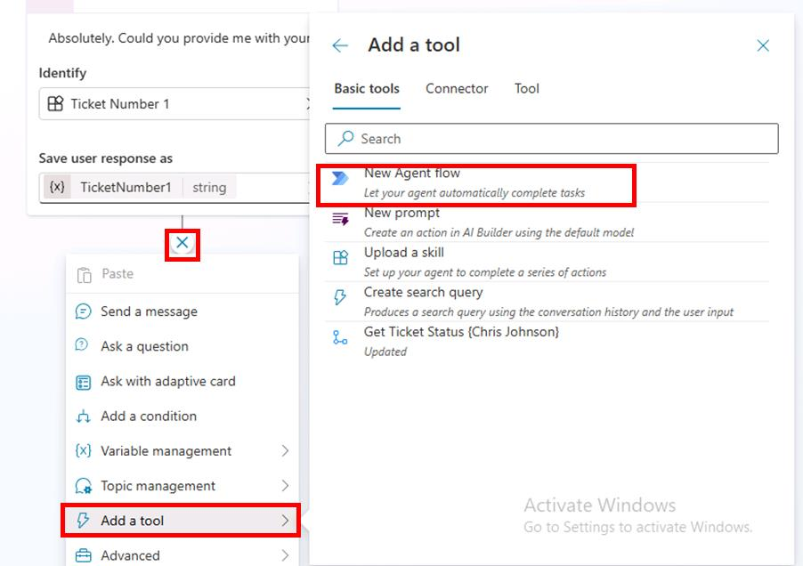

	{: .note }
	> This will open **Power Automate** in a new browser tab and includes the scaffolding pre and post actions for a new Power Automate cloud flow to interact with Copilot Studio.

1. Ensure the **New designer** is enabled in Power Automate, in the upper-right part of the window.

	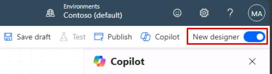

1. Select the **When an agent calls the flow** node.

1. In the new pane, select **Add an input**, then select **Text**.

	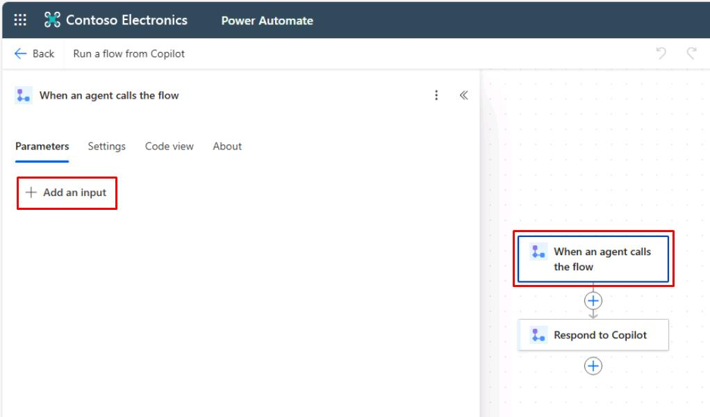

1. Replace the name value of **Input** with `TicketNumber`.

	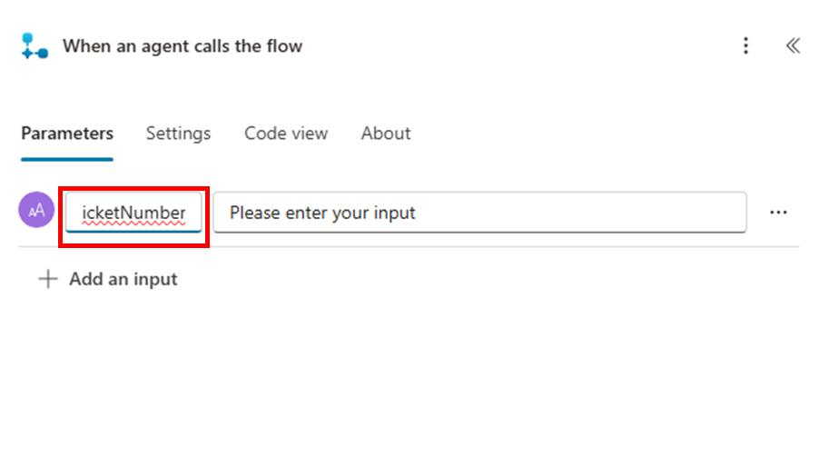

1. Select the **+** button under the **When an agent calls the flow** node.

	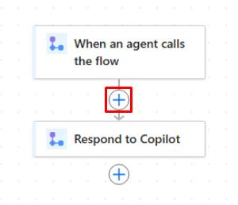

1. Search for `ServiceNow List Records` in the search bar, then select **List Records**.

	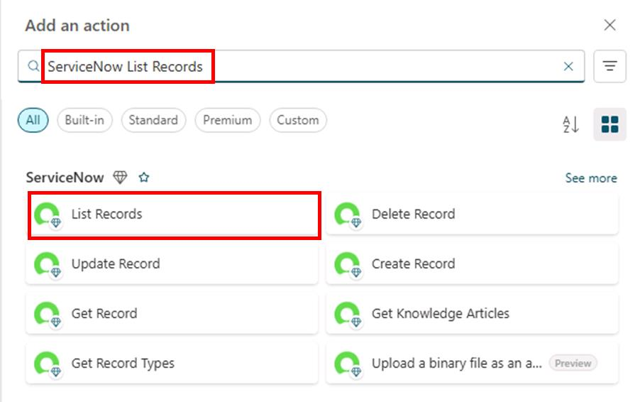

	{: .warning }
	> If your coach provides a ServiceNow environment to use, expand here for details on finishing this task. If not, proceed to the next step.
	> 
	> - Input all the connection details provided by the coach.
	> - Select **Create New**.
	> - Under **Record Type**, select the dropdown menu, then search for and select `Incident`.
	> - Under **Advanced parameters**, select **Show all**.
	> - Set the **Display System References** to **Yes** to show actual values.
	> - Under **Query**, enter `numberCONTAINS`, then select the **TicketNumber** input from the dynamic content (⚡).
	>
	> - Ensure there are no spaces between **numberCONTAINS** and the **TicketNumber** variable you reference. 
	>	Alternatively, you can also paste the following in the **Query** field:
	> ```
	> numberCONTAINS@{triggerBody()?['text']}
	> ```
	> - Under **Limit**, enter `1`.
	>
	> 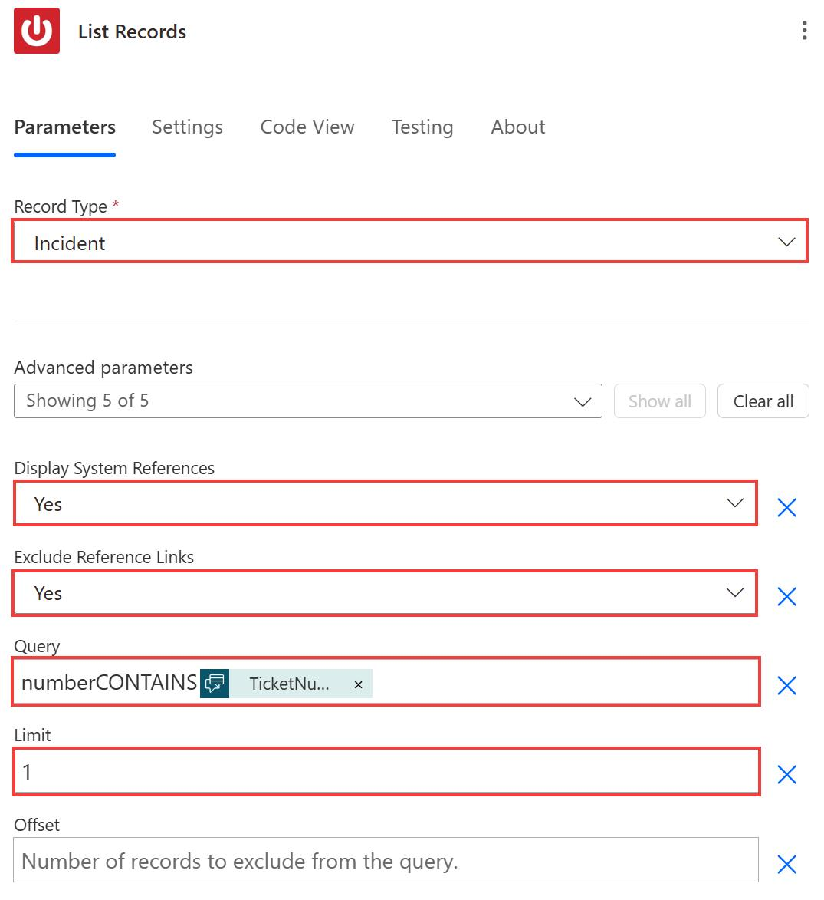
	>
	> - Select the **Respond to Copilot** node in the cloud flow.
	> - Select **Add an output**, then select **Text**.
	> - Set the name to `SNTicketInfo`.
	> - Select the text box to the right of **SNTicketInfo** for its value field, then select the formula button (**fx**).
	>
	> 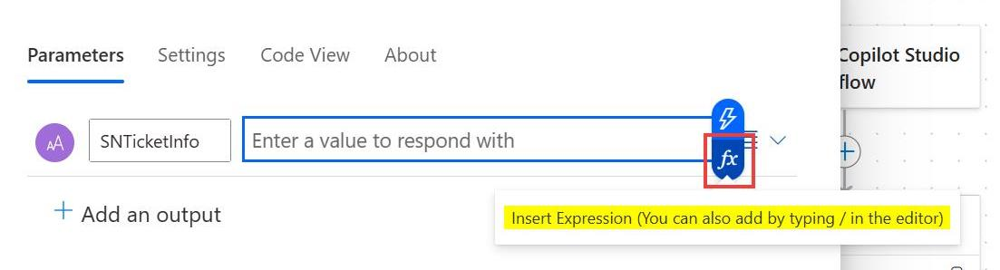
	>
	> - Enter the following formula, then select **Add**. This gets a string of the first returned record of the resulting array from the **List Records** body.
	>
	> ```
	> string(first(outputs('List_Records')?['body/result']))
	> ```
	>
	> 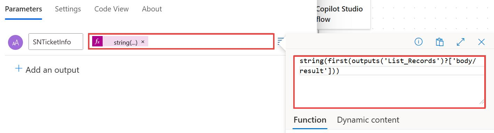
	>
	> - Skip to step 16 in this task to rename and publish the flow.

1. In the **Create connection** step, enter the following:

    | Item | Value |
    |----------|-----------------|
    | **Connection name** | `@lab.User.FirstName @lab.User.LastName ServiceNow` |
    | **Authentication Type** | Basic Authentication |
    | **Instance** | `https://dev261120.service-now.com` |
    | **Username** | `CopilotStudioServiceAccount` |
    | **Password** | `F@k3Pw29@9%92` |

1. Select **Create new**.

	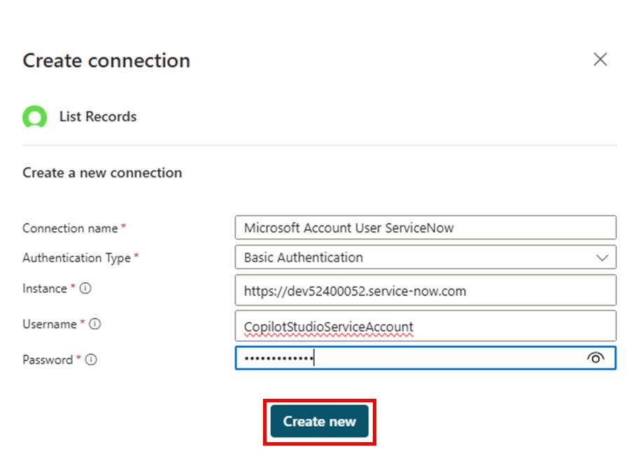

1. In this scenario, you'll simulate a response that comes from this connection instead.

	Delete the **List Records** node by selecting it, then selecting the **Delete** key. Alternatively, right-click the node, then select **Delete**.

	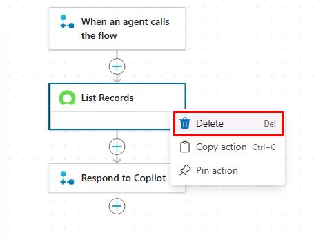

1. Select the **Respond to Copilot** node in the flow.

1. Select **Add an output**, then select **Text**.

1. Set the name to `SNTicketInfo`.

1. Select the text box to the right of **SNTicketInfo** for its value field.

	

1. For this simulated ServiceNow response, paste the following payload sample in the text box.


	```json
	{
		"parent": "",
		"made_sla": "true",
		"caused_by": "",
		"watch_list": "",
		"upon_reject": "Cancel all future Tasks",
		"sys_updated_on": "2018-12-12 23:18:55",
		"child_incidents": "0",
		"hold_reason": "",
		"origin_table": "",
		"task_effective_number": "INC0009005",
		"approval_history": "",
		"number": "INC0009005",
		"resolved_by": "",
		"sys_updated_by": "admin",
		"opened_by": "System Administrator",
		"user_input": "",
		"sys_created_on": "2018-08-31 21:35:45",
		"sys_domain": "global",
		"state": "New",
		"route_reason": "",
		"sys_created_by": "admin",
		"knowledge": "false",
		"order": "",
		"calendar_stc": "",
		"closed_at": "",
		"cmdb_ci": "",
		"delivery_plan": "",
		"contract": "",
		"impact": "1 - High",
		"active": "true",
		"work_notes_list": "",
		"business_service": "",
		"business_impact": "",
		"priority": "1 - Critical",
		"sys_domain_path": "/",
		"rfc": "",
		"time_worked": "",
		"expected_start": "",
		"opened_at": "2018-08-31 21:35:21",
		"business_duration": "",
		"group_list": "",
		"work_end": "",
		"caller_id": "David Miller",
		"reopened_time": "",
		"resolved_at": "",
		"approval_set": "",
		"subcategory": "Email",
		"work_notes": "2018-12-12 23:18:42 - System Administrator (Work notes)\nupdated the priority to high based on the criticality of the Incident.\n\n",
		"universal_request": "",
		"short_description": "Email server is down.",
		"correlation_display": "",
		"delivery_task": "",
		"work_start": "",
		"assignment_group": "",
		"additional_assignee_list": "",
		"business_stc": "",
		"cause": "",
		"description": "Unable to send or receive emails.",
		"origin_id": "",
		"calendar_duration": "",
		"close_notes": "",
		"notify": "Do Not Notify",
		"service_offering": "",
		"sys_class_name": "Incident",
		"closed_by": "",
		"follow_up": "",
		"parent_incident": "",
		"sys_id": "ed92e8d173d023002728660c4cf6a7bc",
		"reopened_by": "",
		"incident_state": "New",
		"urgency": "1 - High",
		"problem_id": "",
		"company": "",
		"reassignment_count": "0",
		"activity_due": "2018-12-13 01:18:55",
		"assigned_to": "",
		"severity": "3 - Low",
		"comments": "",
		"approval": "Not Yet Requested",
		"sla_due": "UNKNOWN",
		"comments_and_work_notes": "2018-12-12 23:18:42 - System Administrator (Work notes)\nupdated the priority to high based on the criticality of the Incident.\n\n",
		"due_date": "",
		"sys_mod_count": "3",
		"reopen_count": "0",
		"sys_tags": "",
		"escalation": "Normal",
		"upon_approval": "Proceed to Next Task",
		"correlation_id": "",
		"location": "",
		"category": "Software"
	}
	```

	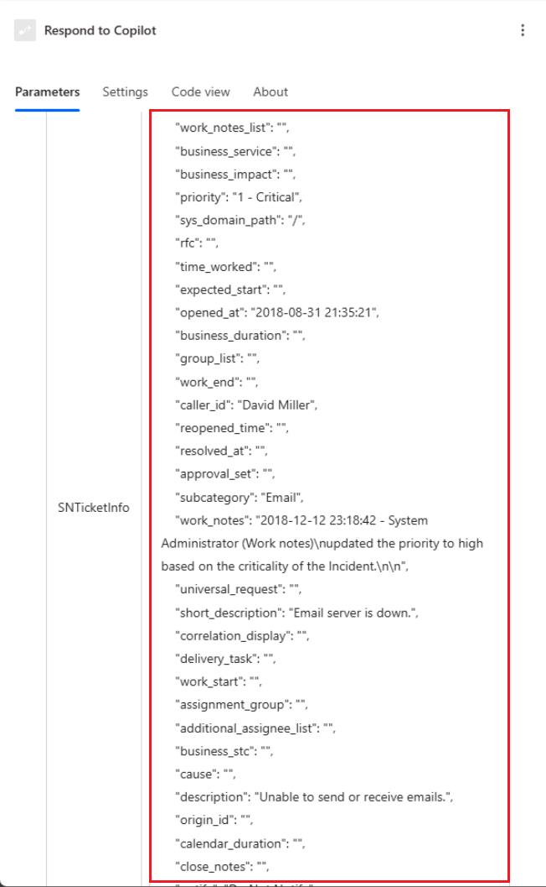

	{: .note }
	> This represents an example of what ServiceNow would typically return.

	{: .important }
	> In a real-world scenario:
	>
	> You could select the **fx** formula button that appears for the value field.
	>
	> 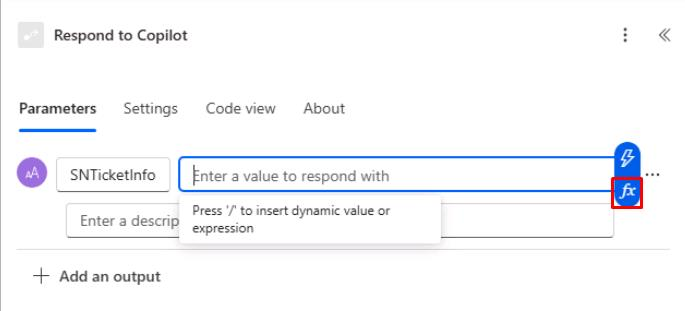
	>
	> Then you could enter a formula in the top text box, then select **Add**.
	>
	>	```
	>	string(first(outputs('List_Records')?['body/result']))
	>	```
	>
	> 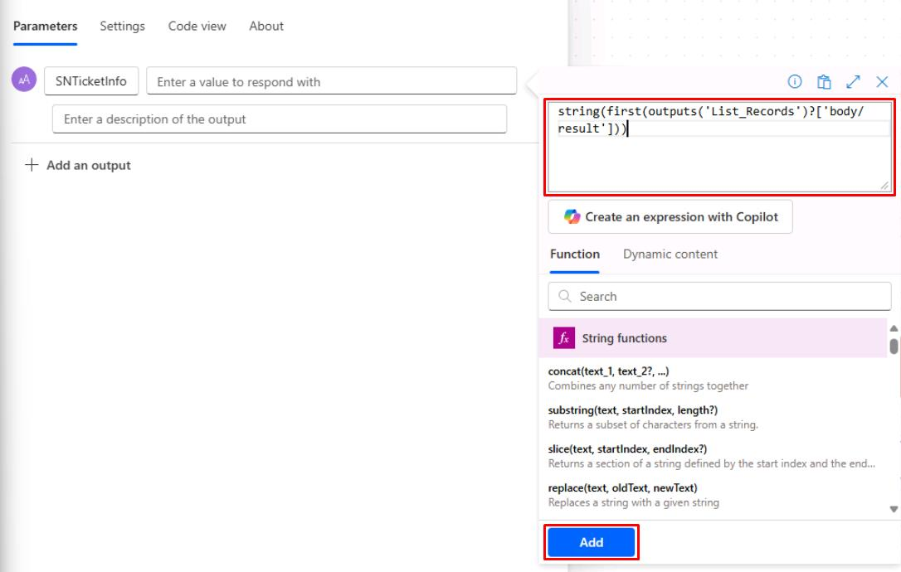
	>
	> This gets a string version of the first returned record of the result array from the ServiceNow **List Records** body.

1. Select **Publish** in the upper-right part of the page. Wait for the green success banner once published.

	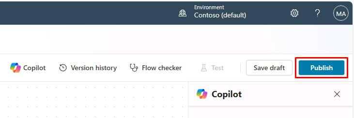

1. In the dialog, select **Go back to agent**.

	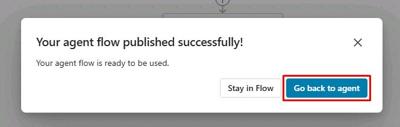

</details>