## Task 02: Call the agent flow

### Introduction

To enhance Contoso's customer interactions, the agent flows, the agent will dynamically fetch and provide customers with relevant information in real-time.

### Description

In this task, you'll integrate your previously created agent flow with the conversational topic. You'll configure the flow invocation and pass collected customer inputs to automate the process of information retrieval.

### Success criteria

- You've linked your conversational topic to the agent flow.
- You've correctly configured topic variables to pass inputs to the flow.
- You've verified through testing that the integration works correctly.


### Key tasks

---

### 01: Connect the agent flow to a topic

1. In the **Check Ticket Status** topic, select the **Action** node.

1. In the **Power Automate inputs** section, select the ellipsis (**...**) and then select the **TicketNumber** variable.

	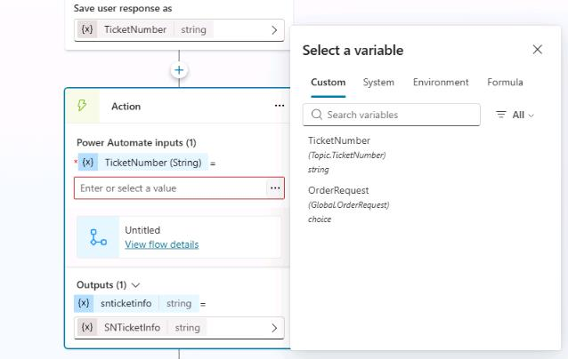

	{: .note }
	> The output from the agent flow will be added to the **SNTicketInfo** variable.

---

### 02: Parse the JSON output

ServiceNow returns the full details of an incident in a JSON format. You need to parse the JSON so that Copilot Studio fully understands its content based on its schema.

1. Below the **Action** node, select **+**. Select **Variable Management** and then select **Parse value**.

	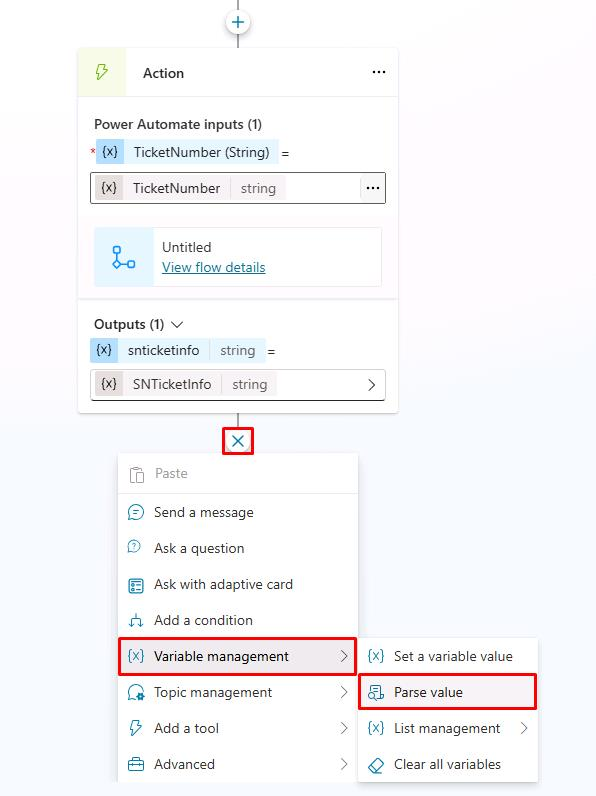


1. In the **Parse value** section, select the ellipsis (**...**) and then select the **SNTicketInfo** variable.

	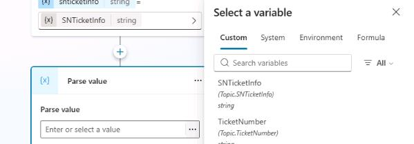

1. In the **Data type** field, select **From sample data**.

	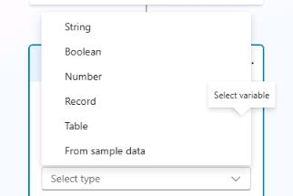

1. Select **Get schema from sample JSON**.

	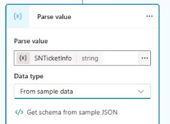

1. In the **Get schema from sample JSON** dialog, paste the following schema and then select **Confirm**:

	```JSON
	{
		"parent": "",
		"made_sla": "true",
		"caused_by": "",
		"watch_list": "",
		"upon_reject": "Cancel all future Tasks",
		"sys_updated_on": "2018-12-12 23:18:55",
		"child_incidents": "0",
		"hold_reason": "",
		"origin_table": "",
		"task_effective_number": "INC0009005",
		"approval_history": "",
		"number": "INC0009005",
		"resolved_by": "",
		"sys_updated_by": "admin",
		"opened_by": "System Administrator",
		"user_input": "",
		"sys_created_on": "2018-08-31 21:35:45",
		"sys_domain": "global",
		"state": "New",
		"route_reason": "",
		"sys_created_by": "admin",
		"knowledge": "false",
		"order": "",
		"calendar_stc": "",
		"closed_at": "",
		"cmdb_ci": "",
		"delivery_plan": "",
		"contract": "",
		"impact": "1 - High",
		"active": "true",
		"work_notes_list": "",
		"business_service": "",
		"business_impact": "",
		"priority": "1 - Critical",
		"sys_domain_path": "/",
		"rfc": "",
		"time_worked": "",
		"expected_start": "",
		"opened_at": "2018-08-31 21:35:21",
		"business_duration": "",
		"group_list": "",
		"work_end": "",
		"caller_id": "David Miller",
		"reopened_time": "",
		"resolved_at": "",
		"approval_set": "",
		"subcategory": "Email",
		"work_notes": "2018-12-12 23:18:42 - System Administrator (Work notes)\nupdated the priority to high based on the criticality of the Incident.\n\n",
		"universal_request": "",
		"short_description": "Email server is down.",
		"correlation_display": "",
		"delivery_task": "",
		"work_start": "",
		"assignment_group": "",
		"additional_assignee_list": "",
		"business_stc": "",
		"cause": "",
		"description": "Unable to send or receive emails.",
		"origin_id": "",
		"calendar_duration": "",
		"close_notes": "",
		"notify": "Do Not Notify",
		"service_offering": "",
		"sys_class_name": "Incident",
		"closed_by": "",
		"follow_up": "",
		"parent_incident": "",
		"sys_id": "ed92e8d173d023002728660c4cf6a7bc",
		"reopened_by": "",
		"incident_state": "New",
		"urgency": "1 - High",
		"problem_id": "",
		"company": "",
		"reassignment_count": "0",
		"activity_due": "2018-12-13 01:18:55",
		"assigned_to": "",
		"severity": "3 - Low",
		"comments": "",
		"approval": "Not Yet Requested",
		"sla_due": "UNKNOWN",
		"comments_and_work_notes": "2018-12-12 23:18:42 - System Administrator (Work notes)\nupdated the priority to high based on the criticality of the Incident.\n\n",
		"due_date": "",
		"sys_mod_count": "3",
		"reopen_count": "0",
		"sys_tags": "",
		"escalation": "Normal",
		"upon_approval": "Proceed to Next Task",
		"correlation_id": "",
		"location": "",
		"category": "Software"
	}
	```

	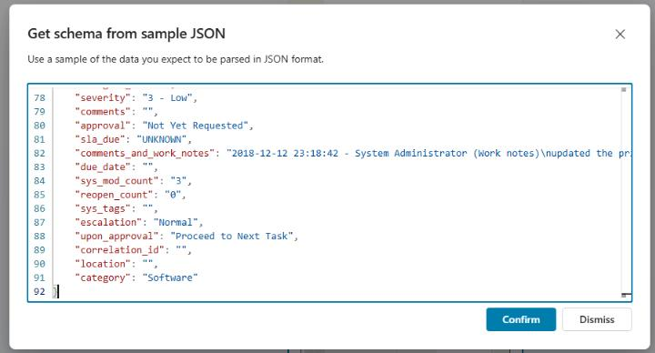


1. In the **Save as** section, select **Select a variable** and then select **Create a new variable**.

	

1. Select **Var1**. Then, in the **Variables properties** pane, in the **Variable name** field, enter ```SNTicketInfoParsed```.

	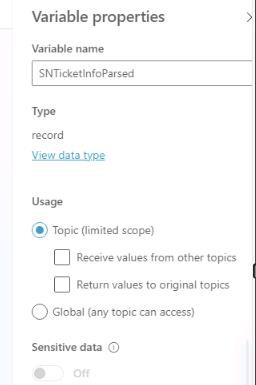

1. Below the **Parse value** node, add a new **Message** node and enter the following message:

	```
	The status of ticket {Topic.TicketNumber} ({Topic.SNTicketInfoParsed.short_description}) is {Topic.SNTicketInfoParsed.state}.
	```

	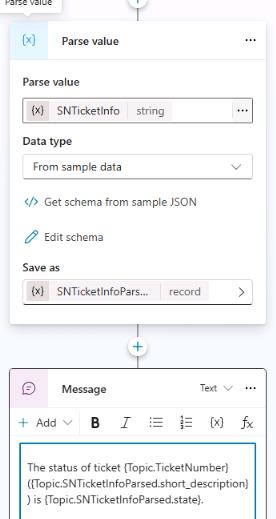

	{: .important }
	> You can apply bold by surrounding the text with \*\*.

1. On the command bar for the agent, select **Save**.

1. On the command bar for the agent, select **Test**.

1. In the upper-right corner of the **Test your agent** pane, select **Start new test session** to start a new conversation.

	

1. Submit the following prompt and review the response: 

	```
	What is the status of my ticket INC0007001?
	```

	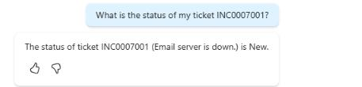
1. Leave the topic page open.


---

### 03: Display the ServiceNow ticket information in an adaptive card

1. In the **Message** node, select the message text and then select **Delete** (the trash can icon) to delete the current message. 

	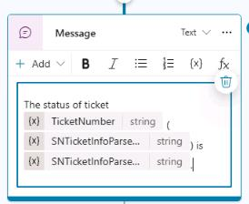

1. In the **Message** node, select **+ Add** and then select **Adaptive card**.

	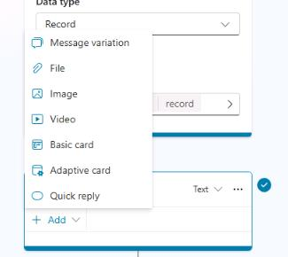

1. In the **Adaptive Card properties** pane, select **JSON card** and then select **Formula**.

	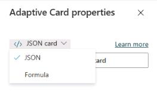

1. Replace the text in the text with the following formula:

	```JSON
	{
	type: "AdaptiveCard",
	version: "1.5",
	body: [
		{
		type: "ColumnSet",
		columns: [
			{
			type: "Column",
			width: "auto",
			items: [
				{
				type: "Image",
				url: "https://www.servicenow.com/community/s/legacyfs/online/avatars_servicenow/1f66cb9fdb3ee3c0107d5583ca961942.jpg",
				size: "Small",
				style: "Person"
				}
			]
			},
			{
			type: "Column",
			width: "stretch",
			items: [
				{
				type: "TextBlock",
				text: Topic.SNTicketInfoParsed.short_description,
				weight: "Bolder",
				size: "Large",
				wrap: true,
				color: "Attention",
				horizontalAlignment: "Left"
				}
			],
			verticalContentAlignment: "Center",
			horizontalAlignment: "Center"
			}
		]
		},
		{
		type: "TextBlock",
		text: Topic.SNTicketInfoParsed.description,
		weight: "Lighter",
		wrap: true
		},
		{
		type: "FactSet",
		facts: [
			{
			title: "Number:",
			value: Topic.SNTicketInfoParsed.number
			},
			{
			title: "State:",
			value: Topic.SNTicketInfoParsed.state
			},
			{
			title: "Priority:",
			value: Topic.SNTicketInfoParsed.priority
			},
			{
			title: "Impact:",
			value: Topic.SNTicketInfoParsed.impact
			},
			{
			title: "Urgency:",
			value: Topic.SNTicketInfoParsed.urgency
			},
			{
			title: "Category:",
			value: Topic.SNTicketInfoParsed.category
			},
			{
			title: "Subcategory:",
			value: Topic.SNTicketInfoParsed.subcategory
			},
			{
			title: "Caller ID:",
			value: Topic.SNTicketInfoParsed.caller_id
			},
			{
			title: "Opened By:",
			value: Topic.SNTicketInfoParsed.opened_by
			},
			{
			title: "Opened At:",
			value: Topic.SNTicketInfoParsed.opened_at
			}
		],
		spacing: "Small"
		},
		{
		type: "TextBlock",
		text: "Comments and notes:",
		weight: "Bolder",
		size: "Medium",
		wrap: true
		},
		{
		type: "TextBlock",
		text: Topic.SNTicketInfoParsed.comments_and_work_notes,
		wrap: true,
		size: "Small"
		}
	],
	actions: [
		{
		type: "Action.OpenUrl",
		title: "Update Ticket",
		url: "https://dev204932.service-now.com/nav_to.do?uri=incident.do?sys_id=" & Topic.SNTicketInfoParsed.sys_id & "%26sysparm_view=ess"
		}
	],
	'$schema': "http://adaptivecards.io/schemas/adaptive-card.json"
	}
	```

	

1. On the command bar for the agent you created, select **Save**.

1. On the command bar for the agent, select **Test**.

1. In the upper-right corner of the **Test your agent** pane, select **Start new test session** to start a new conversation.

	

1. Submit the following prompt and review the response: 

	```
	What is the status of my ticket INC0007001?
	```

	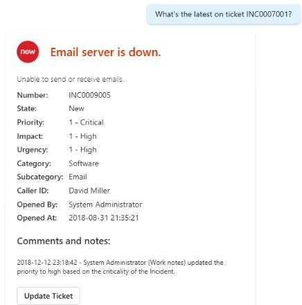

1. Leave the topic page open.
