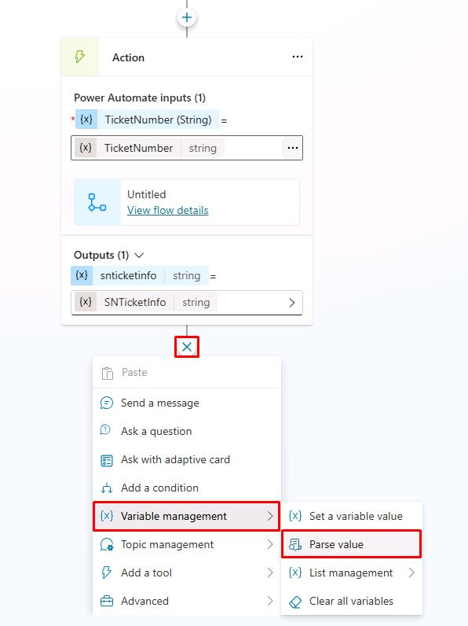

# Task 03: Call your Power Automate cloud flow from Copilot Studio

## Introduction

To enhance Contoso’s customer interactions, the agent needs to integrate seamlessly with automated processes. By connecting conversational topics to Power Automate cloud flows, the agent will dynamically fetch and provide customers with relevant information in real-time.

## Description

In this task, you’ll integrate your previously created Power Automate cloud flow with the conversational topic in Microsoft Copilot Studio. You’ll configure the flow invocation and pass collected customer inputs to automate the process of information retrieval.

## Success criteria

-   You’ve linked your conversational topic to the Power Automate cloud flow.
-   You’ve correctly configured topic variables to pass inputs to the flow.
-   You’ve verified through testing that the integration works correctly.


## Key tasks

### 01: Call your Power Automate cloud flow from Copilot Studio

<details markdown="block"> 
  <summary><strong>Expand this section to view the solution</strong></summary> 

<!--
1. Go back to your tab for Copilot Studio.

1. In the **Save and refresh** dialog, select **Done** to update the flow list with the one you just created. You can also manually refresh the page.

	

1. If needed, select the **+** button under the **Question** node again, select **Add an Action**, then select the **Get Ticket Status (@lab.User.FirstName @lab.User.LastName)** flow.

	

	{: .note }
	> A new **Action** node will be added.
	>
	> If the flow requires an input, it requests the value to be selected. The flow you created in the previous steps requires the **TicketNumber** input. Therefore, we need to add this input into the Power Automate action by selecting the variable containing the value from the user, which is **TicketNumber** from earlier in the lab.

	{: .warning }
	> If you don't see the flow you created, **Save** the topic, refresh the page, then try again.
-->
1. In the new **Action** node, under **Power Automate inputs**, select the ellipsis **(...)** next to **Enter or select a value**, then select the **TicketNumber** variable.

	
	
	{: .note }
	> This is now connected to the Power Automate flow, and outputs the result from Power Automate into the **SNTicketInfo** variable.

	{: .important }
	> **Pro tips**: 
	> - If latency is expected from your integration, go the action's properties and add a latency message , for example: `I'm getting these details for you. Hold on...` 
	> - Consider using HTTP requests and connectors directly in Microsoft Copilot Studio to avoid the added latency of invoking and running a cloud flow in Power Automate.

1. As ServiceNow will return the full details of the incident in a **JSON** format, you need to parse it so that Copilot Studio fully understands its content based on its schema.

	Under the **Action** node, select the **+** button, select **Variable Management**, then select **Parse value**.

	

	{: .note }
	> To parse the JSON you can use the Rest API Explorer in ServiceNow to get the structure of the body, or get the schema from a sample payload. For the exercise, we're providing sample ServiceNow data.

1. Under **Parse value**, select the ellipsis **(...)**, then select the **SNTicketInfo** variable.

	

1. For **Data type**, select **From sample data** from the dropdown menu.

1. Select **Get schema from sample JSON**.

	

1. Paste the schema below.

	{: .warning }
	> Use the **Copy** option on the following code block and paste it with **Ctrl+V**, rather than use **Type**.

	```json
	{
    	"parent": "",
    	"made_sla": "true",
    	"caused_by": "",
    	"watch_list": "",
    	"upon_reject": "Cancel all future Tasks",
    	"sys_updated_on": "2018-12-12 23:18:55",
    	"child_incidents": "0",
    	"hold_reason": "",
    	"origin_table": "",
    	"task_effective_number": "INC0009005",
    	"approval_history": "",
    	"number": "INC0009005",
    	"resolved_by": "",
    	"sys_updated_by": "admin",
    	"opened_by": "System Administrator",
    	"user_input": "",
    	"sys_created_on": "2018-08-31 21:35:45",
    	"sys_domain": "global",
    	"state": "New",
    	"route_reason": "",
    	"sys_created_by": "admin",
    	"knowledge": "false",
    	"order": "",
    	"calendar_stc": "",
    	"closed_at": "",
    	"cmdb_ci": "",
    	"delivery_plan": "",
    	"contract": "",
    	"impact": "1 - High",
    	"active": "true",
    	"work_notes_list": "",
    	"business_service": "",
    	"business_impact": "",
    	"priority": "1 - Critical",
    	"sys_domain_path": "/",
    	"rfc": "",
    	"time_worked": "",
    	"expected_start": "",
    	"opened_at": "2018-08-31 21:35:21",
    	"business_duration": "",
    	"group_list": "",
    	"work_end": "",
    	"caller_id": "David Miller",
    	"reopened_time": "",
    	"resolved_at": "",
    	"approval_set": "",
    	"subcategory": "Email",
    	"work_notes": "2018-12-12 23:18:42 - System Administrator (Work notes)\nupdated the priority to high based on the criticality of the Incident.\n\n",
    	"universal_request": "",
    	"short_description": "Email server is down.",
    	"correlation_display": "",
    	"delivery_task": "",
    	"work_start": "",
    	"assignment_group": "",
    	"additional_assignee_list": "",
    	"business_stc": "",
    	"cause": "",
    	"description": "Unable to send or receive emails.",
    	"origin_id": "",
    	"calendar_duration": "",
    	"close_notes": "",
    	"notify": "Do Not Notify",
    	"service_offering": "",
    	"sys_class_name": "Incident",
    	"closed_by": "",
    	"follow_up": "",
    	"parent_incident": "",
    	"sys_id": "ed92e8d173d023002728660c4cf6a7bc",
    	"reopened_by": "",
    	"incident_state": "New",
    	"urgency": "1 - High",
    	"problem_id": "",
    	"company": "",
    	"reassignment_count": "0",
    	"activity_due": "2018-12-13 01:18:55",
    	"assigned_to": "",
    	"severity": "3 - Low",
    	"comments": "",
    	"approval": "Not Yet Requested",
    	"sla_due": "UNKNOWN",
    	"comments_and_work_notes": "2018-12-12 23:18:42 - System Administrator (Work notes)\nupdated the priority to high based on the criticality of the Incident.\n\n",
    	"due_date": "",
    	"sys_mod_count": "3",
    	"reopen_count": "0",
    	"sys_tags": "",
    	"escalation": "Normal",
    	"upon_approval": "Proceed to Next Task",
    	"correlation_id": "",
    	"location": "",
    	"category": "Software"
	}
	```

1. Select **Confirm**.

	

1. Still in the **Parse value** node, under **Save as**, select **Select a variable**, then select **Create a new variable**.

	

1. Select the new **Var1** variable, then for **Variable name** enter `SNTicketInfoParsed`.

	{: .note }
	> The variable type will automatically be set based on its schema (**record**).

1. Under the **Parse value** node, add a new **Message** node, then enter the following message:

	```
	The status of ticket {Topic.TicketNumber} ({Topic.SNTicketInfoParsed.short_description}) is {Topic.SNTicketInfoParsed.state}.
	```

	

	{: .important }
	> You can bold key information either with the command bar or by surrounding the text with **.
	>
	> Copilot Studio and some channels support [Markdown](https://www.markdownguide.org/) for simple formatting.

	{: .note }
	> You can look above at the sample JSON to see what data would be returned in what value.

1. Under the **Message** node, select the **+** button, select **Topic management**, select **Go to another topic**, then select **End of Conversation**.

	

1. Select **Save** in the upper-right part of the canvas to save the topic.

1. Select the refresh icon in the upper-right corner of the **Test your agent** pane to start a new conversation.

1. Test it out by entering the following prompt:

    ```
	What is the status of my ticket INC0007001?
	```

    

</details>

You've successfully created a Power Automate cloud flow, and a new topic in Copilot Studio that used the flow to provide real-time data from an external service to the user!
