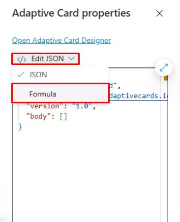

# Task 04: Display the ServiceNow ticket information in an adaptive card

## Introduction

To enhance customer interactions, Contoso needs the AI-powered agent to clearly present ticket details retrieved from external systems.

## Description

In this task, you'll configure your conversational topic to present the information retrieved from ServiceNow using an adaptive card. You’ll design the card layout and integrate the data returned by your cloud flow, ensuring it displays effectively in the conversation.

## Success criteria

-   You’ve created and configured an adaptive card within the conversational topic.
-   You’ve integrated ServiceNow ticket data retrieved from the Power Automate cloud flow into the adaptive card.
-   You’ve successfully tested and verified correct data display in conversations.


## Key tasks

### 01: Display the ServiceNow ticket information in an adaptive card

<details markdown="block"> 
  <summary><strong>Expand this section to view the solution</strong></summary> 

1. Select the message in your **Message** node, then select the delete icon in the upper-right part of the node's text box. 

	

1. In the **Message** node, select **Add**, then select **Adaptive card**.

	

1. Select **Edit JSON**, then select **Formula** so that you can make the adaptive card dynamic and author it in the Power Fx language.

	

1. Replace the text in the text box with this Power Fx formula which contains the references to the ServiceNow ticket information.

	```json
	{
	type: "AdaptiveCard",
	version: "1.5",
	body: [
		{
		type: "ColumnSet",
		columns: [
			{
			type: "Column",
			width: "auto",
			items: [
				{
				type: "Image",
				url: "https://www.servicenow.com/community/s/legacyfs/online/avatars_servicenow/1f66cb9fdb3ee3c0107d5583ca961942.jpg",
				size: "Small",
				style: "Person"
				}
			]
			},
			{
			type: "Column",
			width: "stretch",
			items: [
				{
				type: "TextBlock",
				text: Topic.SNTicketInfoParsed.short_description,
				weight: "Bolder",
				size: "Large",
				wrap: true,
				color: "Attention",
				horizontalAlignment: "Left"
				}
			],
			verticalContentAlignment: "Center",
			horizontalAlignment: "Center"
			}
		]
		},
		{
		type: "TextBlock",
		text: Topic.SNTicketInfoParsed.description,
		weight: "Lighter",
		wrap: true
		},
		{
		type: "FactSet",
		facts: [
			{
			title: "Number:",
			value: Topic.SNTicketInfoParsed.number
			},
			{
			title: "State:",
			value: Topic.SNTicketInfoParsed.state
			},
			{
			title: "Priority:",
			value: Topic.SNTicketInfoParsed.priority
			},
			{
			title: "Impact:",
			value: Topic.SNTicketInfoParsed.impact
			},
			{
			title: "Urgency:",
			value: Topic.SNTicketInfoParsed.urgency
			},
			{
			title: "Category:",
			value: Topic.SNTicketInfoParsed.category
			},
			{
			title: "Subcategory:",
			value: Topic.SNTicketInfoParsed.subcategory
			},
			{
			title: "Caller ID:",
			value: Topic.SNTicketInfoParsed.caller_id
			},
			{
			title: "Opened By:",
			value: Topic.SNTicketInfoParsed.opened_by
			},
			{
			title: "Opened At:",
			value: Topic.SNTicketInfoParsed.opened_at
			}
		],
		spacing: "Small"
		},
		{
		type: "TextBlock",
		text: "Comments and notes:",
		weight: "Bolder",
		size: "Medium",
		wrap: true
		},
		{
		type: "TextBlock",
		text: Topic.SNTicketInfoParsed.comments_and_work_notes,
		wrap: true,
		size: "Small"
		}
	],
	actions: [
		{
		type: "Action.OpenUrl",
		title: "Update Ticket",
		url: "https://dev204932.service-now.com/nav_to.do?uri=incident.do?sys_id=" & Topic.SNTicketInfoParsed.sys_id & "%26sysparm_view=ess"
		}
	],
	'$schema': "http://adaptivecards.io/schemas/adaptive-card.json"
	}

	```

	

1. Select **Save** in the upper-right part of the canvas to save the topic.

1. Select the refresh icon in the upper-right corner of the **Test your agent** pane to start a new conversation.

1. Test it out by entering the following prompt :

	```
	What's the latest on ticket INC0007001?
	```

	

</details>

## Summary

Congratulations on completing Exercise 03! You've successfully:

- Created a new Power Automate cloud flow.
- Called the Power Automate cloud flow into your topic.
- Set input and output variables.
- Displayed dynamic data back to the user in Copilot Studio.