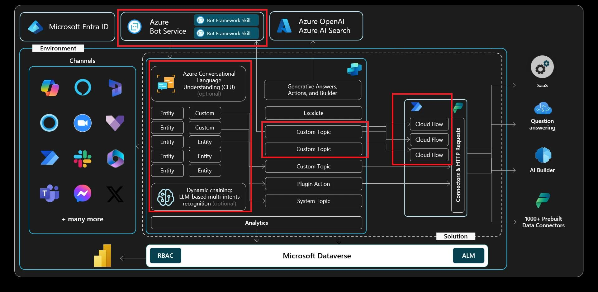

# Exercise 03: Build and call Power Automate cloud flows from your agent

## Scenario
To further automate responses and reduce response times, Contoso integrates their Copilot agent with existing business workflows.

In this exercise, you'll use Power Automate cloud flows to enable the agent to interact seamlessly with Contoso’s backend systems. For example, when customers inquire about service appointments or equipment status, the agent automatically retrieves accurate, real-time data, improving operational efficiency and response accuracy.

## Objectives
In this exercise, you'll create a new topic, add a simple Power Automate action to retrieve information from an external service, and then display that data back to the user.

After this exercise you'll be able to:

-   Understand the basics of Power Automate.
-   Use Copilot Studio to request data from another data source using Power Automate and return the data in a conversational dialog with the end user.

## Architecture

## Fundamental knowledge: Understanding Power Automate

Power Automate is a cloud-based service that makes it practical and simple for line-of-business users to build workflows that automate time-consuming business tasks and processes across applications and services.

Power Automate is part of a powerful and adaptable business application platform that includes Power Apps, Microsoft Dataverse, Dynamics 365, and Office 365. This platform allows our customers, our partners, and our ISV partners to create purpose-built solutions for their own companies, their industry, for functional roles, or even for specific geographies. 

Line-of-business users, who understand their business needs best, can easily analyze, compose, and streamline data and processes. Professional developers can easily extend the automation, analytics, and line-of-business apps to leverage Azure services like Functions, App Services, and Logic Apps. API connectors, gateways, and Microsoft Dataverse make it possible to get more value out of services or data already in use, either in the cloud or on-premises.
 	
Here are a few examples of what you can do with Power Automate:

   - Send automatic reminders for past due tasks.
   - Move business data between systems on a schedule.
   - Connect to more than 1000 data sources or any publicly available API.
   - You can even automate tasks on your local computer, such as computing data in Excel.

Just think about time saved once you automate repetitive manual tasks simply by recording mouse clicks, keystrokes, and copy/paste steps from your desktop! Power Automate is all about automation.

Microsoft Copilot Studio connects easily with Power Automate, being able to pass the variables from user responses and retrieve data from several different data sources, perform complex operations on that data, and return to Microsoft Copilot Studio to share that data with the user. Being able to operate on and retrieve data from almost any data source accessible via an API is one of the most valuable benefits of Copilot Studio.

Alternatively, Microsoft Copilot Studio can also directly use the same connectors, HTTP requests, or custom connectors as in Power Automate, directly from a topic or from a plugin action.

This exercise will not include an extensive introduction to Power Automate but does cover a basic scenario of how to retrieve data from an external data source and use it in the conversational experience of Copilot Studio. 

To learn more specifically about Power Automate, you can review the [Microsoft Docs on Power Automate](https://learn.microsoft.com/en-us/power-automate/), and also the 'In a Day' material for Microsoft Power Apps, which includes Power Automate.

## Build a basic Power Automate cloud flow

Connecting to data provides companies with significant benefits, as it provides information and insight to users that is up-to-date and often relevant to customer or user questions.

## Duration

Estimated time: *60 minutes*.